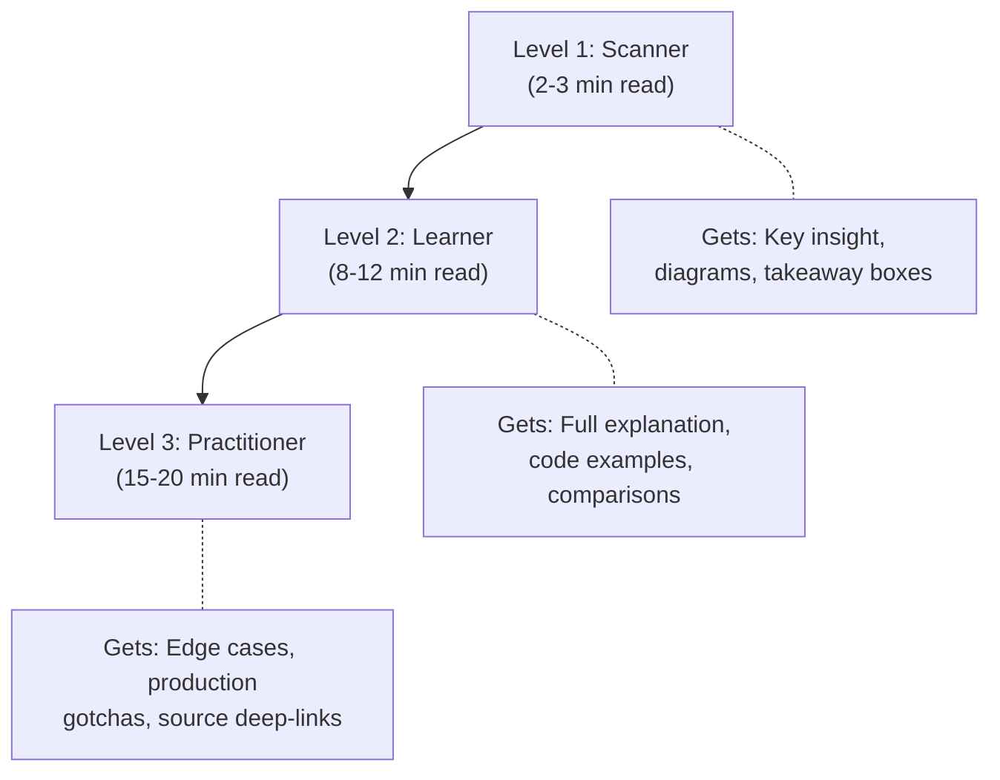
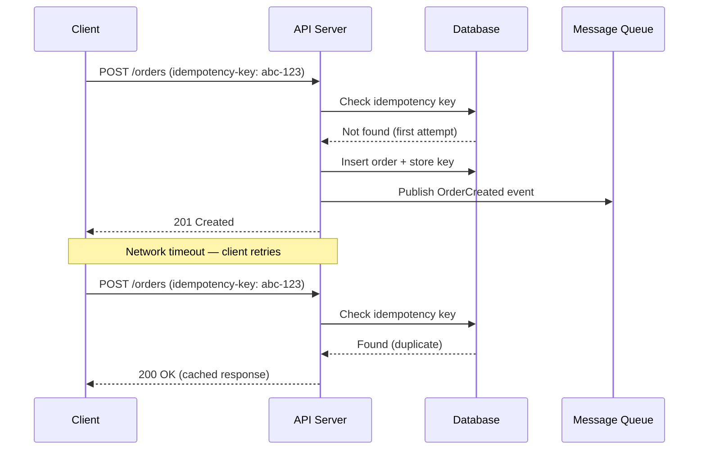
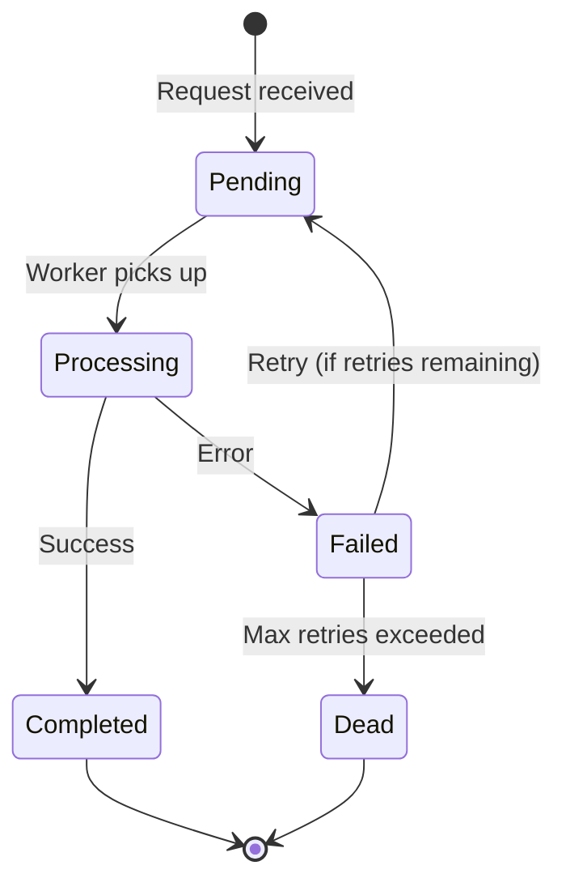
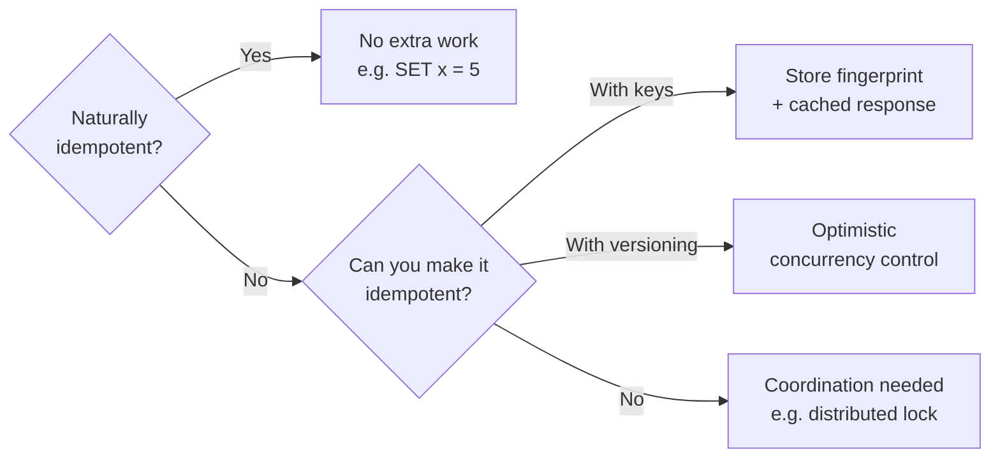

# Technical Blog Content

Write technical blog posts that senior engineers trust and junior engineers actually finish reading. The goal: every post teaches something real, backs it up with evidence, and uses progressive disclosure so readers at different levels all get value.

This skill produces a structured blog outline that can be rendered into any publishing format (Astro MDX, plain Markdown, etc.).

## When to Use

- Writing a new technical blog post on any engineering topic
- Explaining a concept that's routinely misunderstood in the industry
- Writing a "how we built X" or "lessons from running Y in production" post
- Comparing approaches, patterns, or tools with genuine analysis
- Creating educational content that bridges theory and practice

## Workflow

1. **Research the topic.** Gather primary sources, papers, official docs, and real-world case studies before writing a single sentence.
2. **Map the concept space.** Identify what readers think they know vs. what's actually true. Find the gap.
3. **Choose a structural template.** Pick the arc that fits the post type.
4. **Write the content outline.** One entry per section, following the outline format below.
5. **Design diagrams.** Every non-trivial concept gets a visual. Mermaid is the default.
6. **Verify every claim.** Cross-reference sources. No hand-waving.
7. **Run the humanizer skill.** Strip AI-sounding patterns before publishing.

## Core Standards

These standards are adapted from the `presentation-content` skill. They're what separate a blog post that gets bookmarked from one that gets skimmed and forgotten.

### Correctness First

Every technical claim must be precise. If a guarantee has conditions (e.g. "exactly-once" that's really "effectively-once with idempotency keys"), state the conditions. Vendor marketing copy is not a source. RFCs, papers, official documentation, and production incident reports are sources.

### Cite or It Didn't Happen

Every non-obvious claim needs a source. Inline citations link to the original material. Acceptable sources, in order of trust:

1. **Primary sources** -- RFCs, academic papers, language specs, protocol specifications
2. **Official documentation** -- project docs, API references, design documents published by the maintainers
3. **Production experience** -- published post-mortems, engineering blogs from companies running the system at scale (e.g. Stripe's idempotency post, Jepsen test results)
4. **Reputable secondary sources** -- well-researched blog posts by recognized practitioners, conference talks with demonstrated expertise
5. **Your own experience** -- valid, but label it explicitly: "In our experience at [company/project]..." Never present personal experience as universal truth.

If you can't find a source for a claim, either drop it or label it explicitly as opinion: "I believe X because Y, but I haven't found a published source for this."

### Terminology Discipline

Define terms before using them. If the post uses terms that are routinely misapplied (e.g. "exactly-once delivery," "eventual consistency," "serverless," "idempotent"), define them precisely at first use with a callout box. Use those definitions consistently throughout.

Format for term definitions:

```markdown
> **Idempotent** -- An operation that produces the same result whether you execute it once or multiple times. Formally: f(f(x)) = f(x). In distributed systems, this means a retried request has no additional side effects beyond the first successful execution.
```

### No False Precision

Do not invent numerical thresholds without a justified rationale. "Use pattern X when your service handles more than 1000 requests per second" is meaningless without stating what changes at that threshold and why. Name the variables that actually drive the decision.

### Causal History

When presenting a technology's evolution, explain what broke, for whom, and at what scale. Dates without causation are trivia. The question is always: what production failure or operational constraint motivated this design choice?

### Production-Grade Failure Modes

Describe failures that occur in real systems, not theoretical worst cases. Name the specific condition, the observable symptom, and why it's non-obvious. If a failure mode was valid in an older version but has been addressed, say so with the version number.

### Tone: Fun but Honest

Direct, occasionally funny, never flippant about complexity. The reader should feel like they're learning from a colleague who's been in the trenches, not reading a textbook or a marketing page. Verdicts on patterns and tools must be genuine assessments, not hedges. "It depends" is not an answer; make the dependency explicit.

What "fun" means here:
- Concrete scenarios readers recognize ("You deploy on Friday. The on-call phone rings at 2am.")
- Occasional dry humor in parentheticals
- Analogies that actually clarify (not forced metaphors)
- Personality in transitions between sections
- Real-world war stories where they illustrate a point

What "fun" does NOT mean:
- Forced jokes that interrupt technical flow
- Memes or pop culture references that age poorly
- Dumbing down the content
- Clickbait framing

## Progressive Disclosure

Every blog post serves three audiences simultaneously. Progressive disclosure is how you satisfy all of them without boring the advanced readers or losing the beginners.

### The Three Reader Levels



**Level 1 -- The Scanner** reads headings, diagrams, and callout boxes. They should get the core insight in 2-3 minutes without reading body text.

**Level 2 -- The Learner** reads the full post linearly. They should understand the concept well enough to explain it to a colleague.

**Level 3 -- The Practitioner** reads everything including footnotes, linked sources, and edge case sections. They should be able to implement it tomorrow.

### How to Implement Progressive Disclosure in a Blog Post

| Layer | Element | Serves |
|---|---|---|
| Headings | Clear, descriptive (not clever) | Scanner |
| Diagrams | One per major concept | Scanner + Learner |
| Takeaway boxes | Single-sentence insight per section | Scanner |
| Body text | Full explanation with examples | Learner |
| Code blocks | Working, runnable examples | Learner + Practitioner |
| Callout boxes | Definitions, gotchas, "in practice" notes | Learner |
| Collapsible sections | Deep dives, proofs, edge cases | Practitioner |
| Footnotes / sources | Citations, further reading, caveats | Practitioner |

### Progressive Disclosure Anti-Pattern

Never hide essential information in collapsible sections. If a reader needs it to understand the main argument, it goes in the body. Collapsible sections are for supplementary depth, not structural load-bearing content.

## Visualization Guidelines

Diagrams are not decoration. Every diagram must answer a specific question the reader has at that point in the post. If you can't state the question, you don't need the diagram.

### When to Use Each Type

| Diagram Type | Use When | Tool |
|---|---|---|
| Flowchart | Showing a decision process or request flow | Mermaid `graph` |
| Sequence diagram | Showing interactions between components over time | Mermaid `sequenceDiagram` |
| State diagram | Showing lifecycle states and transitions | Mermaid `stateDiagram-v2` |
| Comparison table | Contrasting 2-4 approaches on specific dimensions | Markdown table |
| Architecture diagram | Showing component relationships and data flow | Mermaid `graph` or `C4Context` |
| Timeline | Showing evolution or causal history | Mermaid `timeline` |
| Mental model diagram | Showing how a concept fits into a broader framework | Mermaid `graph` or `mindmap` |

### Diagram Rules

1. **6-8 nodes max.** If a diagram needs more, the concept is too complex for one visual. Split it.
2. **Label edges.** Unlabeled arrows are ambiguous. Every connection should say what flows through it.
3. **Use consistent styling.** Same node shapes for same concept types throughout a post.
4. **Caption every diagram.** State what question the diagram answers.
5. **Provide a text fallback.** Below each diagram, include a one-sentence summary for accessibility and for readers whose Mermaid rendering is broken.
6. **Prefer `graph LR` over `graph TD` for flowcharts and decision trees.** Top-down layouts create very tall diagrams that consume entire viewports, especially with 5+ nodes. Left-to-right layouts produce compact, scannable diagrams that fit naturally in a blog's reading flow. Use `\n` in node labels to control line breaks and keep nodes compact (e.g. `A["Naturally\nidempotent?"]`).

### Mermaid in Astro MDX

Mermaid diagrams use the `<Mermaid>` component with a `chart` prop (not children/slots). This avoids MDX paragraph wrapping that corrupts mermaid syntax. The implementation details are in the `technical-blog-craft` skill.

### Diagram Examples

#### Sequence Diagram (showing a distributed system interaction)

````markdown

*Figure: Idempotency key flow. The second request returns the cached response without re-executing side effects.*
````

#### State Diagram (showing lifecycle)

````markdown

*Figure: Job lifecycle states. Note that retries return to Pending, not Processing -- the job re-enters the queue.*
````

#### Comparison Flowchart (showing a decision tree)

````markdown

*Figure: Decision tree for choosing an idempotency strategy. Uses `graph LR` for compact horizontal layout.*
````

## Blog Section Types

### The Hook (1 section)

Start with a concrete scenario the reader has personally experienced. Never start with a definition, a Wikipedia-style overview, or "In this post, we'll explore..."

Rules:
- The scenario must be specific enough that the reader thinks "I've been there."
- Frame it as a story, not an abstraction.
- The hook must create a question the rest of the post answers.
- Keep it to 2-4 short paragraphs.

### Concept Foundation (2-4 sections)

Build understanding from first principles using progressive disclosure. Introduce one concept per section. After each section, the reader should feel "that's not quite enough yet" until the pieces combine.

Rules:
- Start each section with a diagram or visual that frames the concept.
- Follow the diagram with a precise definition in a callout box.
- Then explain with a concrete example using the same scenario from the hook.
- End each section with a takeaway box.

### The "What You Probably Believe vs. What's Actually True" Section

This is the signature section type for posts about misunderstood concepts. Use a comparison format:

```markdown
| Common Belief | Reality | Why It Matters |
|---|---|---|
| "Exactly-once delivery is possible" | TCP can't guarantee it; what we achieve is effectively-once via idempotency | You'll design for a guarantee you don't have |
| "Idempotency just means retry-safe" | It also requires deterministic side effects | Your payment system charges twice |
```

### Code Examples (1-3 sections)

Working, runnable code that the reader could copy and adapt. Progressive: start simple, add real-world complexity.

Rules:
- **First example:** Minimal, shows the core mechanism in under 20 lines.
- **Second example:** Adds production concerns (error handling, observability, edge cases).
- **Third example (optional):** Full production pattern with tests. Can be in a collapsible section.
- Every code block specifies the language and has a caption.
- Highlight the important lines (the 3-5 lines that matter most).

### Production Lessons (1-2 sections)

Real-world gotchas, failure modes, and operational lessons. This is where the post earns trust with senior readers.

Rules:
- Each lesson names: the condition, the symptom, and why it's non-obvious.
- Include a "how to detect this" note (monitoring, logging, testing strategy).
- Cite the source if it's from a published post-mortem or engineering blog.

### The Landscape (1 section)

Place the concept in its broader context. This is where most blog posts get lazy.

Rules:
- **Layer relationships first.** Which patterns are true alternatives (pick one), which are composable primitives (use together), and which are orthogonal (solve different problems). Most posts flatten this distinction.
- Use a diagram showing how patterns relate.
- End with explicit decision guidance: "if X then A, else B."

### Summary and Further Reading (1 section)

Concise recap and curated resources.

Rules:
- 3-5 bullet point summary of key insights (these serve the Scanner).
- Curated further reading list with annotations explaining why each resource is worth reading (not just a link dump).
- Distinguish: "start here" resources vs. "go deeper" resources.

## Blog-Level Formatting Rules

**One concept per section.** If you need "and also" to describe what a section covers, split it.

**Every dense section needs a takeaway box.** A reader who only reads takeaway boxes should get the full argument.

```markdown
> **Takeaway:** Idempotency keys solve the retry problem, but only if your key generation is deterministic and your storage layer handles races. The key itself is the easy part; the transactional semantics around it are where systems break.
```

**Breathing sections every 3-4 dense sections.** A diagram, a pull-quote, a short anecdote. Readers need cognitive rest.

**Code: 20 lines max per initial block.** Longer code goes in collapsible sections or linked repositories.

**Callout box types** (maps to `<Callout type="...">` in Astro MDX):

| Type | Use For | Astro Component |
|---|---|---|
| Definition | Precise term definitions | `<Callout type="definition">` |
| Takeaway | Section-level key insight | `<Callout type="takeaway">` |
| Gotcha | Non-obvious failure modes | `<Callout type="gotcha">` |
| In Practice | Real-world application notes | `<Callout type="in-practice">` |

Each callout type has a distinct icon, border color, and background tint. When writing content outlines, specify which type each callout should use. The implementation details (icons, colors, MDX syntax) are handled by the `technical-blog-craft` skill.

**Tables: 6 rows max.** More than 6 rows becomes a reference doc. Link to a full comparison if needed.

**Internal cross-references.** When a concept was explained earlier, link back. Don't re-explain.

## Structural Templates

### Concept Explainer (1500-3000 words)

For posts like "What is X really?" or "X vs. Y: what's actually different."

```
Hook: Scenario (200-300 words)
→ "What you probably believe" table
→ Concept 1: Definition + diagram + example (300-500 words)
→ Concept 2: Definition + diagram + example (300-500 words)
→ Breathing: Key diagram showing how concepts relate
→ Code Example: Minimal implementation (200-300 words)
→ Production Lessons: 2-3 gotchas (200-400 words)
→ Landscape: Where this fits + decision tree (200-300 words)
→ Summary + Further Reading (150-200 words)
```

### How-To / Implementation Guide (2000-4000 words)

For posts like "How to add idempotency to your service" or "Building X from scratch."

```
Hook: The problem you'll solve (200-300 words)
→ Why this matters: Failure scenario without the solution (200-300 words)
→ Mental Model: Diagram of the approach (150-200 words)
→ Step 1: Foundation (code + explanation) (300-500 words)
→ Step 2: Core mechanism (code + explanation) (300-500 words)
→ Step 3: Production hardening (code + explanation) (300-500 words)
→ Breathing: Architecture diagram of the full solution
→ Gotchas: 3-5 production lessons (300-500 words)
→ Testing strategy (200-300 words)
→ Landscape: Alternatives and when to use them (200-300 words)
→ Summary + Further Reading (150-200 words)
```

### Deep Dive / Investigation (3000-5000 words)

For posts like "Inside X: how it actually works" or "Why X broke at scale."

```
Hook: The mystery or incident (200-400 words)
→ Context: What the system does (diagram + 200-300 words)
→ The obvious explanation (and why it's wrong) (300-500 words)
→ Layer 1: Surface-level understanding (300-500 words)
→ Layer 2: What most people miss (300-500 words)
→ Layer 3: The real mechanism (diagram + 400-600 words)
→ Breathing: Timeline diagram of the concept's evolution
→ Proof: Code or data that confirms the explanation (300-500 words)
→ Implications: What this means for your systems (300-400 words)
→ Landscape: Related concepts and further investigation (200-300 words)
→ Summary + Further Reading (150-200 words)
```

## Output Format: Blog Content Outline

The content outline is the handoff artifact. Each section is one entry:

```yaml
blog:
  title: "Exactly-Once Is a Lie: How to Actually Build Reliable Services"
  subtitle: "What 'effectively-once' means and why your retry logic is probably broken"
  estimated_read_time: "12 min"
  audience: "Backend engineers building distributed services"
  template: concept-explainer  # concept-explainer | how-to | deep-dive
  tags: ["distributed-systems", "idempotency", "reliability"]

  sources:
    - id: stripe-idempotency
      author: "Brandur Leach"
      title: "Implementing Stripe-like Idempotency Keys in Postgres"
      url: "https://brandur.org/idempotency-keys"
      type: production-experience
    - id: helland-idempotence
      author: "Pat Helland"
      title: "Idempotence Is Not a Medical Condition"
      url: "https://queue.acm.org/detail.cfm?id=2187821"
      type: paper

  sections:
    - number: 1
      type: hook                        # hook | concept | comparison | code
                                        # | production | landscape | summary | breathing
      heading: "It's Friday. You Deploy. The Phone Rings."
      body: |
        You ship a payment service. It works great in staging.
        In production, a network blip causes a timeout. The client retries.
        The customer gets charged twice. Your Slack lights up.

        The post-mortem says "add retry logic." But retry logic without
        idempotency is just a way to create the same bug faster.
      diagram: null
      takeaway: "Retries without idempotency don't fix failures -- they multiply side effects."
      callouts: []
      sources_cited: []
      collapsible: null
      estimated_words: 250

    - number: 2
      type: comparison
      heading: "What You Probably Believe vs. What's True"
      body: null
      diagram: null
      takeaway: "The gap between 'exactly-once' marketing and 'effectively-once' reality is where production bugs live."
      callouts:
        - type: definition
          content: |
            **Exactly-once delivery** -- A message is delivered to the consumer
            exactly one time. In theory. In practice, no network protocol can
            guarantee this (see: Two Generals Problem).
        - type: definition
          content: |
            **Effectively-once execution** -- A message may be *delivered*
            more than once, but the *effect* is applied only once, because
            the consumer is idempotent.
      comparison_table:
        headers: ["Common Belief", "Reality", "Why It Matters"]
        rows:
          - ["Exactly-once delivery is possible", "TCP can't guarantee it", "You design for a guarantee you don't have"]
          - ["Idempotency = retry-safe", "Also requires deterministic side effects", "Payment charges twice"]
      sources_cited: ["helland-idempotence"]
      collapsible: null
      estimated_words: 400

    - number: 3
      type: concept
      heading: "What Idempotency Actually Means"
      body: |
        Formally: f(f(x)) = f(x). An operation that produces the same
        result whether you run it once or ten times.

        Some operations are naturally idempotent (SET x = 5).
        Some are not (INCREMENT x). The interesting engineering is
        in making non-idempotent operations behave as if they were.
      diagram:
        type: mermaid
        definition: |
          graph LR
              A{"Naturally\nidempotent?"} -->|Yes| B["No extra work\ne.g. SET x = 5"]
              A -->|No| C{"Add idempotency\nkey?"}
              C -->|Yes| D["Store key + result\nReturn cached on retry"]
              C -->|No| E["Coordination needed\ne.g. distributed lock"]
        caption: "Decision tree for choosing an idempotency strategy."
      takeaway: "Idempotency is a property of the operation, not the network. You build it into your service layer."
      callouts:
        - type: gotcha
          content: "DELETE is idempotent (deleting twice = same result), but it's not safe (it has side effects). Don't confuse idempotent with safe."
      sources_cited: ["stripe-idempotency"]
      collapsible:
        title: "Formal definition and edge cases"
        content: "Extended mathematical definition..."
      estimated_words: 500
```

### Field Reference

| Field | Required | Purpose |
|---|---|---|
| `number` | yes | Sequential section number |
| `type` | yes | Section type (hook, concept, comparison, code, production, landscape, summary, breathing) |
| `heading` | yes | Section heading (descriptive, not clever) |
| `body` | yes | Section body content (markdown) |
| `diagram` | no | Mermaid diagram with `type`, `definition`, and `caption` |
| `takeaway` | conditional | Required for concept, comparison, code, production sections |
| `callouts` | no | Array of `{type, content}` callout boxes |
| `comparison_table` | no | For comparison sections: `{headers, rows}` |
| `sources_cited` | yes | Array of source IDs referenced in this section |
| `collapsible` | no | Optional deep-dive content: `{title, content}` |
| `estimated_words` | yes | Rough word count for pacing |

## Content Review Checklist

Before handing off to formatting or publishing:

### Correctness and Sources
- [ ] Every non-obvious technical claim has an inline citation
- [ ] No vendor marketing claims repeated uncritically
- [ ] Terms that could be misunderstood are defined at first use
- [ ] No invented thresholds without stated rationale
- [ ] Failure modes described are production-grade, not theoretical
- [ ] Source list includes at least one primary source (RFC, paper, spec)

### Progressive Disclosure
- [ ] Scanner can get the core insight from headings + diagrams + takeaway boxes alone
- [ ] Learner can follow the full post without opening collapsible sections
- [ ] Practitioner gets edge cases, sources, and implementation depth in collapsibles and footnotes

### Visualization
- [ ] Every major concept has a diagram
- [ ] Diagrams have captions stating what question they answer
- [ ] No diagram exceeds 8 nodes
- [ ] Diagram edges are labeled
- [ ] Text fallback exists for each diagram

### Readability
- [ ] One concept per section
- [ ] Breathing section every 3-4 dense sections
- [ ] Code blocks under 20 lines (longer code in collapsibles)
- [ ] Tables under 6 rows
- [ ] Dense sections have a takeaway box
- [ ] Post fits the estimated read time (roughly 200-250 words per minute)

### Tone
- [ ] Reads like a knowledgeable colleague, not a textbook
- [ ] Verdicts are genuine, not hedged with "it depends" without specifying the dependency
- [ ] Humor (if present) serves the explanation, doesn't interrupt it
- [ ] No AI-sounding patterns (run humanizer skill)

### Structure
- [ ] Hook starts with a scenario, not a definition
- [ ] Comparison sections label relationships: alternative / composable / orthogonal
- [ ] Code progresses from simple to production-grade
- [ ] Summary bullet points stand alone as a mini-post
- [ ] Further reading is annotated, not a bare link list

## Content Anti-Patterns

| Anti-pattern | Why it fails | Fix |
|---|---|---|
| Starting with a definition | Reader has no reason to care yet | Start with a problem they recognize |
| "In this post, we'll explore..." | Generic intro that says nothing | Delete it. Jump into the scenario. |
| Wall of text without visuals | Cognitive overload | Add a diagram every 500-800 words |
| Unsourced claims about guarantees | Senior engineers stop trusting you | Cite or label as opinion |
| Code without context | Reader doesn't know what they're looking at | Caption, highlight key lines, explain the "why" |
| "It depends" as an answer | Abdicates the author's role | Make the dependency explicit with a decision tree |
| Listing pros/cons without conditions | Omits when each matters | State the scenario where each point applies |
| Forced metaphors | Obscure rather than clarify | Use analogies only when they genuinely map to the mechanism |
| Encyclopedic coverage | Post becomes a reference doc, not a narrative | Prioritize ruthlessly; link to references |
| Collapsible sections as crutch | Hiding essential content the reader needs | If it's load-bearing, it goes in the body |
| Diagrams without captions | Reader doesn't know what they're looking at | Caption with the question the diagram answers |
| Clickbait title, textbook body | Tone mismatch breaks trust | Title sets the real tone; body delivers on it |

## Handoff to Implementation

This skill produces a content outline. To convert it into a published Astro MDX blog post with proper component usage, styling, and rendering, use the `technical-blog-craft` skill. The craft skill handles MDX syntax, component APIs, CSS conventions, and design rules specific to this site's blog architecture.
