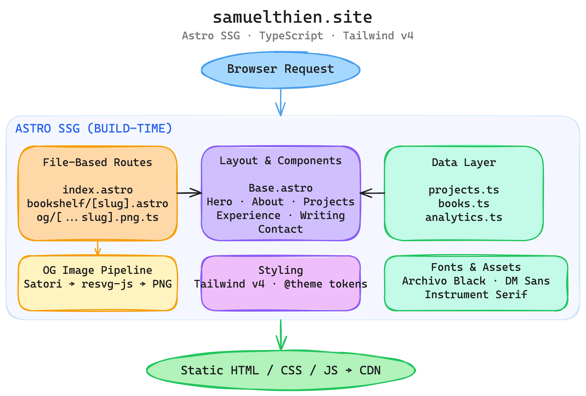

# samuelthien.site

Personal site. Portfolio, bookshelf, and a place to point people when they ask "so what do you do?"

Built with Astro 6, Tailwind CSS 4, and TypeScript. Static output, zero runtime, fast everywhere.

**[samuelthien.site](https://samuelthien.site)**

## Architecture



Astro generates everything at build time. Pages pull from TypeScript data modules, render through a shared layout with section components, and ship as plain HTML/CSS/JS. The OG image pipeline runs in parallel — Satori renders JSX to SVG, resvg-js converts to PNG, one image per route.

## Tech stack

- **Astro 6** — file-based routing, static site generation
- **Tailwind CSS 4** — `@theme` tokens in `global.css`, no config file
- **TypeScript** — data modules and the OG image pipeline
- **Satori + resvg-js** — build-time Open Graph images
- **PostHog** — analytics (optional, needs env vars)

## Project structure

```
src/
├── assets/fonts/            TTFs for OG image rendering (Satori needs local fonts)
├── components/              Astro section components
│   ├── Hero.astro
│   ├── About.astro
│   ├── Projects.astro
│   ├── Experience.astro
│   ├── Writing.astro
│   ├── Contact.astro
│   └── ...
├── data/                    TypeScript data modules
│   ├── projects.ts
│   ├── books.ts
│   └── analytics.ts
├── layouts/
│   └── Base.astro           HTML shell, meta, nav, OG tags
├── pages/
│   ├── index.astro          Main portfolio page
│   ├── bookshelf/           Reading list with per-book pages
│   └── og/[...slug].png.ts  OG image endpoint (runs at build)
└── styles/
    └── global.css           Tailwind v4 @theme tokens
```

## Getting started

Requires **Node.js >= 22.12.0** and **pnpm**.

```bash
git clone https://github.com/samuelabc/personal-site.git
cd personal-site
pnpm install
```

```bash
pnpm dev       # dev server at localhost:4321
pnpm build     # static build to dist/
pnpm preview   # preview the production build
```

### Environment variables

```bash
cp .env.example .env
```

PostHog analytics is optional. The site runs fine without it.

## Deployment

Builds to static HTML in `dist/`. No server, no runtime, no edge functions. Drop the files anywhere — Vercel, Netlify, S3, whatever serves HTML.
