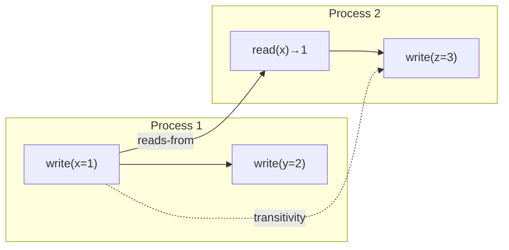
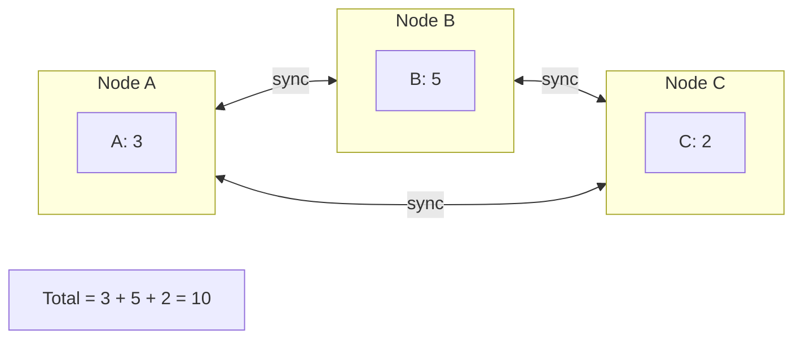
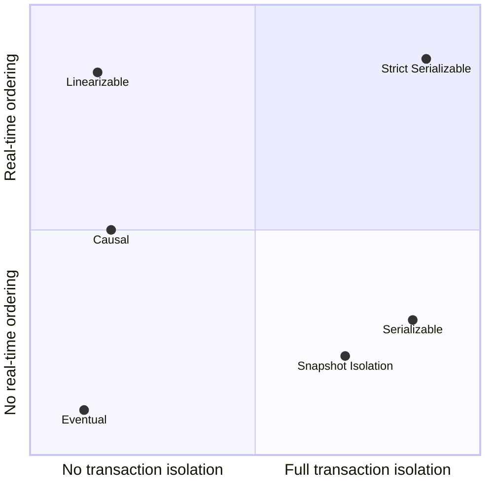
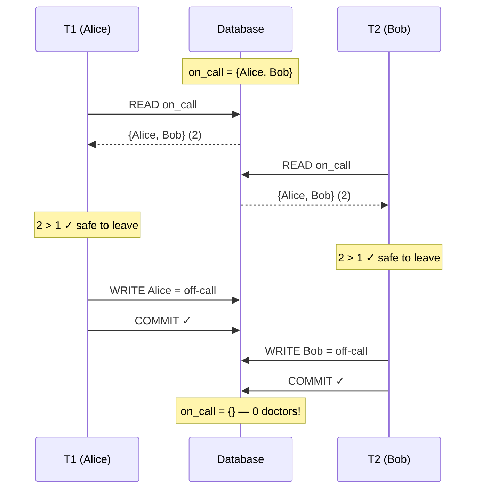
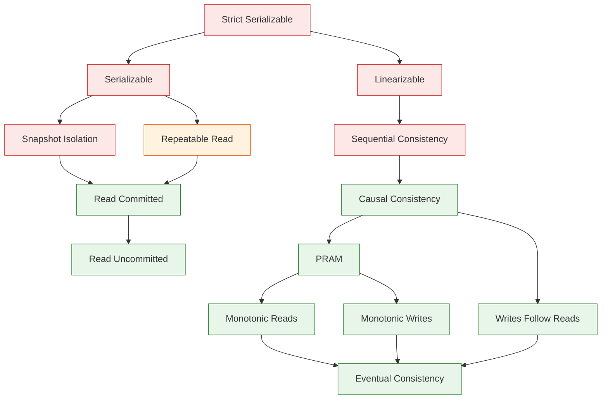
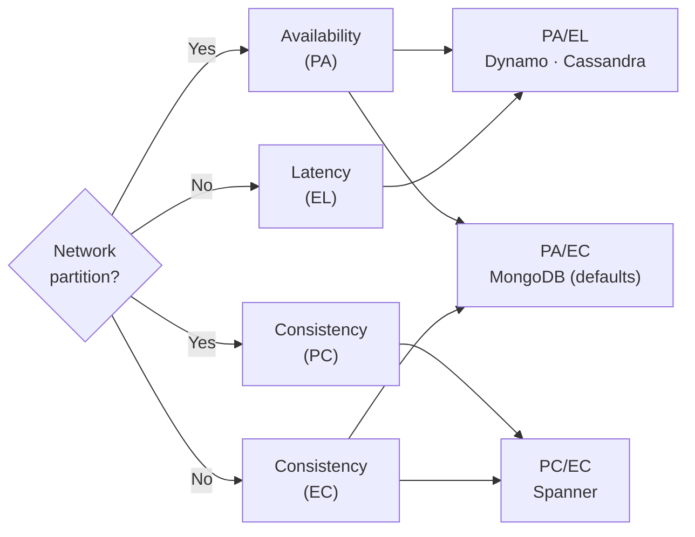
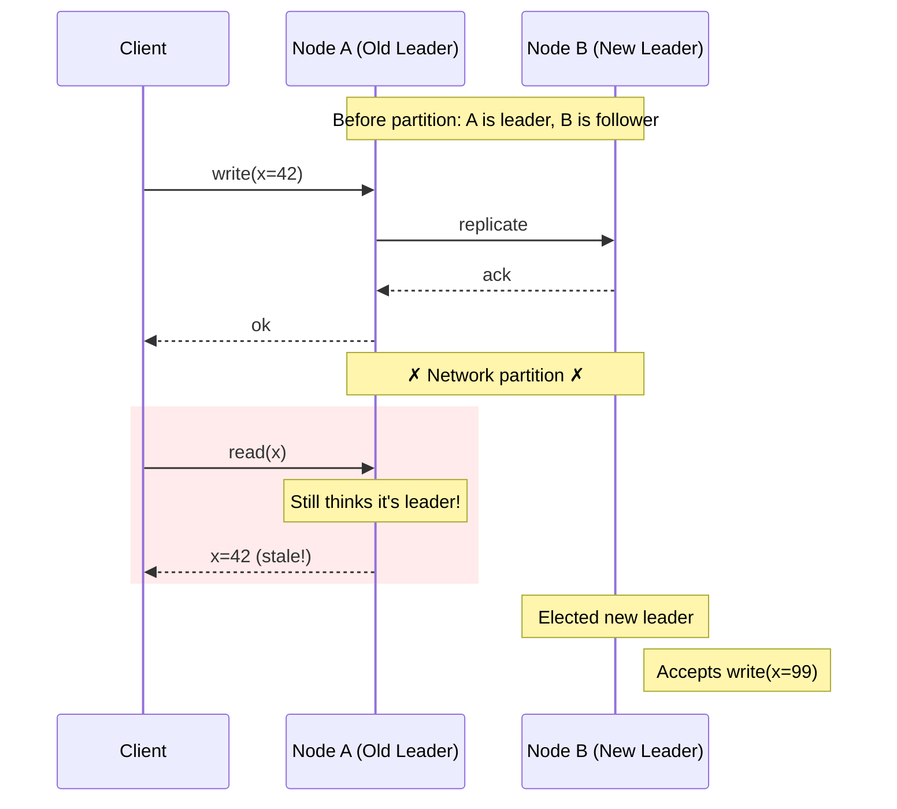
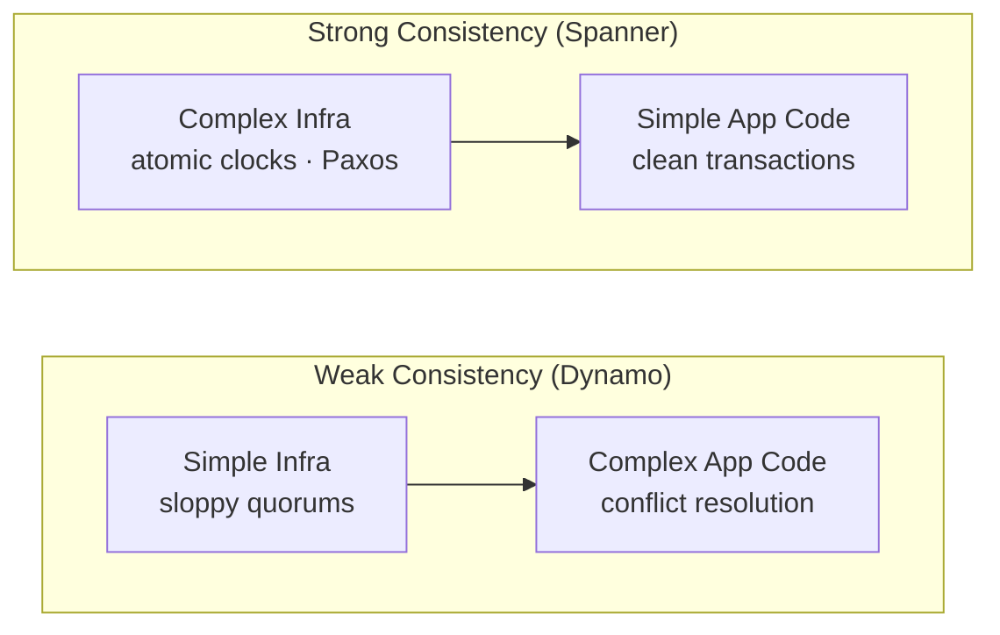
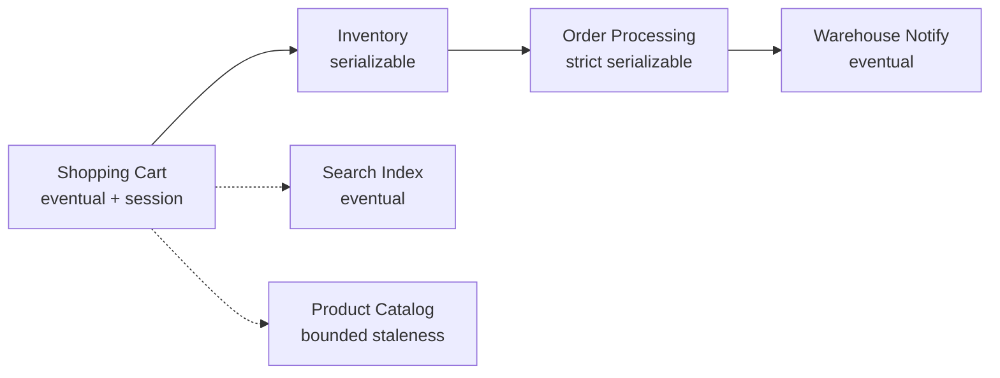

# Consistency Models in Distributed Systems

What your database actually promises — and what it doesn't

<p class="text-secondary" style="margin-top: 1rem; font-size: 1.05rem; max-width: 50ch;">
A first-principles walk through every consistency model, from linearizability to eventual consistency, and how to choose.
</p>

<p class="text-secondary" style="margin-top: 2rem; font-size: 1rem;">
Samuel Thien
</p>

<!--
Welcome. I want to talk about something that most of us use every day but rarely define precisely: consistency. Not "is my data correct?" but rather "what can I observe, and when?" By the end of this talk, you'll have a mental framework for how consistency models relate to each other, and more importantly, you'll know how to choose one for your system.
-->

---

<p class="eyebrow">The Problem</p>

# The Checkout That Broke

You're running an online store. A customer places an order.
Behind the scenes, five things happen:

<v-clicks>

1. **Reserve inventory** <span class="text-secondary">(database write)</span>
2. **Create order record** <span class="text-secondary">(database write)</span>
3. **Charge payment** <span class="text-secondary">(Stripe API call)</span>
4. **Notify warehouse** <span class="text-secondary">(message queue)</span>
5. **Send confirmation email** <span class="text-secondary">(async job)</span>

</v-clicks>

<div v-click class="callout" style="margin-top: 1rem;">
<p>The server crashes after step 3. The customer is charged. The warehouse never got the message. Now multiply this by three replicas across two regions. <strong>Which replica has the truth?</strong></p>
</div>

<!--
Picture this. You're running an online store. A customer places an order. Behind the scenes, five things need to happen. Now: what happens if the server crashes after the payment goes through? The customer is charged, the warehouse never got the message, inventory is still reserved. That's bad enough on a single machine. Now multiply it across three replicas in two regions. Which replica has the "correct" state? Quick show of hands: who has hit something like this in production?
-->

---
layout: center
---

<div class="pull-quote">
When nodes disagree about state, "who is right?" is the wrong question.<br/><br/>
The right question is: <strong>what are the rules?</strong>
</div>

<p v-click style="text-align: center; margin-top: 2rem; color: var(--text-secondary); font-size: 1.05rem;">
The rules are called <strong style="color: var(--accent);">consistency models</strong> — contracts between a system and its clients about which observations are legal.
</p>

<!--
The rules for resolving "who is right" have a precise name: consistency models. A consistency model is a contract. It tells you which sequences of reads and writes are allowed, and which are not. Some contracts are strict. Some are loose. Today, we'll build the full hierarchy from first principles and see what real systems chose and why.
-->

---
layout: section
transition: slide-left
---

# Foundations

<!--
Let's start with the foundation. What is a consistency model, precisely?
-->

---

<p class="eyebrow">Foundations</p>

# What Is a Consistency Model?

A **consistency model** defines which histories a system may legally produce.

<v-clicks>

- A **history** is a sequence of operations (reads, writes) across processes
- Some histories make intuitive sense. Others are bizarre.
- A consistency model draws the line: these histories are legal, those are not.

</v-clicks>

<div v-click class="callout" style="margin-top: 1.5rem;">
<p><strong>Stronger model</strong> = fewer legal histories = more predictable, more expensive<br/>
<strong>Weaker model</strong> = more legal histories = less predictable, cheaper</p>
</div>

<!--
Let's start with the foundation. A consistency model is a set of legal histories. Think of a history as a transcript of every read and write your system performed, across all clients. Some transcripts look reasonable. Others look like time travel. A consistency model draws the boundary: these transcripts are OK, those are bugs. The stronger the model, the fewer legal histories, the more predictable your system — but the more it costs in latency and coordination.
-->

---

<p class="eyebrow">Linearizability</p>

# The Strongest Single-Object Model: Linearizability

Herlihy & Wing, 1990:

> Every operation appears to take effect **atomically** at some point between its **invocation** and its **response**.

<v-clicks>

Three constraints:

1. **Atomicity**: each operation happens at a single instant
2. **Real-time order**: if op A completes before op B starts, A must appear first
3. **Legal sequential spec**: the resulting sequence must be valid for the object

</v-clicks>

<div v-click class="callout" style="margin-top: 1rem;">
<p><strong>Linearizability = single copy + atomic updates + respect real-time order.</strong></p>
</div>

<!--
Here's the anchor for everything else in this talk. Linearizability was defined by Herlihy and Wing in 1990. The intuition is simple: every operation appears to happen at a single instant in time, somewhere between when you sent the request and when you got the response. If operation A finishes before operation B starts, everyone agrees A happened first. The system behaves as if there's exactly one copy of the data, updated atomically. This is what most people mean when they say "strong consistency" — they just don't know the name for it.
-->

---

<p class="eyebrow">Linearizability</p>

# Linearizability: Visualized

<div class="grid grid-cols-2 gap-4" style="margin-top: 1rem;">
<div>

**Linearizable** ✓

<div style="margin-top: 0.75rem; font-family: 'JetBrains Mono', monospace; font-size: 0.78rem; line-height: 2.2;">
<div class="timeline-row">
<span class="timeline-label">Client A</span>
<span class="timeline-bar bar-write" style="width: 45%; margin-left: 5%;">write(x=1)</span>
</div>
<div class="timeline-row">
<span class="timeline-label">Client B</span>
<span class="timeline-bar bar-read-ok" style="width: 40%; margin-left: 15%;">read(x) → 1</span>
</div>
<div class="timeline-row">
<span class="timeline-label">Client C</span>
<span class="timeline-bar bar-read-ok" style="width: 35%; margin-left: 35%;">read(x) → 1</span>
</div>
</div>

B and C both see 1 after A's write takes effect.

</div>
<div>

**NOT Linearizable** ✗

<div style="margin-top: 0.75rem; font-family: 'JetBrains Mono', monospace; font-size: 0.78rem; line-height: 2.2;">
<div class="timeline-row">
<span class="timeline-label">Client A</span>
<span class="timeline-bar bar-write" style="width: 45%; margin-left: 5%;">write(x=1)</span>
</div>
<div class="timeline-row">
<span class="timeline-label">Client B</span>
<span class="timeline-bar bar-read-ok" style="width: 40%; margin-left: 15%;">read(x) → 1</span>
</div>
<div class="timeline-row">
<span class="timeline-label">Client C</span>
<span class="timeline-bar bar-read-fail" style="width: 35%; margin-left: 35%;">read(x) → 0 !</span>
</div>
</div>

C reads 0 **after** B already observed 1. No valid linearization.

</div>
</div>

<div v-click class="callout" style="margin-top: 1rem;">
<p><strong>Once a value is observed by any client, it cannot un-happen for any other client.</strong></p>
</div>

<!--
Let's see this concretely. On the left, client A writes x=1. Client B, overlapping with A, reads x and gets 1. Client C, after B finishes, also reads 1. This is fine — we can place A's effect before B's read. On the right, same setup, but C reads 0 after B already saw 1. This is a linearizability violation. There's no single point in time where we can place A's write that makes both observations legal. Once a value has been observed, it can't be un-observed.
-->

---
layout: center
---

<div class="pull-quote">
"The system behaves like a single copy, updated atomically."
</div>

<p style="text-align: center; margin-top: 1.5rem; color: var(--text-secondary);">
— Herlihy & Wing, 1990
</p>

<!--
Let that sit for a second. This is the gold standard. Every other model we'll see relaxes one of these constraints. The question is always: which constraint do you drop, and what do you get in return?
-->

---

<p class="eyebrow">Sequential Consistency</p>

# What If We Drop Real-Time Order?

**Sequential consistency** (Lamport, 1979):

All operations appear to execute in **some** sequential order, and each process's operations appear in **program order**.

<v-clicks>

But: two concurrent operations can be reordered relative to real time.

| Property | Linearizable | Sequentially consistent |
|---|---|---|
| Per-process order preserved | Yes | Yes |
| Real-time order preserved | Yes | **No** |
| Appears atomic | Yes | Yes |

</v-clicks>

<div v-click class="callout" style="margin-top: 1rem;">
<p>Sequential consistency is linearizability minus the real-time constraint. Cheaper, but allows "time travel" between processes.</p>
</div>

<!--
What if we relax the real-time constraint? That gives us sequential consistency, defined by Lamport in 1979. Operations still appear to execute in some total order, and each process's operations keep their program order. But two operations from different processes can be reordered relative to wall-clock time. So client A writes x=1, then client B reads x=0 — that's legal if we order B's read before A's write in the global sequence. Feels weird, but it's valid. This is what most multi-core CPUs actually provide, by the way.
-->

---

<p class="eyebrow">Causal Consistency</p>

# What If We Only Preserve Causality?

If operation A *could have influenced* operation B, then everyone sees A before B.

But: **concurrent operations** (no causal relationship) can be seen in different orders by different processes.

<v-clicks>

Three rules define "could have influenced":

1. **Same process**: A before B in the same process → A causally precedes B
2. **Reads-from**: B reads a value written by A → A causally precedes B
3. **Transitivity**: A → B and B → C means A → C

</v-clicks>



<div v-click class="callout" style="margin-top: 0.5rem;">
<p>The strongest model achievable with ALPS properties (Available, Low-latency, Partition-tolerant, Scalable) is causal consistency with convergent conflict handling: <strong>Causal+</strong> (COPS, Lloyd et al., 2011).</p>
</div>

<!--
Now let's drop total ordering entirely and keep only causality. If operation A could have influenced operation B — because they're in the same process, or B read something A wrote, or transitively — then everyone must see A before B. But if A and B are truly independent, different clients can see them in different orders. This was formalized in the COPS system from CMU in 2011. They proved that causal+ is the strongest model you can achieve while keeping availability, low latency, partition tolerance, and scalability — the ALPS properties.
-->

---

<p class="eyebrow">Eventual Consistency</p>

# What If We Guarantee... Almost Nothing?

**Eventual consistency**: if no new writes are made, all replicas will *eventually* converge to the same state.

<v-clicks>

What this does **not** specify:

- **When** convergence happens (no time bound)
- **What** intermediate values clients may observe
- **Which** value wins if there are conflicts

</v-clicks>

<div v-click class="callout" style="margin-top: 1.5rem;">
<p>"Eventually consistent" is <strong>not a guarantee</strong>. It is the <strong>absence</strong> of one.</p>
</div>

<!--
Let's drop everything except convergence. Eventual consistency says: stop writing, wait long enough, and all replicas will agree. But it says nothing about when, nothing about what you see in the meantime, and nothing about which value wins if two clients wrote different values. This is not a guarantee in the engineering sense. It's the absence of one. Werner Vogels wrote about this in his 2008 ACM paper — it's a promissory note without a due date.
-->

---

<p class="eyebrow">Eventual Consistency</p>

# CRDTs: Convergence by Construction

**CRDTs (Conflict-free Replicated Data Types)** are data structures designed so all concurrent operations commute. Convergence is **automatic** and **deterministic**: no conflict resolution needed.

<v-clicks>

**G-Counter**: each node maintains its own counter slot. The total is always the sum of all slots. Increments never conflict because nodes only write to their own slot.



Other examples: OR-Set (add/remove sets), LWW-Register (last-writer-wins per cell)

</v-clicks>

<!--
But eventual consistency doesn't have to be useless. CRDTs make it practical by eliminating conflicts by design. Take a G-Counter: each node maintains its own slot in a vector. Node A increments slot A, node B increments slot B. The global count is always the sum of all slots. There's no conflict because nodes only write to their own slot. You don't need conflict resolution because there are no conflicts. OR-Sets work the same way for add/remove operations. LWW-Registers use timestamps to automatically pick a winner. The pattern is the same: design the data structure so concurrent operations commute, and convergence is free.
-->

---

<p class="eyebrow">Eventual Consistency</p>

# Bounded Staleness: Putting a Clock on "Eventually"

Eventual consistency becomes a real guarantee when you bound the lag:

<v-clicks>

**Bounded staleness**: "Replicas lag by at most *k* versions or *t* seconds"

- Spanner offers bounded-staleness reads as a cheaper alternative to linearizable reads
- DynamoDB's DAX cache provides bounded-stale reads within milliseconds
- This turns an open-ended promise into a measurable SLA

**The real spectrum:** not "strong vs eventual" but linearizable → sequential → causal → bounded-stale → eventual

</v-clicks>

<div v-click class="callout" style="margin-top: 1rem;">
<p><strong>The real spectrum is not "strong vs eventual."</strong> It's a rich middle ground: linearizable → sequential → causal → bounded-stale → eventual. CRDTs eliminate conflicts; bounded staleness limits how far behind you can fall. Together, they make eventual consistency usable.</p>
</div>

<!--
The second way to make eventual consistency practical: bound the staleness. Instead of "eventually," you say "within 10 seconds" or "within 5 versions." Spanner offers bounded-staleness reads as a cheaper alternative to linearizable reads. DynamoDB's DAX cache provides reads that lag by single-digit milliseconds. This turns a vague promise into a measurable SLA your operations team can monitor and alert on. The real spectrum isn't strong vs. eventual. There's a rich middle ground, and most production systems live somewhere in it.
-->

---
layout: center
---

<div class="pull-quote">
So far: one object, many observers.
</div>

<p v-click style="text-align: center; margin-top: 1.5rem; color: var(--text-secondary); font-size: 1.1rem;">
But what about operations that touch <strong>multiple objects</strong>?
</p>

<!--
Let's pause. Everything we've discussed so far — linearizability, sequential consistency, causal consistency, eventual consistency — these are all about a single object. One register, one key, one row. But real applications don't touch one row at a time. They transfer money between two accounts. They reserve inventory and create an order. What happens when we need consistency across multiple objects? Remember the checkout scenario from the beginning?
-->

---
layout: section
transition: slide-left
---

# Two Dimensions of Consistency

<!--
Here's the distinction most engineers miss, and most talks gloss over. There are two independent dimensions of consistency.
-->

---
class: dense
---

<p class="eyebrow">Serializability</p>

# Single-Object vs Multi-Object Consistency

<div class="grid grid-cols-[1fr_1.2fr] gap-4" style="margin-top: 0.5rem;">
<div>

**Single-object consistency**
<span class="text-secondary" style="font-size: 0.85rem;">(one key/register)</span>

- Linearizability
- Sequential consistency
- Causal consistency
- Eventual consistency

**Multi-object consistency**
<span class="text-secondary" style="font-size: 0.85rem;">(transactions across keys)</span>

- Serializability
- Snapshot isolation
- Read committed
- Read uncommitted

</div>
<div>



</div>
</div>

<div v-click class="callout" style="margin-top: 0.5rem;">
<p>These are <strong>independent dimensions</strong> that can be combined, not alternatives on the same axis. Most talks and most engineers conflate them.</p>
</div>

<!--
Here's the distinction most engineers miss, and most talks gloss over. There are two independent dimensions of consistency. Linearizability is about a single object and real-time ordering. Serializability is about multiple objects and transaction ordering. A system can be linearizable but not serializable, serializable but not linearizable, both, or neither. Most confusion in this space comes from collapsing these two dimensions into one. Let's unpack the second dimension.
-->

---

<p class="eyebrow">Serializability</p>

# Serializability: Transactions in Some Order

The result of executing transactions concurrently is equivalent to executing them in **some** sequential order.

<v-clicks>

Key distinction from linearizability:

- No real-time constraint — the "some order" can differ from wall-clock order
- Applies to **transactions** (groups of operations), not individual operations
- A transaction that reads A and writes B is atomic

</v-clicks>

<div v-click class="callout" style="margin-top: 1.5rem;">
<p>Serializability guarantees a sequential explanation exists. It doesn't promise <strong>which</strong> sequence, or that it matches wall-clock time.</p>
</div>

<!--
Serializability says: if you ran these transactions concurrently, the result must be explainable by some sequential order. Transaction 1 then 2 then 3, or 3 then 1 then 2 — any order, as long as one exists that produces the observed result. Critically, this order doesn't need to match real time. If transaction A committed at 2pm and transaction B committed at 3pm, the serializable order could place B before A. That's legal. This is why serializability alone isn't enough for some applications.
-->

---

<p class="eyebrow">Snapshot Isolation</p>

# Snapshot Isolation: Almost Serializable

**Snapshot isolation** (Berenson et al., 1995):

<v-clicks>

1. Each transaction reads from a **consistent snapshot** taken at its start
2. Writes are buffered and applied atomically at commit
3. **First-committer-wins**: if two transactions write the same key, the second to commit is aborted

What SI **prevents**: dirty reads, non-repeatable reads, phantom reads, **lost updates**

What SI **allows**: **write skew** — and this is why SI is not serializable

</v-clicks>

<!--
Snapshot isolation is what most production databases actually give you when you ask for "repeatable read." Each transaction gets a frozen snapshot of the database at its start time. It reads from that snapshot, buffers its writes, and commits them atomically. If two transactions wrote the same key, the second one gets rolled back — first-committer-wins. This prevents most anomalies, including lost updates. But it has one blind spot, and it's a subtle one.
-->

---
class: dense
---

<p class="eyebrow">Snapshot Isolation</p>

# The Write Skew Problem

**Setup**: Hospital requires at least one doctor on call. Alice and Bob are both on call.



<v-click>

**Result: 0 doctors on call.** They write to **different rows**, so first-committer-wins never triggers. Each transaction is individually correct; together they break the invariant.

</v-click>

<!--
Here's the scenario. A hospital requires at least one doctor on call. Alice and Bob are both on call. Alice checks: two doctors, safe to leave. Bob checks: two doctors, safe to leave. Alice marks herself off-call and commits. Bob marks himself off-call and commits. Zero doctors on call. Nobody violated a row-level constraint. Nobody wrote the same key. First-committer-wins didn't fire because they wrote different rows. Each transaction was individually reasonable. Together, they broke the system. This is write skew, and it's the reason snapshot isolation is not serializable. Only serializable isolation — or explicit application locking — prevents this.
-->

---

<p class="eyebrow">Strict Serializability</p>

# The Strongest Model: Strict Serializability

**Strict serializability** = Serializability + Linearizability

<v-clicks>

- Transactions execute as if in some sequential order (**serializability**)
- AND that order must respect real-time precedence (**linearizability**)

If transaction A commits before transaction B starts, A appears before B in the serial order. No exceptions.

This is what Google Spanner calls **external consistency**.

| Model | Single-object real-time | Multi-object serial order | Both |
|---|---|---|---|
| Linearizable | Yes | — | — |
| Serializable | — | Yes | — |
| **Strict serializable** | **Yes** | **Yes** | **Yes** |

</v-clicks>

<!--
Now we can define the strongest model in the entire hierarchy. Strict serializability combines both dimensions: transactions appear to execute in a sequential order (serializability), and that order respects real-time precedence (linearizability). If transaction A committed at 2pm and transaction B started at 3pm, A must come before B in the serial order. This is what Google calls "external consistency" in the Spanner paper. It's the gold standard. It's also expensive to implement at global scale, which is why most systems don't provide it.
-->

---
layout: center
---

<div class="pull-quote">
Linearizable is about objects.<br/>
Serializable is about transactions.<br/>
Strict serializable is about both.
</div>

<!--
Let that distinction sink in. Linearizable: single object, real time. Serializable: multiple objects, some order. Strict serializable: multiple objects, real-time order. Two independent axes, one combined model at the top.
-->

---
layout: section
transition: slide-left
---

# The Session Layer

<!--
Before we see the full picture, I want to name something most talks skip: consistency exists at three independent layers.
-->

---

<p class="eyebrow">Session Guarantees</p>

# Three Layers of Consistency

<v-clicks>

**Layer 1: System-level** — what the database guarantees globally
<span class="text-secondary">"All reads reflect the latest committed write" (linearizable)</span>
<span class="text-secondary">"All replicas converge" (eventually consistent)</span>

**Layer 2: Session-level** — what a single client connection sees
<span class="text-secondary">"You always see your own writes" (read-your-writes)</span>
<span class="text-secondary">"Values never go backward" (monotonic reads)</span>

**Layer 3: Application-level** — what the developer must enforce
<span class="text-secondary">"The sum of debits equals the sum of credits" (invariant)</span>
<span class="text-secondary">"Only one winner per auction" (constraint)</span>

</v-clicks>

<div v-click class="callout" style="margin-top: 1rem;">
<p>A system with weak system-level consistency can still provide strong session guarantees. <strong>These layers are independent.</strong></p>
</div>

<!--
Before we see the full picture, I want to name something most talks skip: consistency exists at three independent layers. The system layer is what the database guarantees globally. The session layer is what a single client connection sees — and these can be stronger than the system guarantee. The application layer is what the developer must enforce on top. A system with eventual consistency at the system level can still provide read-your-writes at the session level and enforce business invariants at the application level. These layers compose.
-->

---

<p class="eyebrow">Session Guarantees</p>

# Session Guarantees (Terry et al., 1994)

Four session-level guarantees, each independent:

<v-clicks>

**Read Your Writes**: a read following a write in the same session always reflects that write (or a later one)

**Monotonic Reads**: successive reads in a session never return older values — time doesn't go backward

**Monotonic Writes**: writes from a session are applied in the order they were issued

**Writes Follow Reads**: a write that follows a read in a session is ordered after the value that was read

</v-clicks>

<div v-click class="callout" style="margin-top: 1rem;">
<p>Cheap to implement (sticky sessions, version vectors) and dramatically improve developer experience on eventually-consistent systems.</p>
</div>

<!--
Terry, Demers, Petersen, Spreitzer, and Theimer defined these in 1994. Four guarantees, each independent. Read-your-writes is the most common — you post a comment, you immediately see your comment. Monotonic reads means values never go backward; you don't see a newer balance and then an older one. Monotonic writes means your writes apply in order. Writes follow reads ensures causal ordering within a session. These are cheap — sticky sessions or version vectors are usually enough. And they make eventually-consistent systems actually usable for end users.
-->

---
layout: center
---

<div class="pull-quote">
The system guarantees X.<br/>
The session guarantees Y.<br/>
The developer enforces Z.
</div>

<!--
Three layers. Independent knobs. The strongest system guarantee in the world doesn't help if your application logic has a race condition in the business constraint layer. And a weak system guarantee is perfectly fine if your session guarantees cover what users actually observe. Keep this in mind as we see the full picture.
-->

---
layout: section
transition: slide-left
---

# The Hierarchy

<!--
Now we can see the full picture. Every model in one diagram.
-->

---
class: dense
---

<p class="eyebrow">The Hierarchy</p>

# The Consistency Hierarchy

<p style="font-size: 0.8rem; color: var(--text-secondary); margin-bottom: 0.25rem;">Adapted from Jepsen / Bailis, Davidson, Fekete et al. — arrows show implication (higher implies lower).</p>



<p style="font-size: 0.8rem; margin-top: 0.25rem;">
<span style="color: #d32f2f;">■</span> Unavailable under partition &nbsp;&nbsp;
<span style="color: #e65100;">■</span> Depends on implementation &nbsp;&nbsp;
<span style="color: #2e7d32;">■</span> Available under partition
</p>

<!--
Here it is. The full hierarchy. On the right: single-object models, from linearizable down to eventual. On the left: transaction models, from serializable down to read uncommitted. At the top, strict serializability combines both. Every model below is a specific constraint that was dropped. The green-shaded models are available under partition — notice how they're all in the lower half. This is from Jepsen's consistency page. It maps every model we've discussed and shows how they relate. Worth bookmarking. Take a photo if you want — you'll want this at your desk.
-->

---
layout: center
---

<div class="pull-quote" style="font-style: normal; font-size: 1.5rem;">
Every consistency model is defined by the constraint it drops.
</div>

<div v-click style="text-align: center; margin-top: 2rem; font-size: 1.05rem; line-height: 2.2;">

Drop real-time order → **sequential consistency**

Drop total order → **causal consistency**

Drop causal order → **eventual consistency**

Drop cross-key atomicity → **snapshot isolation**

Drop real-time + cross-key → **most production databases**

</div>

<!--
Here's the frame. You don't need to memorize a taxonomy. You need to understand one model — strict serializability — and then understand what you lose when you relax each constraint. Each relaxation buys you something: lower latency, higher availability, simpler implementation. Each costs you something: a specific anomaly you now have to handle in application code. The rest of this talk is about what real systems chose to drop, why, and what broke.
-->

---

<p class="eyebrow">The Hierarchy</p>

# What This Hierarchy Does NOT Mean

<v-clicks>

**"Linearizable" does NOT mean "serializable"**
They are independent dimensions. Linearizability is about one object in real time. Serializability is about transactions across objects. You can have either without the other.

**"CAP" does NOT mean "pick 2 of 3"**
Partitions are not optional. CAP says: *during* a partition, choose availability or consistency. Outside partitions, you make a different trade-off (latency vs. consistency).

**"Eventually consistent" does NOT mean "inconsistent"**
It means the timing of convergence is unspecified. With CRDTs or bounded staleness, eventual consistency can be a precise, useful guarantee.

</v-clicks>

<!--
Before we move on, three things this hierarchy does not mean. First: linearizable does not mean serializable. I've seen senior engineers use them interchangeably. They're not. Linearizability is about one object in real time. Serializability is about transactions across objects. Second: CAP does not mean pick 2 of 3. Partitions happen. CAP is about what you do during one. We'll correct this properly in a few slides. Third: eventually consistent does not mean broken or inconsistent. It means the timing is unspecified. With the right tooling — CRDTs, bounded staleness — it becomes a precise guarantee.
-->

---
layout: section
transition: slide-left
---

# Real Systems, Real Choices

Every consistency choice was forced by a specific production failure.

Not academic preference. Operational necessity.

<!--
Now let's ground all this theory in production. Every system we're about to look at chose its consistency model because something broke. Not because someone read a paper and thought "this sounds elegant." Because actual money was lost, or actual users couldn't check out. The question for each system: what broke, for whom, at what scale?
-->

---
class: dense
---

<p class="eyebrow">Amazon Dynamo</p>

# Amazon Dynamo (2007): Availability Over Everything

<v-clicks>

**The problem**: Amazon's peak shopping season. Every 100ms of added latency cost 1% of sales. A database that rejected writes during a network partition meant customers couldn't add to cart.

**The choice**: Eventual consistency with client-side conflict resolution.

**The mechanism**:
- Sloppy quorum: writes are accepted by any N healthy nodes, even if they're not the designated replicas for that key. Writes always succeed, even during partition.
- Vector clocks (per-key version vectors) track causal history across replicas
- Conflicting versions pushed to application layer ("add to cart" merges via union)

**The trade-off**: Developers must handle conflicts. Shopping cart: easy (union of items). Payment processing: impossible (you can't "merge" two charges).

</v-clicks>

<p v-click style="font-size: 0.85rem; color: var(--text-secondary); margin-top: 0.5rem;">DeCandia et al., SOSP 2007</p>

<!--
2007. Amazon's holiday season. Every 100ms of added latency cost 1% of revenue. Traditional databases rejected writes during partitions — customers couldn't add to cart. Unacceptable. So they built Dynamo. The core choice: writes always succeed. If replicas diverge, both versions are kept and the application resolves later. Shopping cart? Union of items — easy. Payment processing? A nightmare. This is why Dynamo was only used for specific services at Amazon.
-->

---
class: dense
---

<p class="eyebrow">Google Spanner</p>

# Google Spanner (2012): The Price of Weak Consistency at Scale

<v-clicks>

**The problem**: Google Ads ran on sharded MySQL. Cross-shard transactions required manual two-phase commit at the application layer. Weaker consistency meant ad budgets could overspend or ads could serve after campaigns ended.

**The choice**: External consistency (= strict serializability) via TrueTime.

**The mechanism**:
- Atomic clocks + GPS receivers in every data center
- TrueTime API returns an interval [earliest, latest] instead of a single timestamp
- Commit wait: delay commits by the uncertainty interval (~7ms average)
- Paxos (consensus protocol for keeping replicas in sync) replication runs during the wait, so it's not wasted time

**The trade-off**: ~7ms commit latency floor. Custom hardware. Acceptable for Ads (billions in revenue depend on correctness).

</v-clicks>

<p v-click style="font-size: 0.85rem; color: var(--text-secondary); margin-top: 0.25rem;">Corbett et al., OSDI 2012</p>

<!--
2012. Google Ads ran on sharded MySQL. Weaker consistency meant ad budgets could overspend — two shards each think there's $500 left and both approve. At Google's scale, this was real money. The key innovation: TrueTime. Instead of pretending clocks are perfectly synchronized, they quantify uncertainty. Atomic clocks and GPS keep it under 7 milliseconds. You wait 7ms during commit and get globally consistent transactions. For a business processing billions in ad spend, 7ms is nothing.
-->

---

<p class="eyebrow">CockroachDB</p>

# CockroachDB: Serializable by Default

<v-clicks>

**The problem**: PostgreSQL defaults to Read Committed. Most applications assume serializable behavior. Write skew bugs are silent and rare enough to escape testing — but catastrophic when they hit production.

**The choice**: Serializable isolation as the default. Opt down, don't opt up.

| | PostgreSQL | CockroachDB |
|---|---|---|
| Default isolation | Read Committed | **Serializable** |
| Write skew prevention | Only at SERIALIZABLE | **Always** |
| Transaction retry | Rare | More frequent |
| Developer burden | Must know to opt up | Must know to opt down |

**The philosophy**: Correct by default. Performance tuning is opt-in.

</v-clicks>

<!--
CockroachDB took a different bet. PostgreSQL defaults to Read Committed. That means the doctor write skew scenario we saw earlier? It happens silently. Most apps never test for it because it's rare — it requires exact concurrency timing. But when it hits production, it's catastrophic. CockroachDB said: default to Serializable. If the doctor scenario occurs, CockroachDB retries one transaction. The developer never writes conflict-handling code. The trade-off? More transaction retries, slightly more latency. But no silent invariant violations. This is a philosophical stance: correct by default, optimize explicitly.
-->

---
class: dense
---

<p class="eyebrow">Real Systems</p>

# Write Skew in SQL: What It Actually Looks Like

<div class="grid grid-cols-2 gap-4" style="margin-top: 0.5rem;">
<div>

**PostgreSQL (Read Committed) — breaks silently**

```sql
-- Both sessions run concurrently:
BEGIN;
SELECT count(*) FROM doctors
  WHERE on_call = true; -- → 2
UPDATE doctors SET on_call = false
  WHERE name = 'Alice'; -- (or Bob)
COMMIT; -- Both succeed
-- Result: 0 doctors on call!
```

</div>
<div>

**CockroachDB (Serializable) — caught automatically**

```sql
-- Same SQL, same timing:
ERROR: restart transaction
  REASON: WriteTooOld

-- One transaction retried.
-- Invariant preserved:
-- 1 doctor remains on call.
```

</div>
</div>

<div v-click class="callout" style="margin-top: 0.5rem;">
<p><strong>Same application code, different database defaults, opposite outcomes.</strong> The isolation level is not an optimization knob — it's a correctness knob.</p>
</div>

<!--
Here's what write skew looks like in real SQL. Two sessions, same code. In PostgreSQL at Read Committed, both transactions read the count, both see 2, both proceed, both commit. Zero doctors on call. The database never raised an error. In CockroachDB, same SQL, same timing, but the database detects the read-write conflict and restarts one transaction. The invariant is preserved. Same application code, different outcomes. The isolation level isn't a performance dial you tune later. It's a correctness dial, and the default setting matters.
-->

---
class: dense
---

<p class="eyebrow">CAP vs PACELC</p>

# PACELC: The Trade-off That Actually Matters

<v-clicks>

**CAP** (Brewer, 2000; Gilbert & Lynch, 2002): During a **network partition**, choose **availability** or **consistency**.

What CAP does **not** say:
- It does NOT apply during normal operation
- It is NOT "pick 2 of 3" — you always get P (partitions happen)
- It does NOT address latency at all

**PACELC** (Abadi, 2012): If **Partition** → choose **A** or **C**. Else → choose **L**atency or **C**onsistency.



</v-clicks>

<div v-click class="callout" style="margin-top: 0.5rem;">
<p><strong>CAP tells you what happens when things break. PACELC tells you what happens every single request.</strong></p>
</div>

<!--
Now let's correct a widespread misconception. CAP is probably the most misquoted theorem in our industry. CAP says: during a network partition, choose availability or consistency. That's it. It says nothing about normal operation. It's not "pick 2 of 3" — partitions happen whether you pick them or not. And it says nothing about latency. Abadi's PACELC fixes this. It adds the "Else" clause: when there's no partition, you still make a trade-off — latency versus consistency. This is the trade-off you make on every single request, not just during rare failure scenarios. PACELC is the framework you should actually use.
-->

---
layout: center
---

<div class="pull-quote">
CAP is about once-a-year disasters.<br/>
PACELC is about every request.
</div>

<!--
Rhetorical pause. Next time someone mentions CAP in a design review, ask them: what's your Else clause? What trade-off are you making on every request when the network is fine? That's where the real design decisions live.
-->

---
layout: section
transition: slide-left
---

# Failure Modes in Production

Theory tells you what can go wrong.

Production tells you what **will** go wrong.

<!--
Theory tells you which anomalies are possible. Let's look at the ones that actually happen in production, and why they're non-obvious.
-->

---
class: dense
---

<p class="eyebrow">Failure Modes</p>

# Stale Reads After Leader Failover

A Raft-based system (etcd, Consul) claims linearizability. A network partition isolates the leader.



<div v-click class="callout" style="margin-top: 0.5rem;">
<p>A node can believe it's the leader while serving stale data. <strong>Linearizable reads require quorum verification on every read.</strong> Found by Jepsen testing etcd 0.4.1 and Consul.</p>
</div>

<!--
This one has bitten real systems. etcd and Consul both use Raft for consensus and both claim linearizability. But Jepsen found that when a network partition isolates the leader, the old leader doesn't immediately know it's been deposed. It continues serving reads to clients connected to it. Those reads are stale — the new leader may have accepted writes that the old leader hasn't seen. This was found by Kyle Kingsbury in his Jepsen testing of etcd 0.4.1. The fix? Linearizable reads must verify the leader still holds authority — via quorum reads or lease-based verification. etcd 3.0 made this the default, but the earlier version silently served stale data.
-->

---

<p class="eyebrow">Failure Modes</p>

# Read Skew vs Write Skew

<div class="grid grid-cols-2 gap-4" style="margin-top: 1rem;">
<div>

**Read Skew**

Transaction reads multiple related values at different points in time, seeing an inconsistent combination.

```text
T1: READ balance_a → $500
    (T2 transfers $100: a→b)
T1: READ balance_b → $600
T1 sees total = $1100
Actual total = $1000
```

Prevented by: **Repeatable Read** and above

</div>
<div>

**Write Skew**

Two transactions read shared state, then write to disjoint keys, together violating an invariant.

```text
T1: READ doctors_on_call → 2
T2: READ doctors_on_call → 2
T1: WRITE alice = off_call
T2: WRITE bob = off_call
Result: 0 doctors on call
```

Prevented by: **Serializable** only

</div>
</div>

<div v-click class="callout" style="margin-top: 1rem;">
<p><strong>Read skew is a stale snapshot. Write skew is a logical race condition.</strong> Different anomalies, different cures.</p>
</div>

<!--
Two anomalies that sound similar but require different solutions. Read skew: you read two related values at different points in time and see an impossible combination. The account balance example — total looks wrong because one read happened before a transfer and one after. Repeatable Read fixes this by pinning your reads to a snapshot. Write skew is subtler: two transactions read the same condition, both decide it's safe to proceed, and write to different keys. Together they violate an invariant. Only Serializable isolation prevents write skew, because it's not a row-level conflict — it's a logical conflict.
-->

---

<p class="eyebrow">Failure Modes</p>

# The Cost of Linearizability

Linearizable operations must reflect **global state**. Every linearizable read must verify it's seeing the latest write.

<v-clicks>

Three implementation strategies:

| Strategy | Latency | Throughput | Example |
|---|---|---|---|
| Quorum reads | 1 RTT to majority | Low | etcd (default) |
| Leader reads with lease | ~0 (lease valid) | High | ZooKeeper |
| TrueTime | ~7ms commit wait | Medium | Spanner |

**The fundamental cost**: linearizability requires coordination. Coordination requires communication. Communication has latency.

At geo-distributed scale (100ms+ RTT between regions), linearizable reads add 50-100ms per read. Bounded-staleness reads add ~0ms but may be milliseconds behind.

</v-clicks>

<!--
Every model has a cost. Linearizability's cost is coordination. Every linearizable read must verify it's seeing the most recent write. Three strategies: quorum reads (ask a majority, take the latest — one round trip), leader reads with leases (fast if the lease is valid, but leases can expire at inconvenient times), or TrueTime (wait for clock uncertainty to pass). At geo-distributed scale, this is real: 100ms round-trip between US East and Europe means every linearizable read adds 50-100ms. Bounded-staleness reads — "give me data from the last 10 seconds" — are essentially free but may be slightly behind. The question isn't "is linearizability good?" It's "can my application tolerate the latency?"
-->

---
layout: center
---

<div class="pull-quote">
Complexity doesn't disappear. It migrates.
</div>

<div v-click>



<p style="text-align: center; margin-top: 1rem; color: var(--text-secondary); font-size: 1.05rem;">
The complexity is the same. The address is different.
</p>
</div>

<!--
This is the meta-lesson. You can't eliminate the fundamental complexity of distributed consistency. You can only choose where to put it. Dynamo said: the infrastructure is simple, sloppy quorums, but application developers must handle conflict resolution. Spanner said: the infrastructure is complex, atomic clocks, GPS receivers, commit waits, but application developers get clean serializable transactions. Same total complexity. Different organizational address. Choose based on where your team has more capacity for complexity.
-->

---
layout: section
transition: slide-left
---

# Where the Field Is Heading

Everything so far was settled science by 2014.

Three new questions emerged.

<!--
Everything we've covered — the hierarchy, the systems, the failure modes — that body of work was largely complete by 2014. The most recent paper in our reading list so far is Bailis et al. from that year. But the field didn't stop. Three big questions opened up: When is coordination actually necessary? How do you verify a database's consistency claims? And can we let developers mix consistency models safely within a single program? Let's look at what happened next.
-->

---
class: dense
<!-- optional: cut for 45-min version -->
---

<p class="eyebrow">The Frontier</p>

# The Research Timeline

<div style="margin-top: 0.5rem;">

**1979–2014: Defining the hierarchy**

<div style="font-family: 'JetBrains Mono', monospace; font-size: 0.75rem; line-height: 1.8; margin: 0.5rem 0;">
Lamport '79 → Herlihy & Wing '90 → Berenson '95 → CAP '00 → Dynamo '07 → Spanner '12 → PACELC '12 → HATs '14
</div>

</div>

<v-clicks>

**2018–2025: Three new frontiers**

<div style="font-size: 0.88rem; line-height: 2;">

| Frontier | Key work | Question answered |
|---|---|---|
| **Theory** | CALM Theorem '19 → Keep CALM & CRDT On '22 → No-Op '25 | When is coordination necessary? |
| **Verification** | Elle '21 → Jepsen finds MySQL / MariaDB / RDS bugs '23–'25 | Does your database keep its promises? |
| **Systems** | Calvin → Anna → MixT → Hydro → Aurora DSQL → Durable Objects | Can we mix models safely per-operation? |

</div>

</v-clicks>

<div v-click class="callout" style="margin-top: 0.75rem;">
<p>The field shifted from <strong>defining</strong> consistency models to <strong>automating the choice</strong> between them.</p>
</div>

<!--
Here's the timeline. The first era, 1979 to 2014, was about defining the models and building the hierarchy we just walked through. From 2018 onward, three frontiers opened. First, theory: the CALM theorem gave us a computable answer to "when do I need coordination?" Second, verification: Elle and Jepsen gave us tools to check whether databases actually provide what they claim. Third, systems: new architectures that let you mix consistency levels per-operation, with compilers checking safety. Let's unpack each one.
-->

---

<p class="eyebrow">The Frontier</p>

# CALM Theorem: When Is Coordination Necessary?

Hellerstein & Alvaro (formalized 2019, CACM 2020):

> A program has a consistent, coordination-free distributed implementation **if and only if** it is monotonic.

<v-clicks>

**Monotonic** = only adds information, never retracts. Sets that grow, counters that increase, logs that append.

**Non-monotonic** = requires negation, aggregation, or thresholds. "At most 5 items," "no duplicates," "exactly one winner."

| | CAP / PACELC | CALM |
|---|---|---|
| What it tells you | The trade-off exists | Whether the trade-off applies to **your** program |
| Granularity | System-wide | Per-computation |
| Actionable? | Choose a side | Refactor to avoid coordination |

</v-clicks>

<div v-click class="callout" style="margin-top: 0.5rem;">
<p>Extended by "Keep CALM and CRDT On" (VLDB 2023): monotonicity results apply to CRDT <strong>queries</strong>, not just updates. You can read from CRDTs without coordination too — if your query is monotone.</p>
</div>

<!--
This is the biggest theoretical advance since CAP. CAP and PACELC tell you that a trade-off between consistency and availability exists. But they don't tell you whether YOUR specific program needs to make that trade-off. CALM does. If your computation is monotonic — it only adds information and never retracts — you can distribute it without coordination and still get consistency. Think about it: a G-Counter is monotonic. A growing set is monotonic. An append-only log is monotonic. These are exactly the structures that work well without coordination, and CALM tells you why. The 2023 extension is equally important: it applies the same logic to CRDT reads, not just writes.
-->

---
class: dense
---

<p class="eyebrow">The Frontier</p>

# Elle and the Verification Gap

The gap between what databases **claim** and what they **provide** is still real. Elle (Kingsbury & Alvaro, VLDB 2021) made it mechanically testable.

<v-clicks>

**Elle**: a black-box transactional consistency checker. Sound (no false positives), near-linear time, finds real bugs. Infers Adya-style dependency graphs from observed histories.

**Recent Jepsen findings** (2023–2025):

| System | Year | Finding |
|---|---|---|
| MySQL 8.0.34 | 2023 | Violates SERIALIZABLE on AWS RDS |
| MariaDB Galera | 2025 | Loses committed transactions during crashes |
| RDS PostgreSQL 17.4 | 2025 | Long Fork anomalies; may only provide Parallel SI |
| NATS 2.12.1 | 2025 | Data loss from lazy fsync (flush every 2 min) |

</v-clicks>

<div v-click class="callout" style="margin-top: 0.15rem;">
<p><strong>The claimed-vs-actual gap is not academic.</strong> These are production databases. Read the Jepsen analysis for yours.</p>
</div>

<!--
Remember when I said the Jepsen consistency page was worth bookmarking? Here's why. Elle, published in 2021, gave Jepsen a principled way to detect transactional isolation anomalies from observed histories, with no false positives. And the findings keep coming. MySQL violating SERIALIZABLE at the SERIALIZABLE level. MariaDB Galera losing committed transactions. Amazon's own RDS PostgreSQL showing Long Fork anomalies that suggest it only provides Parallel Snapshot Isolation, not true Snapshot Isolation. These aren't theoretical attack vectors. These are findings from the last two years, on systems you're probably running right now.
-->

---

<p class="eyebrow">The Frontier</p>

# CRDTs Go Mainstream: Local-First Software

CRDTs moved from academic curiosity to production infrastructure. The **local-first** manifesto (Kleppmann et al., 2019) made "offline-first, sync later" a first-class architecture.

<v-clicks>

**What changed:**

- **Automerge 3.0**: Rust/WASM core. 10x memory reduction. A 200,000-edit document loads in under 4 seconds.
- **Fugue** (2023): first replicated list algorithm that prevents text interleaving — a previously unnoticed corruption bug in collaborative editing.
- **ConflictSync** (2025): 18x reduction in CRDT sync bandwidth via digest-driven reconciliation.
- **Blocklace** (2024): CRDTs extended to Byzantine fault tolerance — a CRDT that works even when nodes lie.

**Industry adoption**: Figma, Linear, and Notion all use CRDT-inspired approaches for real-time collaboration.

</v-clicks>

<div v-click class="callout" style="margin-top: 0.5rem;">
<p>CRDTs are no longer a theory slide. They're the consistency model powering the tools you use every day.</p>
</div>

<!--
Remember the G-Counter slide earlier? CRDTs have come a long way since then. The local-first manifesto in 2019 argued that your data should live on your device first, and sync to the cloud second. CRDTs are what make that work. Automerge 3.0 — a Rust and WebAssembly implementation — can load a document with 200,000 edits in under 4 seconds. Fugue solved a subtle bug nobody had noticed: when two users type at the same position concurrently, previous algorithms could interleave their characters. ConflictSync cut sync bandwidth by 18x. And Blocklace extended CRDTs to handle Byzantine nodes. But the real story is industry adoption. Figma's multiplayer is built on CRDT ideas. So is Linear. So is Notion. Quick show of hands: who uses at least one of those tools?
-->

---
layout: center
---

<div class="pull-quote">
The tools you use daily — Figma, Linear, Notion — already chose eventual consistency with CRDTs.<br/><br/>
The frontier is making that choice <strong>automatic</strong>.
</div>

<!--
Pause. The first half of this frontier section was about what changed — verification got serious, CRDTs went mainstream. The second half is about what's coming: systems that choose the consistency model for you. Let's look at three approaches.
-->

---
<!-- optional: cut for 45-min version -->
---

<p class="eyebrow">The Frontier</p>

# Deterministic Ordering: A Third Path

Dynamo resolves conflicts **after** they happen. Spanner prevents conflicts **with clocks**. Calvin orders transactions **before** execution.

<v-clicks>

**Calvin protocol** (Thomson et al., SIGMOD 2012):

1. Batch incoming transactions into time windows
2. Replicate the batch via consensus (one round trip)
3. Every replica executes the same transactions in the same deterministic order

**Result**: strict serializability without atomic clocks, GPS, or distributed locking.

**Trade-off**: you must declare read/write sets upfront. Interactive transactions (read, think, write) are expensive because the system can't slot them into the global order until it knows what they'll touch.

FaunaDB built on Calvin and achieved Jepsen-verified strict serializability — proving the protocol works in production. The protocol continues to influence newer deterministic database designs.

</v-clicks>

<!--
Three approaches to strong consistency: Dynamo resolves conflicts after, Spanner prevents them with TrueTime, Calvin eliminates them by deciding the order before anything executes. Batch transactions, replicate via consensus, every replica executes the same order. One consensus round per batch, not per transaction. Strict serializability without atomic clocks. The catch: you need to declare read/write sets upfront. Interactive transactions are expensive. FaunaDB built on this protocol and Jepsen confirmed it delivered strict serializability.
-->

---
<!-- optional: cut for 45-min version -->
---

<p class="eyebrow">The Frontier</p>

# Mixed Consistency: Per-Operation Choice

The frontier: choose consistency **per operation**, with the compiler checking safety.

<v-clicks>

**MixT** (Milano & Myers, PLDI 2018):

Mix consistency levels within a single transaction. Compile-time information-flow analysis ensures weak data can't influence strong decisions. If your shopping cart is eventually consistent and your inventory is serializable, MixT prevents cart data from leaking into inventory checks.

**Hydro Project** (Berkeley, 2023–present):

A Rust framework that uses the CALM theorem at **compile time**. Lattice types in the Rust type system flag which operations need coordination. If your code is monotonic, Hydro compiles it without coordination. If it's not, you get a type error.

</v-clicks>

<div v-click class="callout" style="margin-top: 1rem;">
<p>Instead of choosing one consistency model for your database, <strong>your compiler tells you which operations need coordination and which don't.</strong></p>
</div>

<!--
This is where I think the field is headed. Remember the e-commerce slide where we used five different consistency models in one system? That's the right architectural instinct, but it's entirely manual today. MixT, from Cornell, lets you mix consistency levels within a single transaction and uses information-flow analysis to prevent weak data from contaminating strong decisions. Hydro, from Berkeley, goes further: it uses the CALM theorem at compile time to determine which parts of your program need coordination. Monotonic code compiles without coordination. Non-monotonic code gets flagged. Consistency requirements become type errors, not runtime surprises.
-->

---
<!-- optional: cut for 45-min version -->
---

<p class="eyebrow">The Frontier</p>

# Edge Computing Changes the Consistency Game

Edge platforms redefine the trade-off by moving compute to where data lives:

<v-clicks>

**Cloudflare Durable Objects** (2024 GA):
Single-threaded actors with embedded SQLite. Code runs where data is stored — zero network hop for reads and writes. Strong consistency within each object. Eventual consistency between objects.

**Aurora DSQL** (AWS, 2024):
Disaggregates query processing, transaction ordering, and storage into separate scalable components. Optimistic concurrency control with MVCC across regions.

</v-clicks>

<div v-click class="callout" style="margin-top: 1rem;">
<p><strong>The emerging pattern: partition data into small strongly-consistent units, accept weaker consistency between units.</strong> This is the consistency analog of microservices — strong local, weak global.</p>
</div>

<!--
Edge computing is changing the consistency conversation in a fundamental way. Cloudflare Durable Objects give you a single-threaded actor with embedded SQLite. Your code runs literally where your data lives — not across a network, not even across a process boundary. Within that object, you get strong consistency for free because there's no replication to worry about. Between objects, you accept eventual consistency. Aurora DSQL takes a different approach: disaggregate everything. Query processing, transaction ordering, and storage are separate components that scale independently. The pattern is the same in both cases: small strongly-consistent units, weaker consistency between them. If this reminds you of the "multiple consistency models in one system" slide from earlier, good — it's the same insight, built into the platform.
-->

---
layout: center
---

<div class="pull-quote">
2014: We defined all the consistency models.<br/><br/>
2025: We're learning which ones you actually need — and building compilers that figure it out for you.
</div>

<!--
Let that sit for a second. The first era was about taxonomy — naming and ordering the models. The era we're in now is about automation. CALM tells you when coordination is necessary. Elle tells you if your database keeps its promises. Hydro tells you at compile time which operations need coordination. The field is converging on a future where consistency violations are caught before deployment, not discovered in production.
-->

---
layout: section
transition: slide-left
---

# How to Choose

A decision framework, not a recommendation.

<!--
We've covered the models, the hierarchy, the real systems, and the failure modes. Now the practical question: given YOUR system, how do you choose? I'm going to give you a decision framework, not a recommendation, because the right answer depends on variables only you know.
-->

---

<p class="eyebrow">Choosing Your Model</p>

# Start From Your Invariants

Don't ask: "which consistency model should I use?"

Ask: **"what invariants must my system never violate?"**

<v-clicks>

**Financial invariant**: "Account balance never goes negative"
→ Needs serializability (cross-object constraint)

**Availability invariant**: "Users can always add to cart"
→ Tolerates eventual consistency (conflicts are mergeable)

**Ordering invariant**: "Messages appear in send order"
→ Needs causal consistency (causality must be preserved)

**Recency invariant**: "Config changes take effect within 10 seconds"
→ Needs bounded staleness (timed convergence guarantee)

</v-clicks>

<div v-click class="callout" style="margin-top: 0.5rem;">
<p><strong>The invariant dictates the minimum model.</strong> Anything stronger is paying for guarantees you don't need.</p>
</div>

<!--
Here's the framework. Don't start with the model. Start with the invariant. What must your system never violate? If the answer is a cross-object constraint like "balance never goes negative," you need serializable transactions. If it's "users can always write," you need availability, which means eventual consistency. If it's "messages appear in order," you need causal consistency. The invariant dictates the minimum consistency model. Anything stronger than that minimum is paying latency and throughput costs for guarantees you don't need.
-->

---

<p class="eyebrow">Choosing Your Model</p>

# The Decision Variables

Four variables that drive the choice:

<v-clicks>

1. **Can conflicts be resolved automatically?**
   Yes → eventual consistency may suffice (CRDTs, last-writer-wins)
   No → you need coordination (serializability or above)

2. **Is cross-region latency acceptable?**
   Yes → linearizable / strict serializable is viable
   No → consider causal or session guarantees

3. **Is the data model append-only or mutable?**
   Append-only → weaker models are safer (events, logs)
   Mutable → stronger models prevent more anomalies (accounts, inventory)

4. **Who handles the complexity — infra or app?**
   Infra team is strong → stronger consistency, simpler app code
   App team is strong → weaker consistency, custom conflict handling

</v-clicks>

<!--
Four variables. First: can you automatically merge conflicts? If your data is a shopping cart, yes — union of items. If it's an account balance, no. Second: can you afford cross-region round-trips on every operation? If yes, linearizability is on the table. If not, you're looking at causal or session guarantees. Third: is your data append-only or mutable? Append-only data like event logs is much safer with weaker models because appends don't conflict. Mutable state like inventory needs stronger protection. Fourth: where does your team have more capacity for complexity? Strong infra team? Let them handle coordination. Strong app team? Let them handle conflict resolution.
-->

---

<p class="eyebrow">Choosing Your Model</p>

# Layer Relationships: Not All Models Are Alternatives

Before comparing, establish the relationship:

<v-clicks>

**Alternative** (pick one — same architectural layer):
- Linearizable vs. sequentially consistent (single-object guarantees)
- Serializable vs. snapshot isolation (transaction isolation levels)

**Composable** (use together — different layers):
- Linearizable objects + serializable transactions = strict serializable
- Eventual consistency + session guarantees (read-your-writes)

**Orthogonal** (solve different problems — coexist):
- System-level consistency vs. session-level guarantees
- Single-object ordering vs. multi-object atomicity

</v-clicks>

<div v-click class="callout" style="margin-top: 1rem;">
<p>Most "X vs Y" comparisons in blog posts flatten these distinctions. <strong>Ask first: alternative, composable, or orthogonal?</strong></p>
</div>

<!--
One more critical point. Most "X versus Y" blog posts compare models as if they're all alternatives on the same shelf. They're not. Linearizability and serializability aren't alternatives — they're orthogonal; you might want both. Session guarantees and system-level consistency aren't alternatives — they compose; you can have weak system consistency with strong session guarantees. Before comparing any two models, ask: are these alternatives, composable, or orthogonal? That question eliminates half the confusion in this space.
-->

---

<p class="eyebrow">Choosing Your Model</p>

# What Most Production Systems Actually Use

The dirty secret: most production systems use **multiple consistency models** in the same application.

<v-clicks>

A typical e-commerce system:



One system, five different consistency choices. Each chosen by invariant, not by blanket policy.

</v-clicks>

<!--
Here's the dirty secret of production systems: nobody uses one consistency model. A typical e-commerce system uses five. Inventory is serializable because you can't oversell. The product catalog is eventually consistent because showing a slightly stale price for 2 seconds is fine. The shopping cart is eventually consistent with read-your-writes because availability matters more than cross-user consistency. The search index is rebuilt periodically. And order processing is strictly serializable because money is involved. One system, five models. Each driven by its invariant, not by a single architectural decision.
-->

---
layout: center
---

<div class="pull-quote">
Don't choose the model you want.<br/>
Choose the model your invariants require.
</div>

<!--
Let that be the frame you take into your next design review. Don't start with "I want strong consistency" or "let's use eventual consistency." Start with "what must never break?" and work backward to the minimum model that prevents it.
-->

---

<p class="eyebrow">Choosing Your Model</p>

# Honest Trade-offs

<v-clicks>

What you gained:
- A precise vocabulary for what your database actually promises
- A hierarchy that relates every model to every other
- A framework for choosing: invariant → model → implementation

What you traded:
- "Eventually consistent" is no longer a comforting blanket term
- "We use a distributed database so it's consistent" is no longer a valid claim
- You now have to ask your database vendor exactly which model they provide — and verify it (Jepsen exists for a reason)

</v-clicks>

<!--
Let me be honest about the trade-off of this talk. You gained a precise vocabulary and a decision framework. You lost the comfort of vague terms. "Eventually consistent" is no longer a reassuring phrase — you now know it's the absence of a guarantee. "We use a distributed database" is no longer a consistency claim. And you know that the gap between what a database vendor claims and what their system actually provides is exactly what Jepsen tests for. That gap is real, and it matters.
-->

---

<p class="eyebrow">Summary</p>

# Three Things to Remember

<v-clicks>

**1. Two independent dimensions.**
Linearizability (single-object, real-time) and serializability (multi-object, some order) are not the same axis. Strict serializability is both.

**2. Consistency has three layers.**
System guarantees, session guarantees, and application invariants. They compose independently. Tune each one.

**3. Start from the invariant, not the model.**
"What must never break?" → minimum consistency model → implementation. Most systems use multiple models in the same application.

</v-clicks>

<!--
Three things. One: two dimensions, not one. Linearizability and serializability are independent. Most confusion comes from conflating them. Two: three layers. System, session, application. They compose independently. Three: start from the invariant. The invariant picks the model. And in practice, one system uses multiple models for different data paths. That's not indecision. That's engineering.
-->

---
class: dense
---

<p class="eyebrow">Resources</p>

# Reading List

**Start here**
- jepsen.io/consistency — the interactive hierarchy map (bookmark this)
- Berenson et al. "A Critique of ANSI SQL Isolation Levels." SIGMOD, 1995.
- Corbett et al. "Spanner: Google's Globally-Distributed Database." OSDI, 2012.
- Abadi. "Consistency Tradeoffs in Modern Distributed Database System Design." IEEE Computer, 2012.
- Hellerstein & Alvaro. "Keeping CALM: When Distributed Consistency is Easy." CACM, 2020.
- Kleppmann et al. "Local-First Software: You Own Your Data, in Spite of the Cloud." Onward!, 2019.

**Go deeper**
- Herlihy & Wing, TOPLAS 1990 (linearizability) · DeCandia et al., SOSP 2007 (Dynamo) · Bailis et al., VLDB 2014 (HATs) · Kingsbury & Alvaro, VLDB 2021 (Elle) · jepsen.io/analyses

<!--
Here are the papers and resources. The Jepsen consistency page is the single best reference — it has the interactive hierarchy map with formal definitions for every model. The Berenson paper on SQL isolation levels is a must-read if you work with relational databases. The Spanner paper is the canonical example of strong consistency at global scale. Abadi's PACELC paper reframes the trade-off you actually face. For the frontier: Hellerstein and Alvaro's CALM paper in CACM is accessible and changes how you think about coordination. Kleppmann's local-first paper is the manifesto for CRDTs in production. The "go deeper" row points to the full set. Thank you. I'll take questions.
-->
