# Durable Execution

An Introduction

<p class="text-secondary" style="margin-top: 1rem; font-size: 1.05rem; max-width: 50ch;">
What if your functions could survive crashes, restarts, and weeks of waiting?
</p>

<p class="text-secondary" style="margin-top: 2rem; font-size: 1rem;">
Samuel Thien
</p>

<!--
Hey everyone, thanks for being here. Today I want to talk about something called durable execution. It's a pattern that changes how you structure reliable backend systems. By the end of this talk, you'll know what it is and when to reach for it.
-->

---
layout: section
transition: slide-left
---

# A Problem You've Seen

<!--
Alright, let's start with something I'm pretty sure every backend developer in this room has run into at some point.
-->

---

<p class="eyebrow">The Problem</p>

# What happens when the server crashes?

You're building an online store. A customer places an order.

<v-clicks>

1. **Reserve inventory** <span class="text-secondary">(database write)</span>
2. **Create order record** <span class="text-secondary">(database write)</span>
3. **Charge payment** <span class="text-secondary">(payment API call)</span>
4. **Notify warehouse** <span class="text-secondary">(webhook call)</span>
5. **Start delivery dispatch** <span class="text-secondary">(async process)</span>

</v-clicks>

<!--
So picture this. You're building an online store. A customer places an order. Behind the scenes, there's a whole chain of things that need to happen. Inventory gets reserved, the order record gets created in the database, the payment goes through via Stripe or whatever provider you use, the warehouse gets notified, and then delivery dispatch kicks off. Five steps. Each one depends on the one before it. Now here's the question I want you to sit with for a second -- what happens if the server crashes right after the payment goes through, but before the warehouse gets the message?
-->

---

<p class="eyebrow">The Problem</p>

# The partial failure problem

The server crashes between step 3 and step 4.

<v-clicks>

- Payment is charged. The customer's money is gone.
- But the warehouse was never notified. No one picks the order.
- The customer waits. Nothing arrives. They call support.
- **This is the partial failure problem.**

</v-clicks>

<div v-click class="callout" style="margin-top: 1.5rem;">
<p>The system is in an <strong>inconsistent state</strong>, and no single component knows it.</p>
</div>

<!--
So the payment went through. The customer's money is gone. But the warehouse never heard about it, so nobody picks the order. The customer sits there waiting, nothing shows up, and eventually they call support. And here's the uncomfortable part -- no single component in your system actually knows this happened. The payment service thinks everything's fine. The warehouse thinks there's no order. The system is in a broken state, and it doesn't even realize it. This is what we call the partial failure problem.
-->

---

<p class="eyebrow">Traditional Solutions</p>

# Why the obvious solutions don't work

| Approach | Why it falls short |
|---|---|
| **Try/catch + retry** | Retries the whole function. Step 3 runs again, customer is **double-charged**. |
| **Database transaction** | Can't wrap payment API calls inside a Postgres transaction. Only works within one DB. |
| **Message queue** | Split logic across producers/consumers. Now manage dead-letter queues, idempotency keys, and a state machine. |
| **Polling state machine** | Store state in a `workflow_state` column, poll every 30s, giant switch/case. |

<div v-click class="callout" style="margin-top: 0.5rem;">
<p>Every one of these pushes reliability into <strong>your application code</strong>. You end up writing infrastructure, not features.</p>
</div>

<!--
Now let's go through what most developers instinctively reach for when they hit this problem. Try/catch with a retry? Well, that retries the entire function, which means step three runs again and your customer gets double-charged. Not great. Wrap it in a database transaction? That works for operations within one database, but you can't put a Stripe API call inside a Postgres transaction. Message queue? Sure, but now you've split your logic across producers and consumers, and you're managing dead-letter queues, idempotency keys, and building a state machine to track progress. You've traded one problem for three. State machine? Store state in a column, advance it on each event, build recovery logic for every workflow. It works, but you end up writing more infrastructure code than actual business logic. Every one of these approaches pushes the reliability burden into your application code. You're writing infrastructure, not features.
-->

---

<p class="eyebrow">Escalation</p>

# Long-running workflows — a solved problem?

You've all built this before.

<v-clicks>

- A `workflow_state` column with a state enum
- API endpoints that advance the state on each event
- Background jobs for timeouts and escalation
- A reconciliation cronjob to catch data that fell out of sync

</v-clicks>

<div v-click>

It works. But look at what it costs you:

- **Business logic gets scattered** across handlers, state transitions, and cron jobs
- **Every workflow** needs its own state machine from scratch
- **Recovery code** is rarely tested, and often wrong when it finally runs
- A **5-step approval** that's 10 lines of logic becomes 200+ lines of infrastructure

</div>

<div v-click class="callout" style="margin-top: 0.5rem;">
<p>The workflow runs. But you're writing more plumbing than business logic, and it's the same plumbing every time.</p>
</div>

<!--
Now, what about long-running workflows? Access request approvals, multi-day onboarding, anything with a human in the loop. You've all built these. A workflow_state column. API endpoints that advance the state -- user submits, approver A approves, approver B approves, provisioning happens. A background job for timeouts. And then -- the reconciliation cronjob. Because things fall out of sync. Maybe the approval went through but the provisioning call failed silently. Maybe a workflow got stuck in "pending" for three weeks and nobody noticed. So you write a cron job that scans for inconsistencies and tries to fix them. It works. You ship it and it runs. But think about the cost. The actual business logic -- wait for A, then B, then provision -- is ten lines of code. The state enum, transition table, API handlers, timeout job, reconciliation logic, error paths -- that's two hundred lines or more. And every new workflow needs the same boilerplate from scratch. You're writing more plumbing than business logic, and it's the same plumbing every time.
-->

---
layout: center
---

<div class="pull-quote">
What if one approach solved both — crash recovery for fast operations and long-running coordination — without the state machine boilerplate?
</div>

<!--
So we have two problems. First, crash recovery during fast operations that call external APIs -- that's genuinely hard, and the traditional solutions don't solve it cleanly. Second, long-running workflows -- that's a solved problem, but the solution costs you hundreds of lines of state machine boilerplate per workflow. What if one approach handled both? Let's build one from first principles.
-->

---
layout: section
transition: slide-left
---

# Building from First Principles

<!--
This is the core of the talk. We're going to derive the solution one building block at a time. After each one, I'm going to ask: does this solve our problem yet? And each time, the answer is going to be "not quite" — until we put all the pieces together.
-->

---

<p class="eyebrow">Building Block 1</p>

# Checkpointing

The fundamental problem: when the process crashes, we **lose track of what already happened**.

<v-click>

**The idea:** After each step completes, save its result somewhere durable.

</v-click>

<div v-click style="margin-top: 1rem; font-family: 'JetBrains Mono', monospace; font-size: 0.9rem; line-height: 2;">
<span class="step-block step-done">Step 1: Reserve inventory → result saved</span><br>
<span class="step-block step-done">Step 2: Create order → result saved</span><br>
<span class="step-block step-done">Step 3: Charge payment → result saved</span><br>
<span class="step-block step-crash">CRASH</span><br>
<span class="step-block step-pending">Step 4: Notify warehouse → never executed</span><br>
<span class="step-block step-pending">Step 5: Dispatch → never executed</span>
</div>

<!--
So here's the fundamental issue. When the process crashes, we lose track of what already happened. Steps one through three completed successfully, but the process has no memory of that. So what if, after each step finishes, we save its result somewhere durable -- like a database? When the process restarts, it can look at what's been saved and say: steps one through three are done, I need to pick up from step four. Does this solve our problem? Almost. But how does the process actually know where to resume from? That leads us to building block number two.
-->

---

<p class="eyebrow">Building Block 1</p>

# How checkpointing works

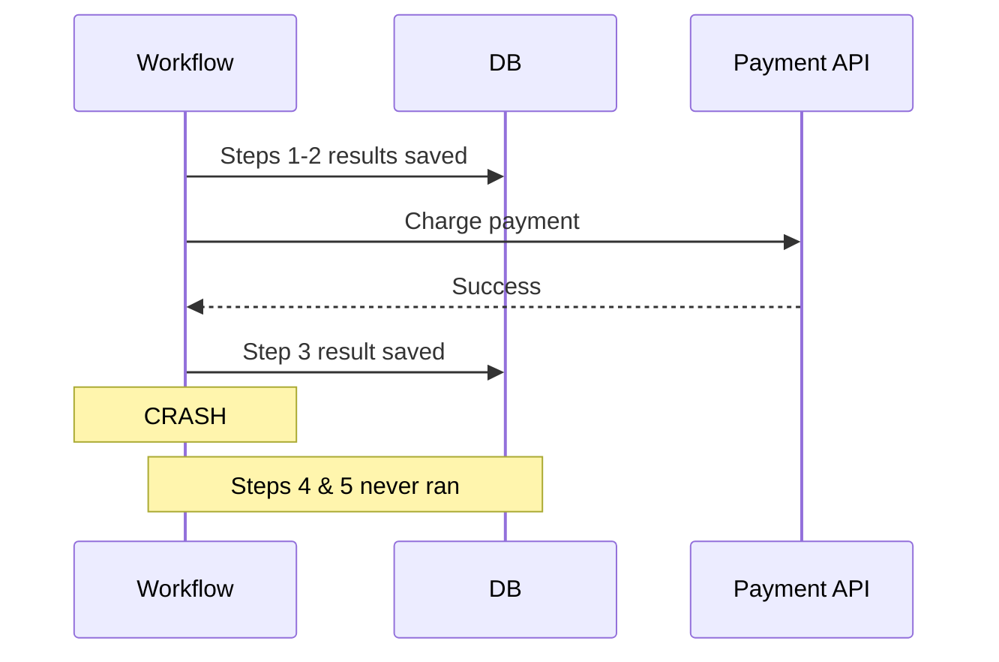

<div v-click class="callout">
<p>We know <em>what happened</em>. But how do we <em>resume</em>?</p>
</div>

<!--
Let me show you what this looks like as a sequence of operations. The workflow runs step one, writes the result to the database. Step two, same thing. Step three calls the payment API, gets a success response, and saves that result. Then the process crashes. Steps four and five never ran. But their predecessors' results are safely stored. So we know what happened. The question now is -- how do we actually use those checkpoints to resume?
-->

---

<p class="eyebrow">Building Block 2</p>

# Replay

We have checkpoints. Now we need a way to **use them**.

<v-click>

**The idea:** On restart, re-run the workflow function from the beginning. But instead of executing completed steps, **return their saved results**.

</v-click>

<div v-click style="margin-top: 1rem; font-family: 'JetBrains Mono', monospace; font-size: 0.9rem; line-height: 2;">
<span class="step-block step-done">Step 1: Checkpoint found → return saved result — skip</span><br>
<span class="step-block step-done">Step 2: Checkpoint found → return saved result — skip</span><br>
<span class="step-block step-done">Step 3: Checkpoint found → return saved result — skip</span><br>
<span class="step-block" style="background: oklch(92% 0.04 250 / 0.3); color: oklch(45% 0.15 250);">Step 4: No checkpoint → execute for real → saved</span><br>
<span class="step-block" style="background: oklch(92% 0.04 250 / 0.3); color: oklch(45% 0.15 250);">Step 5: No checkpoint → execute for real → saved</span>
</div>

<!--
OK so we have checkpoints. Now we need a mechanism to use them. Here's the idea: when the process restarts, re-run the entire workflow function from the beginning. But instead of actually executing the steps that already completed, just return their saved results and skip ahead. Step one -- checkpoint exists, return the saved result. Step two, same thing. Step three, same thing. Step four -- no checkpoint found. This is where the original execution failed. So now we execute step four for real, save its result, and continue to step five. Notice that your code is still a straightforward, linear function. No state machine. No switch/case. The runtime handles the recovery completely transparently.
-->

---

<p class="eyebrow">Building Block 2</p>

# Replay in practice

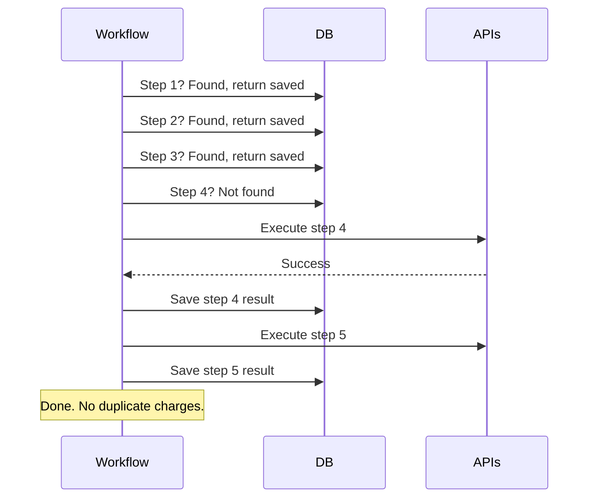

<!--
This is the same thing shown as a sequence diagram. The workflow asks the database: do you have a result for step one? Yes, return it. Step two? Yes. Step three? Yes. Step four? No, nothing found. OK, now we actually call the external API for step four, save the result, move on to step five. Done. And notice -- no duplicate payment charges. The payment step was already checkpointed, so it got skipped during replay.
-->

---

<p class="eyebrow">Building Block 3</p>

# Determinism

For replay to work, the function must produce the **same sequence of steps** every time.

<v-click>

**The idea:** Wrap non-deterministic values (time, random, config) in a checkpointed step.

</v-click>

<div v-click class="grid grid-cols-2 gap-2" style="margin-top: 0.25rem;">
<div>

<p style="margin: 0 0 0.25rem; font-weight: 600; color: var(--danger);">Breaks replay</p>

```go
func dispatchWorkflow(ctx WorkflowCtx, orderID int) {
    // ... previous steps checkpointed ...
    if time.Now().Hour() < 17 {
        step(ctx, func() { notifySameDay(orderID) })
    } else {
        step(ctx, func() { queueNextDay(orderID) })
    }
}
```

</div>
<div>

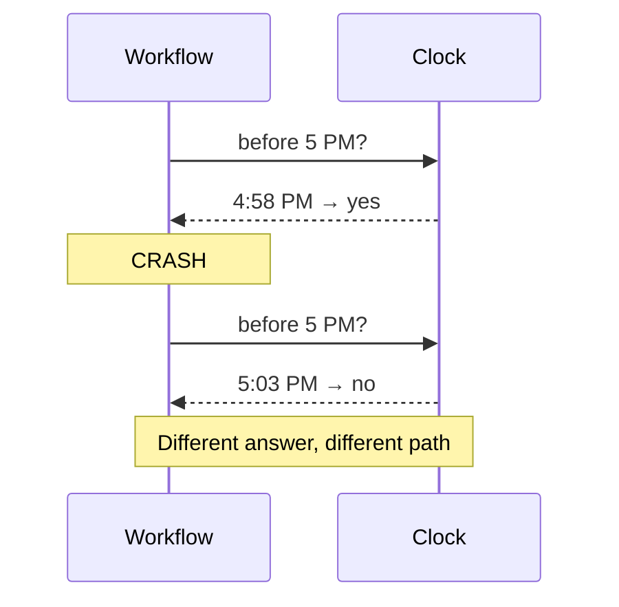

</div>
</div>

<div v-click class="callout" style="margin-top: 0.5rem;">
<p>At 4:58 PM the code takes one path; after the crash at 5:03 PM it takes the other. <strong>Same checkpoint, different branch.</strong></p>
</div>

<!--
For replay to work correctly, the function has to produce the same sequence of steps every time it runs. Otherwise the checkpoints won't line up. Let's stay with the checkout story. On the left you can see the code -- the dispatch decision branches on the current time. On the right, the sequence diagram shows what happens. First execution runs at 4:58 PM, takes the same-day path. Server crashes. Replay starts at 5:03 PM, takes the next-day path. Same checkpoint position, different branch.
-->

---

<p class="eyebrow">Building Block 3</p>

# Determinism — the fix

On replay, the runtime returns the **saved result** instead of re-reading the clock.

<div class="grid grid-cols-2 gap-2" style="margin-top: 0.25rem;">
<div>

<p style="margin: 0 0 0.25rem; font-weight: 600; color: var(--success);">Fixed — checkpoint the decision</p>

```go
func dispatchWorkflow(ctx WorkflowCtx, orderID int) {
    // ... previous steps checkpointed ...
    cutoff := step(ctx, func() bool {
        return time.Now().Hour() < 17
    })
    if cutoff {
        step(ctx, func() { notifySameDay(orderID) })
    } else {
        step(ctx, func() { queueNextDay(orderID) })
    }
}
```

</div>
<div>

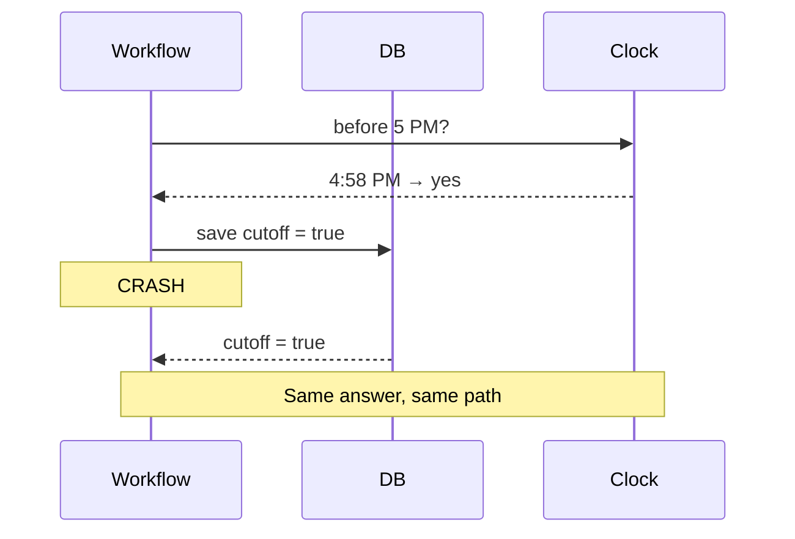

</div>
</div>

<div v-click class="callout" style="margin-top: 0.5rem;">
<p>Same rule for random values, UUIDs, and config reads. If it could differ between runs, <strong>checkpoint it</strong>.</p>
</div>

<!--
The fix: wrap the clock read in a checkpointed step. On replay, the runtime returns the saved value -- 4:58 PM -- and the code follows the same path it took originally. This applies to any non-deterministic source -- random values, UUIDs, external config reads. If it could change between runs, checkpoint it. We'll go deeper on this discipline in the gotchas section.
-->

---

<p class="eyebrow">Building Block 4</p>

# Durable Messaging

If you know Go channels, you already know this.

<v-click>

**The idea:** Two primitives — `Recv` blocks a workflow until a message arrives, `Send` delivers it. Like `<-ch` and `ch <-`, but the state lives in the database.

</v-click>

<div v-click class="grid grid-cols-2 gap-4" style="margin-top: 0.5rem;">
<div>

<p style="margin: 0 0 0.25rem; font-weight: 600;">Go channel</p>

```go
ch := make(chan string)

// goroutine blocks until value arrives
decision := <-ch

// another goroutine sends
ch <- "approved"
```

</div>
<div>

<p style="margin: 0 0 0.25rem; font-weight: 600;">Durable messaging</p>

```go
// workflow blocks until message arrives
decision, _ := dbos.Recv[string](
    ctx, "approval", 7*24*time.Hour)

// HTTP handler sends
dbos.Send(ctx, wfID, "approval", "approved")
```

</div>
</div>

<v-click>

<div class="callout" style="margin-top: 0.75rem;">
<p>Same idea — <strong>block until a value shows up</strong>. But durable: state lives in the DB, survives restarts, and can wait for days with zero compute.</p>
</div>

</v-click>

<!--
If you know Go channels, you already know this pattern. On the left -- a plain Go channel. One goroutine blocks on receive, another sends a value, the first one wakes up. On the right -- durable messaging. Same shape. Recv blocks the workflow, Send delivers a message, the workflow wakes up. The difference: a Go channel lives in memory. Process dies, it's gone. Durable messaging persists the suspension point to the database. The server can restart fifty times over seven days. When the human finally clicks approve, the send arrives, and the workflow picks up right where it left off. No thread held, no connection open. The whole workflow state fits in a single DB row. Same mental model, but crash-proof.
-->

---

<p class="eyebrow">Building Block 4</p>

# Durable messaging in action

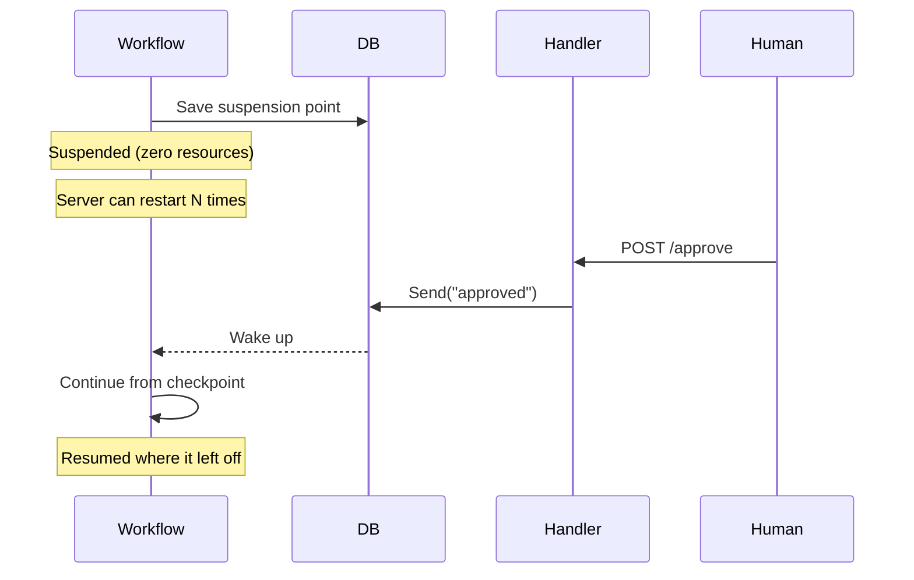

<!--
Here's the sequence. The workflow saves its suspension point to the database and goes dormant. It's not holding a thread or a connection. It's literally just a row in a database table. The server can restart as many times as it needs to. Then a human makes an HTTP request to approve. The handler calls send, which writes to the database. The runtime detects the message, reconstructs the workflow, and it continues from the checkpoint. Exactly where it left off.
-->

---


# What did we just build?

| # | Building Block | What it does |
|---|---|---|
| 1 | **Checkpointing** | Saves each step's result to a database |
| 2 | **Replay** | On restart, re-runs the function, skips completed steps |
| 3 | **Determinism** | Ensures replay produces the same step sequence |
| 4 | **Durable messaging** | Lets workflows sleep and wake across crashes |

<v-click>
<div class="callout" style="margin-top: 1.5rem;">
<p>You write a normal function. The runtime makes it crash-proof.</p>
</div>
</v-click>

<!--
Let's step back and look at what we've put together. Four building blocks. Checkpointing saves each step's result. Replay lets us restart and skip past what's already done. Determinism makes sure replay stays consistent. And durable messaging lets workflows sleep across crashes and wake up on external events. Put them together, and you get something pretty elegant: you write a normal function, and the runtime makes it crash-proof.
-->

---
layout: center
---

# This pattern is called <br> <span class="accent">durable execution</span>.

<p class="text-secondary" style="text-align: center; margin-top: 1.5rem; font-size: 1.1rem;">
You write a normal function. The runtime makes it crash-proof. That's it.
</p>

<!--
And this pattern has a name. It's called durable execution. By now, it probably feels obvious -- of course it has to work this way. And that's exactly the point. You arrived at the concept before I named it.
-->

---

# What durable execution is _not_

<v-clicks>

- It's **not a database**. It uses one, but it's not replacing Postgres.
- It's **not a message queue**. It's not competing with Kafka or RabbitMQ.
- It's **not a job scheduler**. It's not cron with extra steps.

</v-clicks>

<div v-click class="callout" style="margin-top: 1.5rem;">
<p>It's a <strong>runtime pattern</strong> that makes your functions survive failures. Think of it as a reliability layer you add to existing code.</p>
</div>

<!--
Before we move on, let me quickly clear up what durable execution is not, because I've seen people get confused about this. It's not a database -- it uses a database for checkpointing, but it's not replacing Postgres. It's not a message queue -- it's not competing with Kafka or RabbitMQ. And it's not a job scheduler -- it's more than just running tasks on a schedule. It's a runtime pattern. A reliability layer that you add to your existing code. Your functions stay as functions. They just become crash-proof.
-->

---
layout: section
transition: slide-left
---

# The Landscape

<!--
We've built the concept from scratch. Now let's take a quick look at the tools in this space, and then we'll jump into real code.
-->

---

<p class="eyebrow">The Landscape</p>

# Tools in this space

| Runtime | What you deploy | Best for |
|---|---|---|
| **Temporal** | Server cluster (4 services) + workers | Enterprise scale, multi-team orchestration |
| **DBOS** | Library → your existing Postgres | Adding durability without a separate server cluster |
| **Restate** | Single server binary + SDK | Low-latency stateful microservices |
| **Inngest** | Nothing — serverless, HTTP-invoked | Event-driven flows, no workers to manage |
| **Azure Durable Functions** | Cloud-managed replay engine (Azure) | Teams already on Azure |
| **AWS Lambda Durable Functions** | Cloud-managed replay engine (AWS) | Serverless durable execution on AWS |

<!--
There are several tools in this space, sitting on a spectrum from embedded libraries to dedicated server clusters. Temporal is the most established -- it has the largest production deployments at companies like Netflix and DoorDash, but it requires a separate server cluster with four internal services. DBOS takes the opposite approach -- it's an open-source library that checkpoints to your existing Postgres, so there's zero extra infrastructure. Restate is a single server binary with journal-based execution and virtual objects for managing state. Inngest is serverless-native -- your functions get invoked via HTTP, no workers to deploy. Then you've got the cloud-provider options: Azure Durable Functions uses replay internally, similar to what we derived. AWS Lambda Durable Functions is the newest entry -- AWS added checkpoint-and-replay directly into Lambda, so you write sequential code and the runtime handles checkpointing, retries, and suspending execution. Different implementations, but the same mechanics -- checkpointing, replay, determinism, durable messaging -- show up across all of them.
-->

---

<p class="eyebrow">The Landscape</p>

# Architecture spectrum

Three models, same building blocks, different trade-offs.

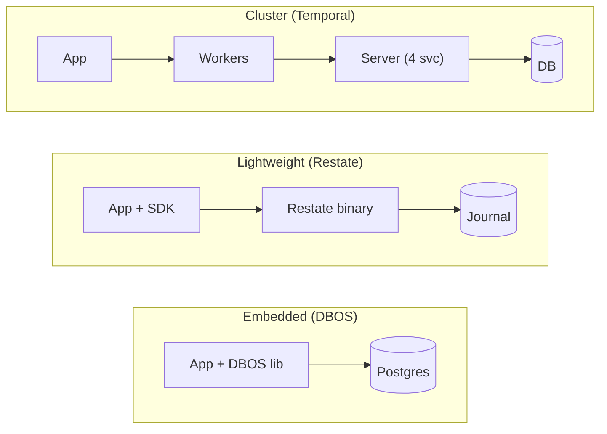

<div class="callout" style="margin-top: 0.25rem;">
<p>Embedded tools are easier to try. Dedicated runtimes usually buy you more operational features.</p>
</div>

<!--
Let me show you where these tools fall on the architecture spectrum. On one end, you've got the embedded library approach -- that's DBOS. Your app includes the DBOS library directly, and it checkpoints to a Postgres database you already have. No extra services, no cluster to manage. In the middle, you've got something like Restate -- a single server binary that your app connects to via an SDK. It manages a journal of execution state. And on the other end, Temporal runs a full server cluster with four internal services -- Frontend, History, Matching, and Worker -- plus its own database. The trade-off is straightforward: less infrastructure means you can get started faster, but more infrastructure gives you more features at scale. Let me show you the actual architecture of each.
-->

---

<p class="eyebrow">The Landscape — Cluster</p>

# Temporal — Dedicated cluster

<div style="display: grid; grid-template-columns: 1fr 1.4fr; gap: 1.5rem; align-items: center; margin-top: 0.5rem;">
<div>

- **4 internal services** — Frontend, History, Matching, Worker
- **Separate worker processes** — your code runs in workers that poll the server
- **Cassandra, Postgres, or MySQL** for persistence
- **Horizontally scalable** — battle-tested at Netflix, DoorDash scale

</div>
<div>


</div>
</div>

<!--
Starting from the heavy end of the spectrum. Temporal runs a full server cluster with four internal services. Your application code runs in separate worker processes that poll the Temporal server for tasks. The server manages all the workflow state, history, and task routing. It's backed by Cassandra, Postgres, or MySQL. This is the most battle-tested option -- Netflix, DoorDash, Snap all run it in production. The trade-off is clear: you get a rich feature set but you're operating a distributed system on top of your distributed system.
-->

---

<p class="eyebrow">The Landscape — Lightweight</p>

# Restate — Lightweight server

<div style="display: grid; grid-template-columns: 1fr 1.4fr; gap: 1.5rem; align-items: center; margin-top: 0.5rem;">
<div>

- **Single binary** with built-in event replication
- **Journal-based execution** — replays from an append-only log
- **Integrates with Lambda, K8s, ECS** — your code runs wherever you want
- **Object store durability** — snapshots state to S3-compatible storage

</div>
<div>


</div>
</div>

<!--
In the middle of the spectrum, Restate takes a different approach. It's a single server binary -- no cluster of services to manage. Your application connects via an SDK, and Restate journals every step of execution. It integrates with existing compute -- Lambda, Kubernetes, ECS -- so your code runs wherever you already deploy. State is durable through low-latency event replication between nodes, with snapshots going to an object store. Less infrastructure than Temporal, but still a separate component in your stack.
-->

---

<p class="eyebrow">The Landscape — Embedded</p>

# DBOS — Embedded library

<div style="display: grid; grid-template-columns: 1fr 1.4fr; gap: 1.5rem; align-items: center; margin-top: 0.5rem;">
<div>

- **Library inside your app** — no separate server or cluster
- **Checkpoints to Postgres** — the database you already run
- **Workflows, queues, messaging** built into the library
- **Zero extra infrastructure** — simplest path to durable execution

</div>
<div>


</div>
</div>

<!--
And at the lightest end of the spectrum, DBOS embeds directly into your application as a library. There's no separate server, no cluster, no additional infrastructure to manage. It checkpoints workflow state to a Postgres database -- the one you probably already have running. Workflows, queues, and messaging are all built into the library. You add a few lines to your existing code and you've got durable execution. The trade-off is that you get fewer operational features out of the box compared to Temporal, but the barrier to entry is nearly zero.
-->

---

<p class="eyebrow">The Landscape</p>

# Why DBOS for today's demos

For this talk, I want the simplest setup that still shows the mechanics clearly.

<v-clicks>

- **Embeds into existing code** — enough to show the pattern without introducing a separate control plane
- **Uses the Postgres you already run** — keeps the demo setup simple
- **Available in Go, Python, TypeScript** — useful for showing the same ideas across languages
- **Open source** — easy to inspect how the runtime works

</v-clicks>

<div v-click class="callout" style="margin-top: 1.5rem;">
<p>The mechanics matter more than the product choice. Checkpointing, replay, determinism, and durable messaging show up in different forms across the ecosystem.</p>
</div>

<!--
For today's demos, I picked DBOS because it has the lowest barrier to entry. You add it to existing code with a few lines -- no architectural overhaul required. It uses a Postgres database you probably already have running. It's available in Go, Python, and TypeScript, so I can show the same pattern across languages. And it's fully open source, so you can look under the hood if you're curious. But I want to be really clear about something -- this is not a DBOS sales pitch. The building blocks are the same whether you use Temporal, Restate, DBOS, or something else.
-->

---
layout: section
transition: slide-left
---

# Code and Demos

<!--
Enough theory. Let's look at real code. I've got three demos lined up, each building on the last. We'll see the code, run the app, and watch it recover from crashes.
-->

---

<p class="eyebrow">Demo 1</p>

# Widget Store — Marketplace Checkout

The checkout scenario from earlier, implemented with durable execution.

<v-clicks>

- Linear function: reserve inventory → create order → wait for payment → dispatch
- `RunAsStep` wraps each database operation (checkpointed)
- `Recv` waits for payment confirmation from an external webhook
- `RunWorkflow` starts a child workflow for dispatch

</v-clicks>

<div v-click class="callout">
<p>This is still a <strong>regular function</strong>. The recovery logic lives in the runtime instead of being spread across the application.</p>
</div>

<!--
First up is the widget store. This is the exact checkout scenario from earlier -- the one where the server crashes between payment and warehouse notification -- but now implemented with durable execution. It's a linear function: reserve inventory, create the order, wait for payment, then kick off dispatch. Each database operation is wrapped in RunAsStep, which means it gets checkpointed automatically. The Recv call waits for the payment webhook to arrive, and RunWorkflow starts a child workflow for delivery dispatch. The key thing to notice is that this is just a regular function. No state machine, no polling loop, no message queue infrastructure.
-->

---

<p class="eyebrow">Demo 1 — Widget Store</p>

# Checkout workflow (Go)

```go {1|3-5|7-9|11|13-16|18}{at:1, maxHeight:'380px'}
func checkoutWorkflow(ctx dbos.DBOSContext, _ string) (string, error) {
    // Step 1: Create order (checkpointed)
    orderID, _ := dbos.RunAsStep(ctx, func(stepCtx context.Context) (int, error) {
        return createOrder(stepCtx)
    })
    // Step 2: Reserve inventory (checkpointed)
    success, _ := dbos.RunAsStep(ctx, func(stepCtx context.Context) (bool, error) {
        return reserveInventory(stepCtx)
    })
    // Step 3: Wait for payment — durably (survives crashes)
    payment, _ := dbos.Recv[string](ctx, PAYMENT_STATUS, 60*time.Second)
    if payment == "paid" {
        // Step 4: Update status (checkpointed)
        dbos.RunAsStep(ctx, func(stepCtx context.Context) (string, error) {
            return updateOrderStatus(stepCtx, orderID, PAID)
        })
        // Step 5: Start dispatch as child workflow
        dbos.RunWorkflow(ctx, dispatchOrderWorkflow, orderID)
    }
}
```

<!--
Let me walk you through this code. At the top, it's just a regular Go function signature. Nothing special about it. Then we create the order using RunAsStep -- this wraps the database call so the result gets saved as a checkpoint. Same thing for reserving inventory. Then we hit Recv, which is the durable wait for payment. This is where the workflow can sit suspended until the payment webhook arrives, and if the server crashes and restarts during that window, the workflow survives. When payment comes through, we update the order status -- again, checkpointed -- and then start a child workflow for dispatch. Remember that crash scenario from earlier? The one where the customer gets charged but the warehouse never hears about it? That literally cannot happen here. Every step is checkpointed. If the server crashes between the payment and the warehouse notification, it just picks up right where it left off.
-->

---
layout: center
---

<p class="eyebrow" style="text-align: center;">Demo 1</p>

# Widget Store

<p class="text-secondary" style="text-align: center; font-size: 1.1rem; margin-top: 1rem;">
Live demo — checkout, payment, crash recovery
</p>

<!--
Let me switch over to the live demo now. I'll walk you through the checkout process, trigger the payment webhook, and then we'll kill the server mid-dispatch and watch it recover on restart.
-->

---

<p class="eyebrow">Demo 2</p>

# Agent Inbox — AI Agent with Human Approval

Same `Recv`/`Send` pattern, now applied to AI agents.

<v-clicks>

- Agent does work → reaches a decision point
- Calls `DBOS.recv()` to wait for human approval
- `set_event` updates agent status (frontend polls this)
- HTTP handler calls `DBOS.send()` when the human responds

</v-clicks>

<div v-click class="callout">
<p>Same building block, different use case. <code>Recv</code> waits for payment in the store; <code>Recv</code> waits for human approval here.</p>
</div>

<!--
Next up, same building blocks but a completely different use case. This is an AI agent that does some work, reaches a decision point, and then needs human approval before continuing. It uses the exact same Recv and Send pattern we just saw in the store. The agent publishes its status using set_event so the frontend can track what it's doing. Then it calls recv to wait for a human to approve or deny. On the other side, an HTTP handler calls send when the human makes their decision. Same building block that waited for a payment webhook in the store -- now it waits for a human in an agent workflow.
-->

---

<p class="eyebrow">Demo 2 — Agent Inbox</p>

# Durable agent workflow (Python)

```python {1|3-4|6-8|9|11-12|14-16}{at:1, maxHeight:'380px'}
@DBOS.workflow()
def durable_agent(request: AgentStartRequest):
    agent_status = AgentStatus(name=request.name, task=request.task, status="working")
    DBOS.set_event(AGENT_STATUS, agent_status)

    # Durable wait for human approval (survives crashes)
    agent_status.status = "pending_approval"
    DBOS.set_event(AGENT_STATUS, agent_status)
    approval = DBOS.recv(timeout_seconds=3600)

    if approval is None or approval.response == "deny":
        raise Exception("Agent denied or timed out")

    agent_status.status = "working"
    DBOS.set_event(AGENT_STATUS, agent_status)
    return "Agent successful"
```

<!--
Let's look at the Python code. The DBOS.workflow decorator at the top marks this function as a durable workflow. The agent does its initial work, then publishes status updates through set_event -- the frontend polls this to show what the agent is doing. Then it switches to pending_approval status and calls DBOS.recv with a one-hour timeout. This is the durable wait. The server can crash and restart, and the agent just keeps waiting. If approval comes back as None or denied, we raise an exception. Otherwise, we continue working. OpenAI's Agents SDK, Pydantic AI, and LangGraph have all added durable execution support for this kind of human-in-the-loop flow.
-->

---
layout: center
---

<p class="eyebrow" style="text-align: center;">Demo 2</p>

# Agent Inbox

<p class="text-secondary" style="text-align: center; font-size: 1.1rem; margin-top: 1rem;">
Live demo — agent task, human approval, crash recovery
</p>

<!--
Let me show you this one in action. I'll start an agent task, we'll see it pause and wait for approval, I'll approve it, and then I'll demonstrate the crash recovery -- start an agent, kill the server while it's waiting, restart, and then approve it. The agent survives the full restart.
-->

---

<p class="eyebrow">Demo 3 (optional)</p>

# Access Management — Long-Running Approval Chain

Multi-approver workflow that spans days, with saga-pattern rollback.

<v-clicks>

- `Recv` per approver with 7-day timeout
- Denial at any step stops the chain
- On full approval → child `ProvisioningWorkflow`
- Saga pattern: if external provisioning fails, compensate by revoking local assignment

</v-clicks>

<!--
If we have time, this last demo shows the most complex version of the pattern. It's an access management system where a request needs multiple approvals -- each approver gets a seven-day timeout. Denial at any step stops the whole chain. Once everyone approves, a child provisioning workflow kicks off. And if the external provisioning fails after the local role assignment has already happened, there's a compensation step that rolls it back -- that's the saga pattern. I'll use this demo only if we're running ahead of schedule.
-->

---

<p class="eyebrow">Demo 3 — Approval Workflow</p>

# Multi-step approval (Go)

```go {1|3-5|7-9|10|13-15}{at:1, maxHeight:'380px'}
func ApprovalWorkflow(ctx dbos.DBOSContext, input ApprovalWorkflowInput) (Result, error) {
    // Load approval chain (checkpointed)
    steps, _ := dbos.RunAsStep(ctx, func(c context.Context) ([]ApprovalStep, error) {
        return loadApprovalSteps(c, input.RequestID)
    })
    // Wait for each approver (7-day timeout, survives restarts)
    for _, step := range steps {
        decision, err := dbos.Recv[Decision](ctx, "approval", 7*24*time.Hour)
        if err != nil { /* timeout → auto-escalate */ }
        if decision == "DENIED" { return denied() }
    }
    // All approved → start child provisioning workflow
    handle, _ := dbos.RunWorkflow(ctx, ProvisioningWorkflow,
        ProvisioningInput{RequestID: input.RequestID})
    result, _ := handle.GetResult()
    return result, nil
}
```

<!--
Here's the approval workflow in Go. First, we load the list of required approvals from the database using RunAsStep -- so that query result gets checkpointed. Then we loop through each approver, calling Recv with a seven-day timeout. The workflow sleeps durably between each approval. If anyone denies, we short-circuit and return immediately. Once everyone approves, we start a child provisioning workflow and wait for its result. The thing to appreciate here is that this workflow might run for weeks. Servers will restart. Deployments will happen. None of that matters -- the workflow just keeps going from wherever it left off.
-->

---

<p class="eyebrow">Demo 3 — Saga Pattern</p>

# Provisioning with rollback (Go)

```go {1|3-5|7-9|11-14}{at:1, maxHeight:'380px'}
func ProvisioningWorkflow(ctx dbos.DBOSContext, input ProvisioningInput) (Result, error) {
    // Saga Step 1: Assign role in local database
    dbos.RunAsStep(ctx, func(c context.Context) (string, error) {
        return "ok", assignUserRole(c, input.UserID, input.RoleID)
    })
    // Saga Step 2: Provision in external system (3 retries)
    _, err := dbos.RunAsStep(ctx, func(c context.Context) (string, error) {
        return provisionExternal(input.UserID, input.RoleName)
    }, dbos.WithStepMaxRetries(3))
    if err != nil {
        // Compensate: roll back Step 1
        dbos.RunAsStep(ctx, func(c context.Context) (string, error) {
            return "ok", revokeUserRole(c, input.UserID, input.RoleID)
        })
        return Result{Status: "FAILED"}, err
    }
    return Result{Status: "PROVISIONED"}, nil
}
```

<!--
And here's the provisioning workflow implementing the saga pattern. Step one assigns the role in the local database. Step two provisions in the external system, with up to three retries if it fails. If step two fails even after retries, we run a compensation step that revokes the role assignment from step one. Both the forward path and the rollback path are fully checkpointed. If the server crashes during compensation, it picks up and finishes rolling back. You never end up in a half-compensated state where the local role is assigned but the external system doesn't know about it.
-->

---
layout: section
transition: slide-left
---

# Practical Guidance

<!--
So when should you actually reach for durable execution? And what are the things that will bite you if you're not careful? Let's get practical.
-->

---

<p class="eyebrow">Guidance</p>

# When to use it — and when to skip it

<div class="compact-table grid grid-cols-2 gap-4" style="margin-top: 0.15rem;">
<div>

**Reach for DE when...**

| Scenario | Why |
|---|---|
| **Payment + fulfillment** | Crash = money taken, no delivery |
| **Multi-step approvals** | Must survive restarts across human-speed waits |
| **AI agent orchestration** | LLM calls cost money; retry wastes $ and context |
| **Saga with rollback** | Forward and compensating steps must both complete |

</div>
<div>

**Skip DE when...**

| Scenario | Use instead |
|---|---|
| **Single-step CRUD** | Direct DB call |
| **Millisecond-fast ops** | Inline code (checkpoint adds 1-5ms) |
| **Database-local work** | Single transaction or savepoints |
| **Cheap-to-retry ops** | Job queue (BullMQ, Celery) |

</div>
</div>

<div v-click class="callout" style="margin-top: 0.25rem;">
<p>Gut check: describe the work as a single verb -- <em>send, process, sync</em>? It's a job, use a queue. Need "and then" or "wait until"? It's a workflow.</p>
</div>

<!--
Here's the practical split. On the left, the scenarios where durable execution actually pays for itself. Payment plus fulfillment -- the checkout demo. Multi-step approvals -- the access management demo. AI agent orchestration -- LLM calls cost real money, and retrying from scratch wastes money and loses context. And saga workflows where both the forward path and compensation must complete.

On the right, where you should skip it. Single-step CRUD -- there's nothing to checkpoint between. Fast operations where the checkpoint overhead dominates latency. Database-local work where ACID already gives you atomicity. And cheap-to-retry operations where a job queue with built-in retry is simpler and sufficient.

The gut check at the bottom: if you can describe the work with a single verb -- send an email, resize an image -- it's a job, use a queue. If you need "and then" or "wait until" to describe it, it's a workflow, and that's when durable execution earns its keep.
-->

---

<p class="eyebrow">Guidance</p>

# Gotchas

<div class="grid grid-cols-2 gap-6">
<div>

**1. Determinism discipline**

`time.Now()`, `uuid.New()`, `rand.Intn()` must be inside checkpointed steps. Non-deterministic code outside steps causes replay mismatches — and these bugs only surface during crash recovery, exactly when you need the system to work.

**2. Workflow versioning**

Changing step sequences while instances are in-flight causes replay mismatches. This is the hardest operational problem in DE adoption — plan for it before your first long-running workflow ships.

</div>
<div>

**3. Idempotency**

Steps have at-least-once semantics. If a step succeeds but the checkpoint write fails, the step re-executes. External calls need idempotency keys.

**4. Payload size**

Every step's I/O is serialized to the database. Pass references (S3 URL, record ID), not large objects.

</div>
</div>

<!--
Four things that will bite you in production. First, determinism -- every call to time.Now, uuid.New, or rand.Intn needs to be inside a checkpointed step. If you accidentally put non-deterministic code in the control flow, replay breaks silently. Second, workflow versioning. If you change a workflow's step sequence while instances are still running the old version, those in-flight workflows hit replay mismatches. You need a versioning strategy from day one. Third, idempotency. There's a tiny window where a step can succeed but the checkpoint write fails. On recovery, that step runs again. External calls like payments need idempotency keys. Fourth, payload size. Every step's input and output gets serialized to the database. Don't pass fifty-megabyte files through steps -- pass a reference, an S3 URL or a record ID, and let the step fetch what it needs.
-->

---

<p class="eyebrow">Guidance</p>

# Complexity migrates — it never disappears

Durable execution doesn't reduce your system's total complexity. It **relocates** it.

| You stop dealing with... | You start dealing with... |
|---|---|
| Hand-rolled retry loops at every call site | **Determinism discipline** — non-deterministic code must live inside steps |
| Custom state machines + polling tables | **Workflow versioning** — changing step sequences breaks in-flight instances |
| Dead-letter queues + manual reprocessing | **Idempotency boundaries** — external calls still need idempotency keys |
| Ad-hoc crash recovery scattered across services | **Payload awareness** — every step's I/O is serialized to the database |

<div v-click class="callout" style="margin-top: 1rem;">
<p>The trade: recovery logic stops being scattered across services and becomes explicit rules the team can review and enforce. You're not removing complexity. You're moving it.</p>
</div>

<!--
Here's something I want to be honest about. There's a principle in systems design, sometimes attributed to Larry Tesler: complexity doesn't magically disappear, it just moves to another part of the system. The law of conservation of complexity. And it absolutely applies to durable execution. Look at this table. On the left, the problems you had before. On the right, the problems you have after. Your hand-rolled retry loops went away, but now you need determinism discipline. Your custom state machines are gone, but now you need a versioning strategy for in-flight workflows. You stopped managing dead-letter queues, but you still need idempotency keys for external calls. Ad-hoc crash recovery disappeared, but now you need to think about what gets serialized at every checkpoint. The total complexity didn't shrink. But look at the difference in character. The left column is scattered, implicit, easy to miss. A retry loop missing from one call site. A dead-letter queue nobody checks. A crash recovery path that was never tested. The right column is structured, explicit, and well-documented. These constraints show up in your code review, your linter, your deployment checklist. The point isn't less complexity — it's better-located complexity. You moved it from the gaps between your services, where bugs hide, to the surface of your code, where you can see it and reason about it.
-->

---
layout: section
transition: slide-left
---

# The Coordination Landscape

<!--
We've seen durable execution in action -- what it is, how it works, and when to reach for it. Now let's pull back and place it on the map. When an operation spans multiple services, you need a way to keep them consistent. This problem is older than most of us in this room. Let's walk through how the field has evolved -- from distributed transactions, to sagas, to durable execution -- and see where each approach fits.
-->

---
layout: two-cols
layoutClass: gap-4
---

<p class="eyebrow">Coordination</p>

# The distributed transaction problem

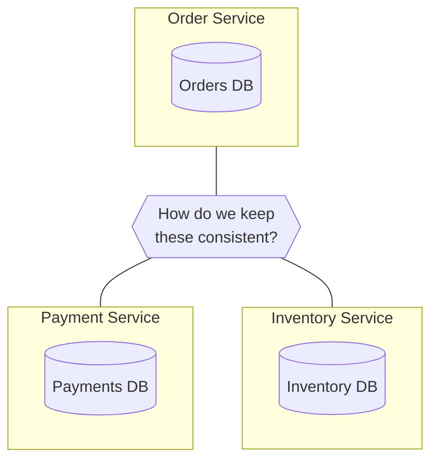

::right::

<p class="text-secondary" style="margin-top: 3.5rem;">When a single operation spans multiple services, a local DB transaction can't help you.</p>

<v-clicks>

- Each service has its **own database**
- A local DB transaction can't span services
- External APIs don't participate in DB transactions

</v-clicks>

<div v-click class="callout" style="margin-top: 0.75rem;">
<p>Three families of solutions: <strong>distributed transactions</strong> (lock everything), <strong>sagas</strong> (compensate on failure), <strong>durable execution</strong> (orchestrate as a function).</p>
</div>

<!--
Here's the core problem. You have an order service with its own database, a payment service with its own database, and an inventory service with its own database. A single customer checkout touches all three. You can't wrap a cross-service operation in a Postgres transaction. So how do you keep them consistent? Three approaches exist. Distributed transactions try to lock everything. Sagas coordinate with compensation. And durable execution orchestrates the whole thing as a function. Let's look at each one.
-->

---
layout: two-cols
layoutClass: gap-4
---

<p class="eyebrow">Coordination</p>

# Two-Phase Commit (2PC)

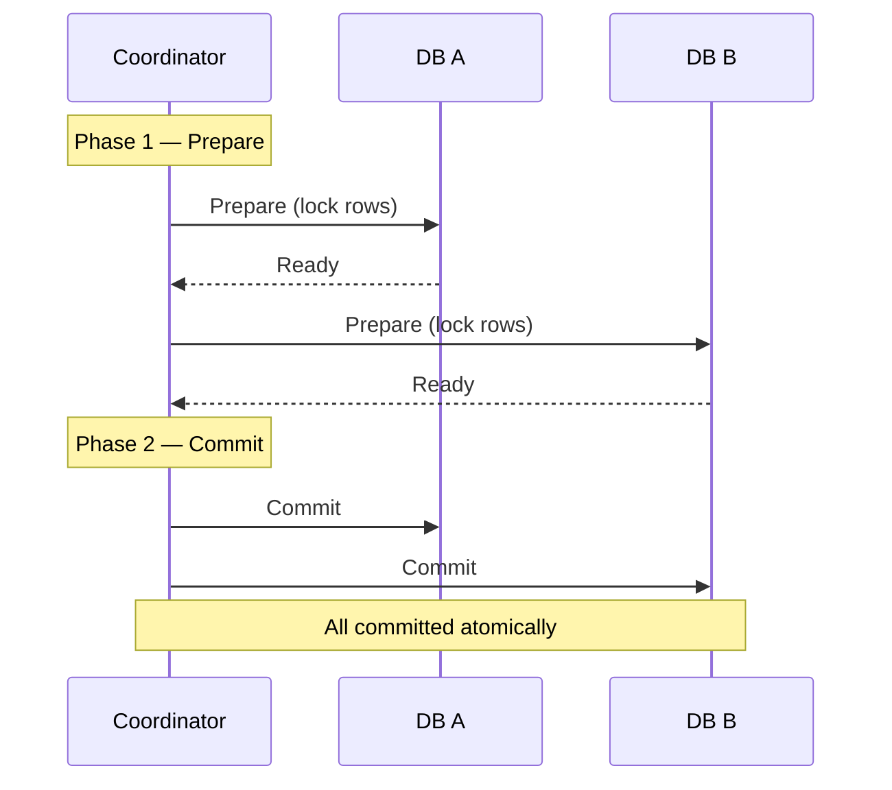

::right::

<p class="text-secondary" style="margin-top: 3.5rem;">A coordinator locks all participants, then commits atomically.</p>

<v-clicks>

- **Blocking:** participants hold locks while waiting for the coordinator's decision
- **Fragile:** if the coordinator crashes between prepare and commit, all participants are stuck
- **Closed-world:** every participant must support the 2PC protocol (XA, PostgreSQL `PREPARE TRANSACTION`), but external APIs don't
- **Where it lives today:** inside distributed DBs (Google Spanner, CockroachDB), rarely across microservices

</v-clicks>

<!--
Two-phase commit is the textbook answer. A coordinator sends a prepare message to every participant. Each participant locks its rows and votes "ready." Once all participants vote ready, the coordinator sends a commit message. All three databases commit atomically. It guarantees consistency -- either all commit or all abort. But it has serious problems. First, it's blocking. All participants hold locks while waiting for the coordinator's decision. If the coordinator is slow, everything waits. Second, it's fragile. If the coordinator crashes between the prepare and commit phases, every participant is stuck holding locks with no one to tell them what to do. Third, it's a closed-world protocol. Every participant must speak the XA protocol or PostgreSQL's PREPARE TRANSACTION. External APIs like Stripe or webhooks don't speak this protocol. You can't include a payment gateway call in a two-phase commit. Now, 2PC isn't dead -- it's alive and well inside distributed databases like Google Spanner and CockroachDB, where the database manages the protocol internally across shards. But across microservices with heterogeneous data stores and external APIs, it breaks down.

You might wonder about 3PC -- three-phase commit. It adds a pre-commit phase to fix the blocking problem: if the coordinator crashes, participants can look at whether they reached pre-commit to decide on their own. The catch is it only works under crash-stop failures. Network partitions -- which are the realistic failure mode -- can still leave participants in inconsistent states. No major database implements 3PC. Modern systems solved 2PC's blocking problem with Paxos or Raft-based consensus instead -- that's how Spanner does it.
-->

---
layout: two-cols
layoutClass: gap-4
---

<p class="eyebrow">Coordination</p>

# Saga pattern

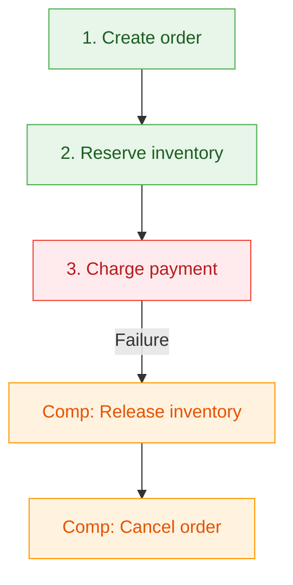

::right::

<p class="text-secondary" style="margin-top: 3.5rem;">The practical alternative: break the transaction into local transactions, each with a compensating action.</p>

<v-clicks>

- Each step is a **local transaction** -- no distributed locks
- If step N fails, run **compensating transactions** for steps N-1 down to 1
- No atomicity guarantee -- the system is **eventually consistent**
- Two coordination strategies: **choreography** and **orchestration**
- **Framework support:** Axon Framework (Java), MassTransit (.NET), Temporal, eventuate.io

</v-clicks>

<!--
The saga pattern is the practical alternative. The term comes from a 1987 paper by Garcia-Molina and Salem. Instead of trying to lock everything at once, you break the distributed transaction into a sequence of local transactions. Each step commits independently. And each step has a compensating action -- a way to undo its effect. If step three fails -- say the payment is declined -- you run compensating transactions in reverse. Release the inventory reservation. Cancel the order. No distributed locks, no 2PC coordinator. The trade-off: you lose atomicity. The system is eventually consistent, not immediately consistent. Between step one committing and step three failing, there's a window where the data is inconsistent. For many real-world systems, that's an acceptable trade. Several frameworks give you saga primitives: Axon Framework in Java, MassTransit in .NET, eventuate.io for event-driven sagas, and Temporal as a general-purpose durable workflow engine. Now, sagas need coordination -- someone or something has to decide what step runs next and what to do when something fails. There are two strategies for this: choreography and orchestration.
-->

---
layout: two-cols
layoutClass: gap-4
---

<p class="eyebrow">Coordination — Saga</p>

# Choreography

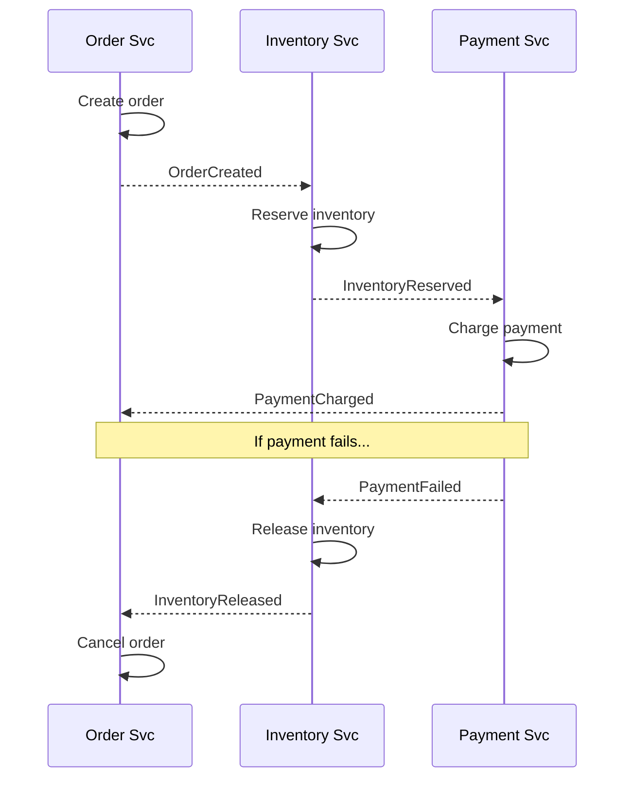

::right::

<p class="text-secondary" style="margin-top: 3.5rem;">Each service emits events. The next service listens and reacts. No central coordinator.</p>

<v-clicks>

- **Decoupled:** services only know about events, not each other
- **Hard to trace:** the full flow is implicit, scattered across event handlers
- **Compensation is event-driven too:** failure events trigger reverse actions, but no one tracks overall status
- **Common brokers:** Apache Kafka, RabbitMQ, NATS, Redis Streams, AWS EventBridge

</v-clicks>

<!--
In a choreographed saga, there's no central coordinator. Each service reacts to events. The event transport is typically a message broker -- Kafka is the dominant choice in production, RabbitMQ for simpler setups, NATS for low-latency, Redis Streams if you're already running Redis. The order service creates the order and emits an OrderCreated event. The inventory service hears that, reserves stock, and emits InventoryReserved. The payment service hears that, charges the customer, and emits PaymentCharged. If the payment fails, it emits PaymentFailed. The inventory service hears that and releases the reservation. The order service hears that and cancels the order. The upside: services are decoupled. They don't call each other directly -- they only react to events. The downside: the full workflow is implicit. No single place in the code shows the complete flow. When something fails at step three, you're reading logs from three different services trying to reconstruct what happened. And compensation is event-driven too -- if a compensating event gets lost, the system stays inconsistent with no one noticing.
-->

---
layout: two-cols
layoutClass: gap-4
---

<p class="eyebrow">Coordination — Saga</p>

# Orchestration

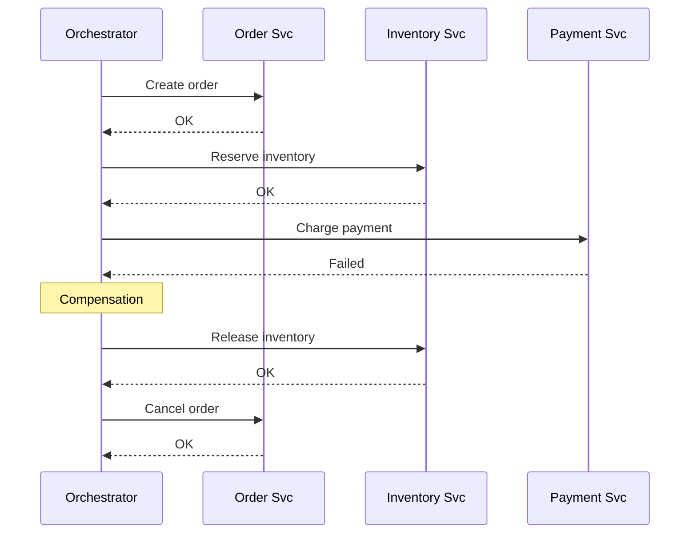

::right::

<p class="text-secondary" style="margin-top: 3.5rem;">A central orchestrator drives the saga. It tells each service what to do and handles failures.</p>

<v-clicks>

- **Visible:** the full flow lives in one place -- the orchestrator
- **Debuggable:** one log stream, one state to inspect
- **But:** the orchestrator itself must be reliable -- if it crashes mid-saga, the whole thing stalls
- **Tools:** Temporal, Camunda (BPMN), AWS Step Functions, Netflix Conductor (now Orkes)

</v-clicks>

<!--
In an orchestrated saga, a central coordinator -- the orchestrator -- drives everything. It tells the order service to create the order, waits for confirmation, tells the inventory service to reserve, waits, tells the payment service to charge, waits. If the payment fails, the orchestrator drives compensation in reverse: release inventory, cancel order. The entire flow lives in one place. One log stream. One piece of state to inspect when something goes wrong. Common orchestrator tools: Temporal and its predecessor Uber Cadence are code-first -- you write the orchestrator in Go, Java, or Python. Camunda is BPMN-based -- you draw the flow in a visual editor. AWS Step Functions is the cloud-native option, defined in JSON state machines. Netflix built Conductor (now open-sourced as Orkes) to orchestrate their microservices. The problem all of them share: the orchestrator is a single point of failure. If it crashes between charging the payment and running compensation, the saga stalls. You need retry logic, state persistence, crash recovery -- in other words, you need the orchestrator itself to be durable.
-->

---
layout: two-cols
layoutClass: gap-4
---

<p class="eyebrow">Coordination</p>

# Where durable execution fits

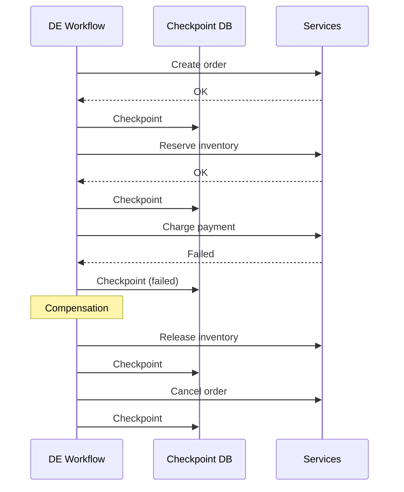

::right::

<p style="margin-top: 3.5rem;">DE is a <strong>saga orchestrator where the orchestrator itself is crash-proof</strong>.</p>

<v-clicks>

- The orchestrator problem -- *"what if it crashes?"* -- is solved by checkpoint/replay
- Compensation is ordinary error handling inside a linear function
- Unlike traditional sagas, durable messaging enables **long waits** (human approvals, webhooks)
- **Implementations:** Temporal (server cluster), DBOS (library + Postgres), Restate (single binary), Inngest (serverless)

</v-clicks>

<!--
This is where durable execution fits. It's a saga orchestrator where the orchestrator itself is crash-proof via checkpoint and replay. Every step -- forward and compensating -- gets checkpointed. If the orchestrator crashes between charging the payment and running compensation, it restarts, replays from the last checkpoint, and finishes compensation. The orchestrator problem -- "what if the coordinator crashes?" -- is solved by the same mechanism that makes each step durable. And durable execution goes beyond what a traditional saga gives you. With durable messaging, the workflow can pause for days waiting for a human approval or an external webhook, using zero resources while suspended. That's not something a classical saga pattern handles. The implementations differ in deployment model: Temporal runs as a separate server cluster with its own Cassandra or Postgres backend -- it's the heavyweight, used by Netflix and Snap. DBOS is an embedded library that uses your existing Postgres -- zero new infrastructure. Restate is a single Rust binary with journal-based replay. Inngest is serverless-native -- functions invoked via HTTP. Different trade-offs, same core pattern. 2PC is atomic but rigid. Sagas are flexible but need coordination infrastructure. Durable execution provides that infrastructure as a runtime, so you write the saga as a plain function.
-->

---
layout: two-cols
layoutClass: gap-4
---

<p class="eyebrow">Coordination</p>

# Orchestration vs choreography

Not a competition -- they compose.

| | When to reach for it | Sounds like |
|---|---|---|
| **Orchestration** (DE) | Steps depend on each other | *"Do A, then B, then C. If C fails, undo B and A."* |
| **Choreography** (Kafka) | Steps are independent | *"Something happened; whoever cares can react."* |

::right::

<div style="padding-top: 4rem;">

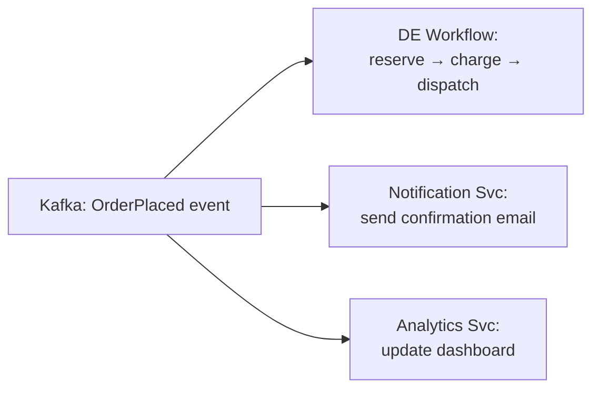

<div v-click class="callout" style="margin-top: 0.5rem;">
<p>Same event, different coordination needs. Kafka distributes. DE orchestrates.</p>
</div>

</div>

<!--
How is durable execution different from just using Kafka? They solve different problems and they compose. Orchestration -- what used to require hand-built process managers, now replaced by durable execution -- is for workflows where steps depend on each other. You need ordering, rollback if something fails, end-to-end visibility. Choreography -- Kafka, event-driven architecture -- is for truly independent reactions. Something happened, multiple services care, but they don't depend on each other. In practice, you use both. Kafka publishes an OrderPlaced event. A DE workflow picks it up and runs the multi-step fulfillment: reserve inventory, charge payment, dispatch. Meanwhile, the notification service sends a confirmation email and the analytics service updates a dashboard. Same event, different consumers, different coordination needs. Each tool at its own layer.
-->

---

<p class="eyebrow">Coordination</p>

# How these patterns compose in production

A food delivery order touches multiple coordination strategies:

| Step | Pattern | Why |
|---|---|---|
| Event published atomically | **Outbox + CDC** | DB write and event must be atomic |
| Reserve, charge, dispatch | **DE workflow** (saga) | Survives crashes; no double charges |
| ↳ Payment gateway call | **Circuit breaker + idemp. key** | DE retries alone hammer a degraded service |
| Send email, update analytics | **Choreography** (Kafka) | Subscribe to order event -- no new publish |
| Generate receipt PDF | **Job queue** (BullMQ) | Loss is tolerable -- a reconciliation job catches misses |

<div v-click class="callout" style="margin-top: 0.25rem;">
<p>No single pattern covers the full flow. The skill is knowing which to reach for at each layer.</p>
</div>

<!--
This is the slide I want you to remember from this section. No single pattern covers a real production flow end to end. Take a food delivery order. The event publish uses the outbox pattern -- the DB write and the Kafka event must be atomic, because a lost order event means the kitchen never sees it. The multi-step fulfillment is a DE workflow -- an orchestrated saga. Inside the payment step -- notice the arrow, it's nested within the workflow -- you need a circuit breaker and an idempotency key because DE's retries alone will hammer a struggling gateway. The notification and analytics consumers subscribe to the event already published in step one via Kafka -- no separate publish, just independent consumers reacting. And the receipt PDF? A simple job queue. Could we lose it if the server crashes before enqueuing? Yes. But a nightly reconciliation query catches missing receipts -- the consequence is low. Five patterns, five layers, one order. The skill is matching the reliability investment to the consequence of failure.
-->

---

<p class="eyebrow">Coordination</p>

# What DE handles vs. what you still own

| Pattern | Status | Detail |
|---|---|---|
| **Retry with backoff** | Absorbed | Built-in step config -- `WithStepMaxRetries(3)` with exponential backoff. |
| **Idempotent consumer** | Mostly absorbed | Steps replay from checkpoint. External calls still need idempotency keys. |
| **Circuit breaker** | **Not absorbed** | Needed at the HTTP client level -- e.g., `gobreaker` (Go), `opossum` (Node). |
| **Timeout / bulkhead** | **Not absorbed** | Context deadlines, connection pools -- below the workflow layer. |

<v-click>
<p class="text-secondary" style="font-size: 0.95rem; margin-top: 0.75rem;"><strong>A real failure:</strong> Grab Food order. A workflow step charges RM 45.00 via a payment gateway. Gateway processes the charge, but the response times out. DE retries. Gateway charges again -- <strong>RM 90.00 debited</strong>. Without an idempotency key, the retry creates a duplicate. Without a circuit breaker, retries pile up against a struggling service. <strong>The patterns must compose.</strong></p>
</v-click>

<!--
DE handles some resilience patterns for you, but not all. Retry with backoff -- that's built in. Idempotent consumer is mostly covered by checkpoint replay, but external calls still need idempotency keys for the edge case where a step succeeds but the checkpoint write fails. Circuit breakers and timeouts are explicitly not absorbed -- those live at the HTTP client level inside your steps.

The Grab Food example makes this concrete. A workflow step charges RM 45 via the payment gateway. The gateway processes it, money leaves the customer's Touch 'n Go wallet, but the response times out. DE sees a failure and retries. The gateway charges again. The customer is out RM 90. Without an idempotency key on the payment request, the retry created a duplicate charge. Without a circuit breaker, if the gateway is struggling, those retries pile up and make it worse. DE provides retry and resume. Idempotency keys prevent duplicate side effects. Circuit breakers prevent retry storms. No single pattern handles all of this alone.
-->

---

<p class="eyebrow">Coordination</p>

# Choosing the right tool

| You need to... | Reach for | Not |
|---|---|---|
| Atomic commit across DBs | **2PC** (within a DB cluster) | 2PC across services (fragile) |
| DB write + event publish atomically | **Outbox + CDC** | Dual writes (DB then Kafka) |
| Multi-step process with rollback | **Durable execution** (saga built in) | Custom state machine + polling |
| Independent reactions to events | **Choreography** (Kafka) | Orchestration (unnecessary coupling) |
| Single-step, loss-tolerable work | **Job queue** (BullMQ, Celery) | DE (overkill for reconciliation jobs) |
| Full audit trail of state changes | **Event sourcing** | Mutable rows with `updated_at` |

<div v-click class="callout" style="margin-top: 0.25rem;">
<p>Common mistake: reaching for DE when a job queue would do, or hand-rolling a state machine when DE would save weeks.</p>
</div>

<!--
Quick reference. Atomic commit within a database cluster? 2PC works there -- but not across services. Atomic event publish? Outbox plus CDC. Multi-step process that must survive crashes and roll back on failure? Durable execution -- saga compensation is built in, it's not a separate tool. Independent event reactions? Choreography with Kafka. Single-step work where loss is tolerable? Job queue -- a reconciliation job catches gaps. State change audit trail? Event sourcing. The most common mistakes: reaching for DE when a job queue would do, or spending weeks building a state machine when a durable workflow would have saved that entire effort.
-->

---
layout: center
---

<div class="pull-quote">
Write workflows as ordinary functions. The runtime makes them survive crashes, restarts, and days-long waits.
</div>

<!--
This is the one sentence I want you to take away from this talk. You write workflows as ordinary functions. The runtime guarantees they complete -- through crashes, restarts, and days-long waits. That's the whole idea.
-->

---

<p class="eyebrow">Resources</p>

# Learn more

| Resource | Link |
|---|---|
| **DBOS** | [dbos.dev](https://dbos.dev) — open source, docs, quickstart |
| **Temporal** | [temporal.io](https://temporal.io) — the category leader |
| **Restate** | [restate.dev](https://restate.dev) — lightweight alternative |
| **Inngest** | [inngest.com](https://www.inngest.com) — serverless-native |

<div style="margin-top: 1.5rem;">

**The core mechanics to look for:**

Checkpointing. Replay. Determinism. Durable messaging.

**The tools change. These four ideas don't.**

</div>

<!--
Here's where you can dig deeper into any of these tools. DBOS, Temporal, Restate, Inngest -- they're all open source or have free tiers you can try today. The demo code from this talk is available too. The building blocks are simple: checkpoint, replay, determinism, durable messaging. The tools that implement them vary, but if you understand these four mechanics, you can evaluate any of them.
-->

---
layout: center
---

# Questions?

<p class="text-secondary" style="text-align: center; font-size: 1.1rem; margin-top: 1rem;">
Thank you
</p>

<!--
And that's the talk. Let's take questions. Thanks for being here.
-->
