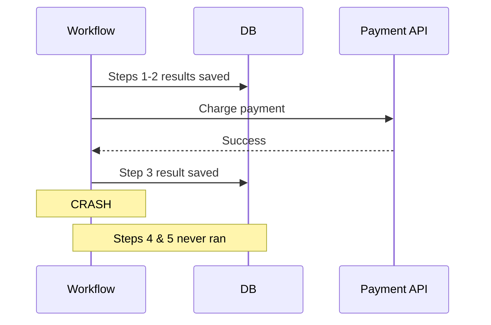
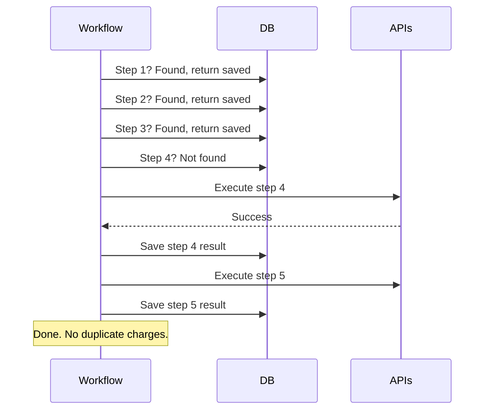
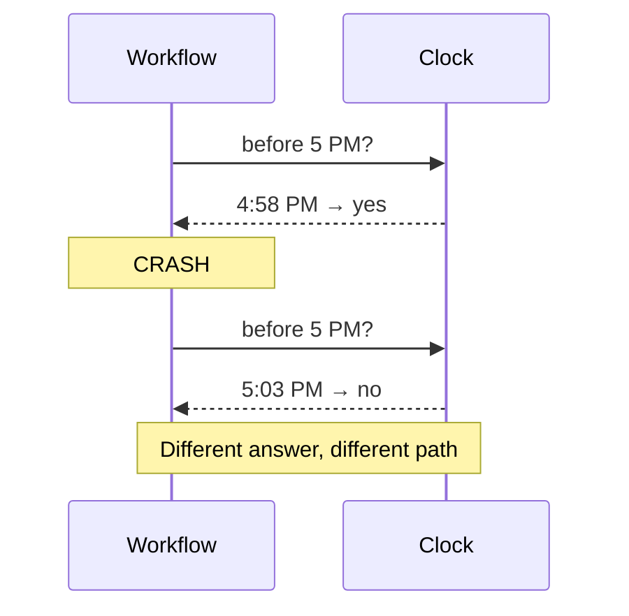
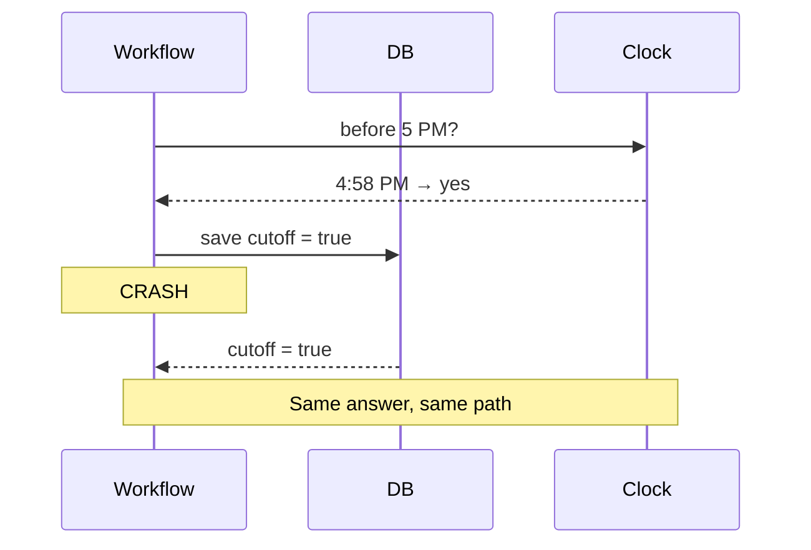
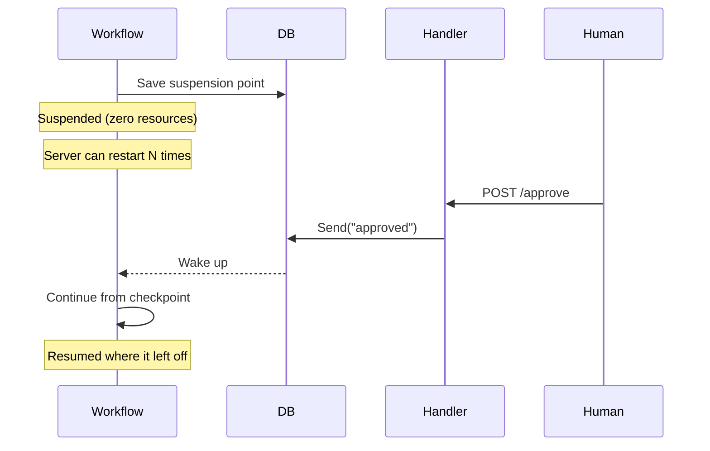
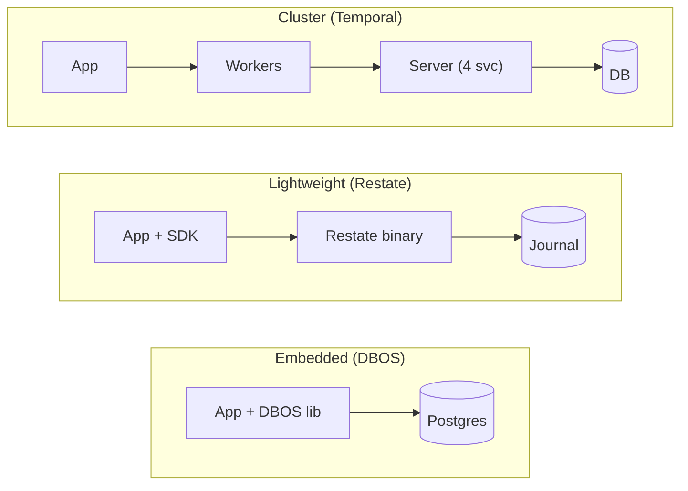
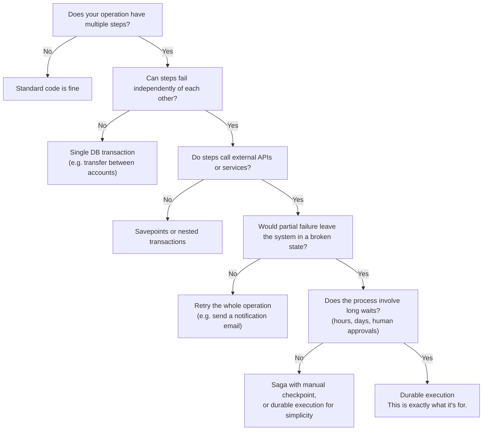

# Durable Execution

An Introduction

<p class="text-secondary" style="margin-top: 1rem; font-size: 1.05rem; max-width: 50ch;">
What if your functions could survive crashes, restarts, and weeks of waiting?
</p>

<p class="text-secondary" style="margin-top: 2rem; font-size: 1rem;">
Samuel Thien
</p>

<!--
Hey everyone, thanks for being here. Today I want to talk about something called durable execution. It's a pattern that changes how you structure reliable backend systems. By the end of this talk, you'll know what it is and when to reach for it.
-->

---
layout: section
transition: slide-left
---

# A Problem You've Seen

<!--
Alright, let's start with something I'm pretty sure every backend developer in this room has run into at some point.
-->

---

<p class="eyebrow">The Problem</p>

# What happens when the server crashes?

You're building an online store. A customer places an order.

<v-clicks>

1. **Reserve inventory** <span class="text-secondary">(database write)</span>
2. **Create order record** <span class="text-secondary">(database write)</span>
3. **Charge payment** <span class="text-secondary">(payment API call)</span>
4. **Notify warehouse** <span class="text-secondary">(webhook call)</span>
5. **Start delivery dispatch** <span class="text-secondary">(async process)</span>

</v-clicks>

<!--
So picture this. You're building an online store. A customer places an order. Behind the scenes, there's a whole chain of things that need to happen. Inventory gets reserved, the order record gets created in the database, the payment goes through via Stripe or whatever provider you use, the warehouse gets notified, and then delivery dispatch kicks off. Five steps. Each one depends on the one before it. Now here's the question I want you to sit with for a second -- what happens if the server crashes right after the payment goes through, but before the warehouse gets the message?
-->

---

<p class="eyebrow">The Problem</p>

# The partial failure problem

The server crashes between step 3 and step 4.

<v-clicks>

- Payment is charged. The customer's money is gone.
- But the warehouse was never notified. No one picks the order.
- The customer waits. Nothing arrives. They call support.
- **This is the partial failure problem.**

</v-clicks>

<div v-click class="callout" style="margin-top: 1.5rem;">
<p>The system is in an <strong>inconsistent state</strong>, and no single component knows it.</p>
</div>

<!--
So the payment went through. The customer's money is gone. But the warehouse never heard about it, so nobody picks the order. The customer sits there waiting, nothing shows up, and eventually they call support. And here's the uncomfortable part -- no single component in your system actually knows this happened. The payment service thinks everything's fine. The warehouse thinks there's no order. The system is in a broken state, and it doesn't even realize it. This is what we call the partial failure problem.
-->

---

<p class="eyebrow">Traditional Solutions</p>

# Why the obvious solutions don't work

| Approach | Why it falls short |
|---|---|
| **Try/catch + retry** | Retries the whole function. Step 3 runs again, customer is **double-charged**. |
| **Database transaction** | Can't wrap payment API calls inside a Postgres transaction. Only works within one DB. |
| **Message queue** | Split logic across producers/consumers. Now manage dead-letter queues, idempotency keys, and a state machine. |
| **Polling state machine** | Store state in a `workflow_state` column, poll every 30s, giant switch/case. |

<div v-click class="callout" style="margin-top: 0.5rem;">
<p>Every one of these pushes reliability into <strong>your application code</strong>. You end up writing infrastructure, not features.</p>
</div>

<!--
Now let's go through what most developers instinctively reach for when they hit this problem. Try/catch with a retry? Well, that retries the entire function, which means step three runs again and your customer gets double-charged. Not great. Wrap it in a database transaction? That works for operations within one database, but you can't put a Stripe API call inside a Postgres transaction. Message queue? Sure, but now you've split your logic across producers and consumers, and you're managing dead-letter queues, idempotency keys, and building a state machine to track progress. You've traded one problem for three. State machine? Store state in a column, advance it on each event, build recovery logic for every workflow. It works, but you end up writing more infrastructure code than actual business logic. Every one of these approaches pushes the reliability burden into your application code. You're writing infrastructure, not features.
-->

---

<p class="eyebrow">Escalation</p>

# Long-running workflows — a solved problem?

You've all built this before.

<v-clicks>

- A `workflow_state` column with a state enum
- API endpoints that advance the state on each event
- Background jobs for timeouts and escalation
- A reconciliation cronjob to catch data that fell out of sync

</v-clicks>

<div v-click>

It works. But look at what it costs you:

- **Business logic gets scattered** across handlers, state transitions, and cron jobs
- **Every workflow** needs its own state machine from scratch
- **Recovery code** is rarely tested, and often wrong when it finally runs
- A **5-step approval** that's 10 lines of logic becomes 200+ lines of infrastructure

</div>

<div v-click class="callout" style="margin-top: 0.5rem;">
<p>The workflow runs. But you're writing more plumbing than business logic, and it's the same plumbing every time.</p>
</div>

<!--
Now, what about long-running workflows? Access request approvals, multi-day onboarding, anything with a human in the loop. You've all built these. A workflow_state column. API endpoints that advance the state -- user submits, approver A approves, approver B approves, provisioning happens. A background job for timeouts. And then -- the reconciliation cronjob. Because things fall out of sync. Maybe the approval went through but the provisioning call failed silently. Maybe a workflow got stuck in "pending" for three weeks and nobody noticed. So you write a cron job that scans for inconsistencies and tries to fix them. It works. You ship it and it runs. But think about the cost. The actual business logic -- wait for A, then B, then provision -- is ten lines of code. The state enum, transition table, API handlers, timeout job, reconciliation logic, error paths -- that's two hundred lines or more. And every new workflow needs the same boilerplate from scratch. You're writing more plumbing than business logic, and it's the same plumbing every time.
-->

---
layout: center
---

<div class="pull-quote">
What if one approach solved both — crash recovery for fast operations and long-running coordination — without the state machine boilerplate?
</div>

<!--
So we have two problems. First, crash recovery during fast operations that call external APIs -- that's genuinely hard, and the traditional solutions don't solve it cleanly. Second, long-running workflows -- that's a solved problem, but the solution costs you hundreds of lines of state machine boilerplate per workflow. What if one approach handled both? Let's build one from first principles.
-->

---
layout: section
transition: slide-left
---

# Building from First Principles

<!--
This is the core of the talk. We're going to derive the solution one building block at a time. After each one, I'm going to ask: does this solve our problem yet? And each time, the answer is going to be "not quite" — until we put all the pieces together.
-->

---

<p class="eyebrow">Building Block 1</p>

# Checkpointing

The fundamental problem: when the process crashes, we **lose track of what already happened**.

<v-click>

**The idea:** After each step completes, save its result somewhere durable.

</v-click>

<div v-click style="margin-top: 1rem; font-family: 'JetBrains Mono', monospace; font-size: 0.9rem; line-height: 2;">
<span class="step-block step-done">Step 1: Reserve inventory → result saved</span><br>
<span class="step-block step-done">Step 2: Create order → result saved</span><br>
<span class="step-block step-done">Step 3: Charge payment → result saved</span><br>
<span class="step-block step-crash">CRASH</span><br>
<span class="step-block step-pending">Step 4: Notify warehouse → never executed</span><br>
<span class="step-block step-pending">Step 5: Dispatch → never executed</span>
</div>

<!--
So here's the fundamental issue. When the process crashes, we lose track of what already happened. Steps one through three completed successfully, but the process has no memory of that. So what if, after each step finishes, we save its result somewhere durable -- like a database? When the process restarts, it can look at what's been saved and say: steps one through three are done, I need to pick up from step four. Does this solve our problem? Almost. But how does the process actually know where to resume from? That leads us to building block number two.
-->

---

<p class="eyebrow">Building Block 1</p>

# How checkpointing works



<div v-click class="callout">
<p>We know <em>what happened</em>. But how do we <em>resume</em>?</p>
</div>

<!--
Let me show you what this looks like as a sequence of operations. The workflow runs step one, writes the result to the database. Step two, same thing. Step three calls the payment API, gets a success response, and saves that result. Then the process crashes. Steps four and five never ran. But their predecessors' results are safely stored. So we know what happened. The question now is -- how do we actually use those checkpoints to resume?
-->

---

<p class="eyebrow">Building Block 2</p>

# Replay

We have checkpoints. Now we need a way to **use them**.

<v-click>

**The idea:** On restart, re-run the workflow function from the beginning. But instead of executing completed steps, **return their saved results**.

</v-click>

<div v-click style="margin-top: 1rem; font-family: 'JetBrains Mono', monospace; font-size: 0.9rem; line-height: 2;">
<span class="step-block step-done">Step 1: Checkpoint found → return saved result — skip</span><br>
<span class="step-block step-done">Step 2: Checkpoint found → return saved result — skip</span><br>
<span class="step-block step-done">Step 3: Checkpoint found → return saved result — skip</span><br>
<span class="step-block" style="background: oklch(92% 0.04 250 / 0.3); color: oklch(45% 0.15 250);">Step 4: No checkpoint → execute for real → saved</span><br>
<span class="step-block" style="background: oklch(92% 0.04 250 / 0.3); color: oklch(45% 0.15 250);">Step 5: No checkpoint → execute for real → saved</span>
</div>

<!--
OK so we have checkpoints. Now we need a mechanism to use them. Here's the idea: when the process restarts, re-run the entire workflow function from the beginning. But instead of actually executing the steps that already completed, just return their saved results and skip ahead. Step one -- checkpoint exists, return the saved result. Step two, same thing. Step three, same thing. Step four -- no checkpoint found. This is where the original execution failed. So now we execute step four for real, save its result, and continue to step five. Notice that your code is still a straightforward, linear function. No state machine. No switch/case. The runtime handles the recovery completely transparently.
-->

---

<p class="eyebrow">Building Block 2</p>

# Replay in practice



<!--
This is the same thing shown as a sequence diagram. The workflow asks the database: do you have a result for step one? Yes, return it. Step two? Yes. Step three? Yes. Step four? No, nothing found. OK, now we actually call the external API for step four, save the result, move on to step five. Done. And notice -- no duplicate payment charges. The payment step was already checkpointed, so it got skipped during replay.
-->

---

<p class="eyebrow">Building Block 3</p>

# Determinism

For replay to work, the function must produce the **same sequence of steps** every time.

<v-click>

**The idea:** Wrap non-deterministic values (time, random, config) in a checkpointed step.

</v-click>

<div v-click class="grid grid-cols-2 gap-2" style="margin-top: 0.25rem;">
<div>

<p style="margin: 0 0 0.25rem; font-weight: 600; color: var(--danger);">Breaks replay</p>

```go
func dispatchWorkflow(ctx WorkflowCtx, orderID int) {
    // ... previous steps checkpointed ...
    if time.Now().Hour() < 17 {
        step(ctx, func() { notifySameDay(orderID) })
    } else {
        step(ctx, func() { queueNextDay(orderID) })
    }
}
```

</div>
<div>



</div>
</div>

<div v-click class="callout" style="margin-top: 0.5rem;">
<p>At 4:58 PM the code takes one path; after the crash at 5:03 PM it takes the other. <strong>Same checkpoint, different branch.</strong></p>
</div>

<!--
For replay to work correctly, the function has to produce the same sequence of steps every time it runs. Otherwise the checkpoints won't line up. Let's stay with the checkout story. On the left you can see the code -- the dispatch decision branches on the current time. On the right, the sequence diagram shows what happens. First execution runs at 4:58 PM, takes the same-day path. Server crashes. Replay starts at 5:03 PM, takes the next-day path. Same checkpoint position, different branch.
-->

---

<p class="eyebrow">Building Block 3</p>

# Determinism — the fix

On replay, the runtime returns the **saved result** instead of re-reading the clock.

<div class="grid grid-cols-2 gap-2" style="margin-top: 0.25rem;">
<div>

<p style="margin: 0 0 0.25rem; font-weight: 600; color: var(--success);">Fixed — checkpoint the decision</p>

```go
func dispatchWorkflow(ctx WorkflowCtx, orderID int) {
    // ... previous steps checkpointed ...
    cutoff := step(ctx, func() bool {
        return time.Now().Hour() < 17
    })
    if cutoff {
        step(ctx, func() { notifySameDay(orderID) })
    } else {
        step(ctx, func() { queueNextDay(orderID) })
    }
}
```

</div>
<div>



</div>
</div>

<div v-click class="callout" style="margin-top: 0.5rem;">
<p>Same rule for random values, UUIDs, and config reads. If it could differ between runs, <strong>checkpoint it</strong>.</p>
</div>

<!--
The fix: wrap the clock read in a checkpointed step. On replay, the runtime returns the saved value -- 4:58 PM -- and the code follows the same path it took originally. This applies to any non-deterministic source -- random values, UUIDs, external config reads. If it could change between runs, checkpoint it. We'll go deeper on this discipline in the gotchas section.
-->

---

<p class="eyebrow">Building Block 4</p>

# Durable Messaging

If you know Go channels, you already know this.

<v-click>

**The idea:** Two primitives — `Recv` blocks a workflow until a message arrives, `Send` delivers it. Like `<-ch` and `ch <-`, but the state lives in the database.

</v-click>

<div v-click class="grid grid-cols-2 gap-4" style="margin-top: 0.5rem;">
<div>

<p style="margin: 0 0 0.25rem; font-weight: 600;">Go channel</p>

```go
ch := make(chan string)

// goroutine blocks until value arrives
decision := <-ch

// another goroutine sends
ch <- "approved"
```

</div>
<div>

<p style="margin: 0 0 0.25rem; font-weight: 600;">Durable messaging</p>

```go
// workflow blocks until message arrives
decision, _ := dbos.Recv[string](
    ctx, "approval", 7*24*time.Hour)

// HTTP handler sends
dbos.Send(ctx, wfID, "approval", "approved")
```

</div>
</div>

<v-click>

<div class="callout" style="margin-top: 0.75rem;">
<p>Same idea — <strong>block until a value shows up</strong>. But durable: state lives in the DB, survives restarts, and can wait for days with zero compute.</p>
</div>

</v-click>

<!--
If you know Go channels, you already know this pattern. On the left -- a plain Go channel. One goroutine blocks on receive, another sends a value, the first one wakes up. On the right -- durable messaging. Same shape. Recv blocks the workflow, Send delivers a message, the workflow wakes up. The difference: a Go channel lives in memory. Process dies, it's gone. Durable messaging persists the suspension point to the database. The server can restart fifty times over seven days. When the human finally clicks approve, the send arrives, and the workflow picks up right where it left off. No thread held, no connection open. The whole workflow state fits in a single DB row. Same mental model, but crash-proof.
-->

---

<p class="eyebrow">Building Block 4</p>

# Durable messaging in action



<!--
Here's the sequence. The workflow saves its suspension point to the database and goes dormant. It's not holding a thread or a connection. It's literally just a row in a database table. The server can restart as many times as it needs to. Then a human makes an HTTP request to approve. The handler calls send, which writes to the database. The runtime detects the message, reconstructs the workflow, and it continues from the checkpoint. Exactly where it left off.
-->

---


# What did we just build?

| # | Building Block | What it does |
|---|---|---|
| 1 | **Checkpointing** | Saves each step's result to a database |
| 2 | **Replay** | On restart, re-runs the function, skips completed steps |
| 3 | **Determinism** | Ensures replay produces the same step sequence |
| 4 | **Durable messaging** | Lets workflows sleep and wake across crashes |

<v-click>
<div class="callout" style="margin-top: 1.5rem;">
<p>You write a normal function. The runtime makes it crash-proof.</p>
</div>
</v-click>

<!--
Let's step back and look at what we've put together. Four building blocks. Checkpointing saves each step's result. Replay lets us restart and skip past what's already done. Determinism makes sure replay stays consistent. And durable messaging lets workflows sleep across crashes and wake up on external events. Put them together, and you get something pretty elegant: you write a normal function, and the runtime makes it crash-proof.
-->

---
layout: center
---

# This pattern is called <br> <span class="accent">durable execution</span>.

<p class="text-secondary" style="text-align: center; margin-top: 1.5rem; font-size: 1.1rem;">
You write a normal function. The runtime makes it crash-proof. That's it.
</p>

<!--
And this pattern has a name. It's called durable execution. By now, it probably feels obvious -- of course it has to work this way. And that's exactly the point. You arrived at the concept before I named it.
-->

---

# What durable execution is _not_

<v-clicks>

- It's **not a database**. It uses one, but it's not replacing Postgres.
- It's **not a message queue**. It's not competing with Kafka or RabbitMQ.
- It's **not a job scheduler**. It's not cron with extra steps.

</v-clicks>

<div v-click class="callout" style="margin-top: 1.5rem;">
<p>It's a <strong>runtime pattern</strong> that makes your functions survive failures. Think of it as a reliability layer you add to existing code.</p>
</div>

<!--
Before we move on, let me quickly clear up what durable execution is not, because I've seen people get confused about this. It's not a database -- it uses a database for checkpointing, but it's not replacing Postgres. It's not a message queue -- it's not competing with Kafka or RabbitMQ. And it's not a job scheduler -- it's more than just running tasks on a schedule. It's a runtime pattern. A reliability layer that you add to your existing code. Your functions stay as functions. They just become crash-proof.
-->

---
layout: section
transition: slide-left
---

# The Landscape

<!--
We've built the concept from scratch. Now let's take a quick look at the tools in this space, and then we'll jump into real code.
-->

---

<p class="eyebrow">The Landscape</p>

# Tools in this space

| Runtime | What you deploy | Best for |
|---|---|---|
| **Temporal** | Server cluster (4 services) + workers | Enterprise scale, multi-team orchestration |
| **DBOS** | Library → your existing Postgres | Adding durability without a separate server cluster |
| **Restate** | Single server binary + SDK | Low-latency stateful microservices |
| **Inngest** | Nothing — serverless, HTTP-invoked | Event-driven flows, no workers to manage |
| **Azure Durable Functions** | Cloud-managed replay engine (Azure) | Teams already on Azure |
| **AWS Lambda Durable Functions** | Cloud-managed replay engine (AWS) | Serverless durable execution on AWS |

<!--
There are several tools in this space, sitting on a spectrum from embedded libraries to dedicated server clusters. Temporal is the most established -- it has the largest production deployments at companies like Netflix and DoorDash, but it requires a separate server cluster with four internal services. DBOS takes the opposite approach -- it's an open-source library that checkpoints to your existing Postgres, so there's zero extra infrastructure. Restate is a single server binary with journal-based execution and virtual objects for managing state. Inngest is serverless-native -- your functions get invoked via HTTP, no workers to deploy. Then you've got the cloud-provider options: Azure Durable Functions uses replay internally, similar to what we derived. AWS Lambda Durable Functions is the newest entry -- AWS added checkpoint-and-replay directly into Lambda, so you write sequential code and the runtime handles checkpointing, retries, and suspending execution. Different implementations, but the same mechanics -- checkpointing, replay, determinism, durable messaging -- show up across all of them.
-->

---

<p class="eyebrow">The Landscape</p>

# Architecture spectrum

Three models, same building blocks, different trade-offs.



<div class="callout" style="margin-top: 0.25rem;">
<p>Embedded tools are easier to try. Dedicated runtimes usually buy you more operational features.</p>
</div>

<!--
Let me show you where these tools fall on the architecture spectrum. On one end, you've got the embedded library approach -- that's DBOS. Your app includes the DBOS library directly, and it checkpoints to a Postgres database you already have. No extra services, no cluster to manage. In the middle, you've got something like Restate -- a single server binary that your app connects to via an SDK. It manages a journal of execution state. And on the other end, Temporal runs a full server cluster with four internal services -- Frontend, History, Matching, and Worker -- plus its own database. The trade-off is straightforward: less infrastructure means you can get started faster, but more infrastructure gives you more features at scale. For today, I want the simplest path to show you the concepts.
-->

---

<p class="eyebrow">The Landscape</p>

# Why DBOS for today's demos

For this talk, I want the simplest setup that still shows the mechanics clearly.

<v-clicks>

- **Embeds into existing code** — enough to show the pattern without introducing a separate control plane
- **Uses the Postgres you already run** — keeps the demo setup simple
- **Available in Go, Python, TypeScript** — useful for showing the same ideas across languages
- **Open source** — easy to inspect how the runtime works

</v-clicks>

<div v-click class="callout" style="margin-top: 1.5rem;">
<p>The mechanics matter more than the product choice. Checkpointing, replay, determinism, and durable messaging show up in different forms across the ecosystem.</p>
</div>

<!--
For today's demos, I picked DBOS because it has the lowest barrier to entry. You add it to existing code with a few lines -- no architectural overhaul required. It uses a Postgres database you probably already have running. It's available in Go, Python, and TypeScript, so I can show the same pattern across languages. And it's fully open source, so you can look under the hood if you're curious. But I want to be really clear about something -- this is not a DBOS sales pitch. The building blocks are the same whether you use Temporal, Restate, DBOS, or something else.
-->

---
layout: section
transition: slide-left
---

# Code and Demos

<!--
Enough theory. Let's look at real code. I've got three demos lined up, each building on the last. We'll see the code, run the app, and watch it recover from crashes.
-->

---

<p class="eyebrow">Demo 1</p>

# Widget Store — Marketplace Checkout

The checkout scenario from earlier, implemented with durable execution.

<v-clicks>

- Linear function: reserve inventory → create order → wait for payment → dispatch
- `RunAsStep` wraps each database operation (checkpointed)
- `Recv` waits for payment confirmation from an external webhook
- `RunWorkflow` starts a child workflow for dispatch

</v-clicks>

<div v-click class="callout">
<p>This is still a <strong>regular function</strong>. The recovery logic lives in the runtime instead of being spread across the application.</p>
</div>

<!--
First up is the widget store. This is the exact checkout scenario from earlier -- the one where the server crashes between payment and warehouse notification -- but now implemented with durable execution. It's a linear function: reserve inventory, create the order, wait for payment, then kick off dispatch. Each database operation is wrapped in RunAsStep, which means it gets checkpointed automatically. The Recv call waits for the payment webhook to arrive, and RunWorkflow starts a child workflow for delivery dispatch. The key thing to notice is that this is just a regular function. No state machine, no polling loop, no message queue infrastructure.
-->

---

<p class="eyebrow">Demo 1 — Widget Store</p>

# Checkout workflow (Go)

```go {1|3-5|7-9|11|13-16|18}{at:1, maxHeight:'380px'}
func checkoutWorkflow(ctx dbos.DBOSContext, _ string) (string, error) {
    // Step 1: Create order (checkpointed)
    orderID, _ := dbos.RunAsStep(ctx, func(stepCtx context.Context) (int, error) {
        return createOrder(stepCtx)
    })
    // Step 2: Reserve inventory (checkpointed)
    success, _ := dbos.RunAsStep(ctx, func(stepCtx context.Context) (bool, error) {
        return reserveInventory(stepCtx)
    })
    // Step 3: Wait for payment — durably (survives crashes)
    payment, _ := dbos.Recv[string](ctx, PAYMENT_STATUS, 60*time.Second)
    if payment == "paid" {
        // Step 4: Update status (checkpointed)
        dbos.RunAsStep(ctx, func(stepCtx context.Context) (string, error) {
            return updateOrderStatus(stepCtx, orderID, PAID)
        })
        // Step 5: Start dispatch as child workflow
        dbos.RunWorkflow(ctx, dispatchOrderWorkflow, orderID)
    }
}
```

<!--
Let me walk you through this code. At the top, it's just a regular Go function signature. Nothing special about it. Then we create the order using RunAsStep -- this wraps the database call so the result gets saved as a checkpoint. Same thing for reserving inventory. Then we hit Recv, which is the durable wait for payment. This is where the workflow can sit suspended until the payment webhook arrives, and if the server crashes and restarts during that window, the workflow survives. When payment comes through, we update the order status -- again, checkpointed -- and then start a child workflow for dispatch. Remember that crash scenario from earlier? The one where the customer gets charged but the warehouse never hears about it? That literally cannot happen here. Every step is checkpointed. If the server crashes between the payment and the warehouse notification, it just picks up right where it left off.
-->

---
layout: center
---

<p class="eyebrow" style="text-align: center;">Demo 1</p>

# Widget Store

<p class="text-secondary" style="text-align: center; font-size: 1.1rem; margin-top: 1rem;">
Live demo — checkout, payment, crash recovery
</p>

<!--
Let me switch over to the live demo now. I'll walk you through the checkout process, trigger the payment webhook, and then we'll kill the server mid-dispatch and watch it recover on restart.
-->

---

<p class="eyebrow">Demo 2</p>

# Agent Inbox — AI Agent with Human Approval

Same `Recv`/`Send` pattern, now applied to AI agents.

<v-clicks>

- Agent does work → reaches a decision point
- Calls `DBOS.recv()` to wait for human approval
- `set_event` updates agent status (frontend polls this)
- HTTP handler calls `DBOS.send()` when the human responds

</v-clicks>

<div v-click class="callout">
<p>Same building block, different use case. <code>Recv</code> waits for payment in the store; <code>Recv</code> waits for human approval here.</p>
</div>

<!--
Next up, same building blocks but a completely different use case. This is an AI agent that does some work, reaches a decision point, and then needs human approval before continuing. It uses the exact same Recv and Send pattern we just saw in the store. The agent publishes its status using set_event so the frontend can track what it's doing. Then it calls recv to wait for a human to approve or deny. On the other side, an HTTP handler calls send when the human makes their decision. Same building block that waited for a payment webhook in the store -- now it waits for a human in an agent workflow.
-->

---

<p class="eyebrow">Demo 2 — Agent Inbox</p>

# Durable agent workflow (Python)

```python {1|3-6|8-10|11|13-14|16-18}{at:1}
@DBOS.workflow()
def durable_agent(request: AgentStartRequest):
    # Do work...
    agent_status = AgentStatus(name=request.name, task=request.task,
                               status="working")
    DBOS.set_event(AGENT_STATUS, agent_status)

    # Pause: wait for human approval (survives crashes)
    agent_status.status = "pending_approval"
    DBOS.set_event(AGENT_STATUS, agent_status)
    approval = DBOS.recv(timeout_seconds=3600)

    if approval is None or approval.response == "deny":
        raise Exception("Agent denied or timed out")

    # Approved — continue working
    agent_status.status = "working"
    DBOS.set_event(AGENT_STATUS, agent_status)
    return "Agent successful"
```

<!--
Let's look at the Python code. The DBOS.workflow decorator at the top marks this function as a durable workflow. The agent does its initial work, then publishes status updates through set_event -- the frontend polls this to show what the agent is doing. Then it switches to pending_approval status and calls DBOS.recv with a one-hour timeout. This is the durable wait. The server can crash and restart, and the agent just keeps waiting. If approval comes back as None or denied, we raise an exception. Otherwise, we continue working. OpenAI's Agents SDK, Pydantic AI, and LangGraph have all added durable execution support for this kind of human-in-the-loop flow.
-->

---
layout: center
---

<p class="eyebrow" style="text-align: center;">Demo 2</p>

# Agent Inbox

<p class="text-secondary" style="text-align: center; font-size: 1.1rem; margin-top: 1rem;">
Live demo — agent task, human approval, crash recovery
</p>

<!--
Let me show you this one in action. I'll start an agent task, we'll see it pause and wait for approval, I'll approve it, and then I'll demonstrate the crash recovery -- start an agent, kill the server while it's waiting, restart, and then approve it. The agent survives the full restart.
-->

---

<p class="eyebrow">Demo 3 (optional)</p>

# Access Management — Long-Running Approval Chain

Multi-approver workflow that spans days, with saga-pattern rollback.

<v-clicks>

- `Recv` per approver with 7-day timeout
- Denial at any step stops the chain
- On full approval → child `ProvisioningWorkflow`
- Saga pattern: if external provisioning fails, compensate by revoking local assignment

</v-clicks>

<!--
If we have time, this last demo shows the most complex version of the pattern. It's an access management system where a request needs multiple approvals -- each approver gets a seven-day timeout. Denial at any step stops the whole chain. Once everyone approves, a child provisioning workflow kicks off. And if the external provisioning fails after the local role assignment has already happened, there's a compensation step that rolls it back -- that's the saga pattern. I'll use this demo only if we're running ahead of schedule.
-->

---

<p class="eyebrow">Demo 3 — Approval Workflow</p>

# Multi-step approval (Go)

```go {1|3-5|7-9|10|13-15}{at:1, maxHeight:'380px'}
func ApprovalWorkflow(ctx dbos.DBOSContext, input ApprovalWorkflowInput) (Result, error) {
    // Load approval chain (checkpointed)
    steps, _ := dbos.RunAsStep(ctx, func(c context.Context) ([]ApprovalStep, error) {
        return loadApprovalSteps(c, input.RequestID)
    })
    // Wait for each approver (7-day timeout, survives restarts)
    for _, step := range steps {
        decision, err := dbos.Recv[Decision](ctx, "approval", 7*24*time.Hour)
        if err != nil { /* timeout → auto-escalate */ }
        if decision == "DENIED" { return denied() }
    }
    // All approved → start child provisioning workflow
    handle, _ := dbos.RunWorkflow(ctx, ProvisioningWorkflow,
        ProvisioningInput{RequestID: input.RequestID})
    result, _ := handle.GetResult()
    return result, nil
}
```

<!--
Here's the approval workflow in Go. First, we load the list of required approvals from the database using RunAsStep -- so that query result gets checkpointed. Then we loop through each approver, calling Recv with a seven-day timeout. The workflow sleeps durably between each approval. If anyone denies, we short-circuit and return immediately. Once everyone approves, we start a child provisioning workflow and wait for its result. The thing to appreciate here is that this workflow might run for weeks. Servers will restart. Deployments will happen. None of that matters -- the workflow just keeps going from wherever it left off.
-->

---

<p class="eyebrow">Demo 3 — Saga Pattern</p>

# Provisioning with rollback (Go)

```go {1|3-5|7-9|11-14}{at:1, maxHeight:'380px'}
func ProvisioningWorkflow(ctx dbos.DBOSContext, input ProvisioningInput) (Result, error) {
    // Saga Step 1: Assign role in local database
    dbos.RunAsStep(ctx, func(c context.Context) (string, error) {
        return "ok", assignUserRole(c, input.UserID, input.RoleID)
    })
    // Saga Step 2: Provision in external system (3 retries)
    _, err := dbos.RunAsStep(ctx, func(c context.Context) (string, error) {
        return provisionExternal(input.UserID, input.RoleName)
    }, dbos.WithStepMaxRetries(3))
    if err != nil {
        // Compensate: roll back Step 1
        dbos.RunAsStep(ctx, func(c context.Context) (string, error) {
            return "ok", revokeUserRole(c, input.UserID, input.RoleID)
        })
        return Result{Status: "FAILED"}, err
    }
    return Result{Status: "PROVISIONED"}, nil
}
```

<!--
And here's the provisioning workflow implementing the saga pattern. Step one assigns the role in the local database. Step two provisions in the external system, with up to three retries if it fails. If step two fails even after retries, we run a compensation step that revokes the role assignment from step one. Both the forward path and the rollback path are fully checkpointed. If the server crashes during compensation, it picks up and finishes rolling back. You never end up in a half-compensated state where the local role is assigned but the external system doesn't know about it.
-->

---
layout: section
transition: slide-left
---

# Practical Guidance

<!--
So when should you actually reach for durable execution? And what are the things that will bite you if you're not careful? Let's get practical.
-->

---

<p class="eyebrow">Guidance</p>

# When to use durable execution

<p class="text-secondary" style="font-size: 0.95rem; margin-bottom: 0.25rem;">Quick gut check: can you describe the work as a single verb — <em>send, process, sync</em>? It's a job. Need "and then" or "wait until"? It's a process.</p>



<!--
Here's a quick way to think about it. If you can describe the work as a single verb -- send an email, process an image, sync a record -- it's a job. Use a queue. If you need "and then" or "wait until" to describe it, it's a process. That's when this decision tree matters.

Start at the top. Multi-step? If not, standard code is fine. Can steps fail independently? If not, a single database transaction covers you. Do they call external APIs? If everything stays in your database, savepoints work. Would partial failure leave the system inconsistent? If retry-from-scratch is cheap and safe, do that.

Now the last branch is where it gets nuanced. If partial failure IS dangerous, the question becomes: does the process involve long waits? If it's a fast multi-step operation -- say three API calls that finish in seconds -- you can build a saga with manual checkpointing, or use durable execution for the simpler programming model. Both work. But if the process involves human approvals, webhook waits, or anything that spans hours or days, durable execution is the clear answer. That's where the durable suspension and zero-resource waiting really pay for themselves.
-->

---

<p class="eyebrow">Guidance</p>

# Where durable execution earns its keep

| Scenario | Why DE | What breaks without it |
|---|---|---|
| **Payment + fulfillment** | Steps cross service boundaries with irreversible side effects | Crash between charge and dispatch = charged customer, no delivery |
| **Multi-step approvals** (days/weeks) | Process must survive restarts across human-speed waits | Polling state machine: ~40,000 wasted DB queries over 14 days |
| **AI agent orchestration** | LLM calls are expensive and non-idempotent | Retry from scratch = repeated $0.10+ API calls, lost agent context |
| **Saga workflows with rollback** | Forward + compensating steps must both complete despite crashes | Manual compensation code that itself can fail mid-rollback |

<!--
Four scenarios where durable execution actually pays for itself. Payment plus fulfillment -- you saw this earlier with the checkout demo. The payment API charges real money, and the warehouse notification is a separate call. A crash between those two means a customer is out money with no order on the way. No retry loop fixes that without idempotency keys and checkpointed progress.

Multi-step approvals -- this is the access management demo. A request sits waiting for Bob, then Alice, potentially for days. Without durable execution, you need a workflow_state column and a polling loop. At 30-second intervals over 14 days, that's roughly 40,000 queries for a single request. And if the server redeploys during that window, you lose track of where you were unless you built your own state machine.

AI agent orchestration is newer but the economics are clear. A GPT-4 call costs real money. If your agent runs five reasoning steps at $0.10 each and crashes at step four, retrying from scratch wastes $0.30 and may produce different results because LLM outputs aren't deterministic. Checkpointing each step means recovery picks up from step four, not step one.

Saga workflows -- provisioning a role in an external system, then rolling back the local assignment if it fails. Both the forward step and the compensation step need to complete. If the compensation itself crashes halfway through, you're stuck in a worse state than before. Durable execution checkpoints the compensation, so it finishes on recovery.
-->

---

<p class="eyebrow">Guidance</p>

# When to skip it

| Scenario | Why not | Use instead |
|---|---|---|
| **Single-step CRUD** | No multi-step coordination to protect -- checkpoint overhead is pure cost | Direct DB call |
| **Millisecond-fast operations** | Checkpoint write adds 1-5ms per step -- dominates total latency | Inline code, no framework |
| **Purely database-local work** | ACID transactions already guarantee atomicity within one DB | Single transaction or savepoints |
| **Cheap-to-retry operations** | If full retry is safe and fast, checkpointing complexity isn't justified | Job queue with retry (BullMQ, Celery) |

<!--
Now the other side. Durable execution has real overhead -- every step is a database write, and every workflow carries the determinism constraint. That overhead buys you crash recovery. If you don't need crash recovery, you're paying for nothing.

Single-step CRUD -- updating a user's profile, inserting a record. There's one step. Nothing to checkpoint between. The database write IS the operation.

Millisecond-fast operations -- each checkpoint is a Postgres write, typically 1 to 5 milliseconds. If your operation takes 2ms total, adding a checkpoint doubles the latency. That's a bad trade for something that doesn't need recovery.

Purely database-local work -- if every step is a query against the same Postgres instance, wrap them in a transaction. ACID gives you atomicity for free. You don't need a separate checkpoint mechanism for work that never leaves the database.

And cheap-to-retry operations -- sending a notification email, resizing an image. If the whole thing fails, retry it from the top. The cost of re-running is low, the side effects are harmless or idempotent. A job queue with built-in retry handles this fine. Don't bring in durable execution when BullMQ or Celery will do.

The common mistake I see: teams wrapping every background job in a durable workflow because the framework is there. Match the tool to the problem. If retry-from-scratch is cheap and safe, skip the complexity.
-->

---

<p class="eyebrow">Guidance</p>

# Gotchas

<div class="grid grid-cols-2 gap-6">
<div>

**1. Determinism discipline**

`time.Now()`, `uuid.New()`, `rand.Intn()` must be inside checkpointed steps. Non-deterministic code outside steps causes replay mismatches — and these bugs only surface during crash recovery, exactly when you need the system to work.

**2. Workflow versioning**

Changing step sequences while instances are in-flight causes replay mismatches. This is the hardest operational problem in DE adoption — plan for it before your first long-running workflow ships.

</div>
<div>

**3. Idempotency**

Steps have at-least-once semantics. If a step succeeds but the checkpoint write fails, the step re-executes. External calls need idempotency keys.

**4. Payload size**

Every step's I/O is serialized to the database. Pass references (S3 URL, record ID), not large objects.

</div>
</div>

<!--
Four things that will bite you in production. First, determinism -- every call to time.Now, uuid.New, or rand.Intn needs to be inside a checkpointed step. If you accidentally put non-deterministic code in the control flow, replay breaks silently. Second, workflow versioning. If you change a workflow's step sequence while instances are still running the old version, those in-flight workflows hit replay mismatches. You need a versioning strategy from day one. Third, idempotency. There's a tiny window where a step can succeed but the checkpoint write fails. On recovery, that step runs again. External calls like payments need idempotency keys. Fourth, payload size. Every step's input and output gets serialized to the database. Don't pass fifty-megabyte files through steps -- pass a reference, an S3 URL or a record ID, and let the step fetch what it needs.
-->

---

<p class="eyebrow">Guidance</p>

# Complexity migrates — it never disappears

Durable execution doesn't reduce your system's total complexity. It **relocates** it.

| You stop dealing with... | You start dealing with... |
|---|---|
| Hand-rolled retry loops at every call site | **Determinism discipline** — non-deterministic code must live inside steps |
| Custom state machines + polling tables | **Workflow versioning** — changing step sequences breaks in-flight instances |
| Dead-letter queues + manual reprocessing | **Idempotency boundaries** — external calls still need idempotency keys |
| Ad-hoc crash recovery scattered across services | **Payload awareness** — every step's I/O is serialized to the database |

<div v-click class="callout" style="margin-top: 1rem;">
<p>The trade: recovery logic stops being scattered across services and becomes explicit rules the team can review and enforce. You're not removing complexity. You're moving it.</p>
</div>

<!--
Here's something I want to be honest about. There's a principle in systems design, sometimes attributed to Larry Tesler: complexity doesn't magically disappear, it just moves to another part of the system. The law of conservation of complexity. And it absolutely applies to durable execution. Look at this table. On the left, the problems you had before. On the right, the problems you have after. Your hand-rolled retry loops went away, but now you need determinism discipline. Your custom state machines are gone, but now you need a versioning strategy for in-flight workflows. You stopped managing dead-letter queues, but you still need idempotency keys for external calls. Ad-hoc crash recovery disappeared, but now you need to think about what gets serialized at every checkpoint. The total complexity didn't shrink. But look at the difference in character. The left column is scattered, implicit, easy to miss. A retry loop missing from one call site. A dead-letter queue nobody checks. A crash recovery path that was never tested. The right column is structured, explicit, and well-documented. These constraints show up in your code review, your linter, your deployment checklist. The point isn't less complexity — it's better-located complexity. You moved it from the gaps between your services, where bugs hide, to the surface of your code, where you can see it and reason about it.
-->

---

<p class="eyebrow">Guidance</p>

# Durable execution vs event-driven

<div class="grid grid-cols-2 gap-8" style="margin-top: 1rem;">
<div>

### Orchestration

**Durable execution**

*"Given this input, execute these steps in order."*

Central coordinator. The workflow knows the full plan.

</div>
<div>

### Choreography

**Event-driven (Kafka, etc.)**

*"Something happened; whoever cares can react."*

No coordinator. Services react independently.

</div>
</div>

<p v-click class="text-secondary" style="margin-top: 1.5rem; font-size: 0.95rem; max-width: 60ch;">Forward logic is ~10% of most applications. Error handling and crash recovery are ~90%. In a workflow, that 90% lives in one place. In event-driven, it's scattered across independent handlers.</p>

<div v-click class="callout" style="margin-top: 1rem;">
<p>They're <strong>complementary</strong>. Use Kafka for event distribution. Use durable execution for the multi-step workflow triggered by those events.</p>
</div>

<!--
This is probably the most common question people ask: how is this different from just using Kafka? Here's the distinction. Durable execution is orchestration. You've got a central coordinator -- the workflow function -- that says: given this input, execute these steps in this order. Event-driven architecture, like Kafka, is choreography. Something happened, and whoever cares about it can react independently. No central coordinator.

Here's the thing that makes the difference concrete. Mike Stonebraker -- Postgres creator, Turing Award winner -- published a paper earlier this year called "Goto Considered Harmful," the 2026 version. His argument: in most multi-step applications, the forward logic is only about ten percent of the code. The error handling, crash recovery, and "oops" logic is ninety percent. In a workflow architecture, that ninety percent lives in one function -- you can see the full error path, debug it, test it. In an event-driven architecture, that same logic is scattered across independent handlers that know nothing about each other. When something fails, you're trekking through multiple logs trying to reconstruct what happened.

That said, they're complementary, not competing. Use Kafka for distributing events across your system. Use durable execution for the multi-step workflow that gets triggered when one of those events arrives. Event-driven wins when steps are truly independent with no durability requirements -- pure pub/sub fanout, analytics pipelines. For everything else, workflow architecture handles the hard part better.
-->

---
layout: section
transition: slide-left
---

# Zooming Out

<!--
We've spent the whole talk inside durable execution -- what it is, how it works, when to reach for it. Now let's pull back and place it on the map. Distributed systems have accumulated decades of patterns for moving data, modeling state, coordinating work, and surviving failures. Some overlap with durable execution. Some complement it at a different layer. And a few are quietly absorbed by it -- you get them for free. We're going to focus specifically on the patterns that touch state progression over time. We're not covering scaling patterns like sharding, structural patterns like sidecar proxies, or deployment patterns like strangler fig. Those exist, they matter, but they solve different problems.
-->

---

<p class="eyebrow">Zooming Out</p>

# You already use these patterns. Where does DE fit?

<p class="text-secondary" style="font-size: 0.85rem; margin-bottom: 0.5rem;">Scoped to patterns that manage state progression over time -- not scaling, structural, or deployment patterns.</p>

| Family | Key patterns | How DE relates |
|---|---|---|
| **Data Flow** | Transactional outbox, CDC | **Complements.** Outbox triggers the workflow; DE runs it. |
| **State Modeling** | Event sourcing, CQRS, actor model | **Shared DNA.** Both use "replay," but for different jobs. |
| **Coordination** | Saga, process manager, task queues | **DE lives here.** Absorbs sagas and process managers. |
| **Resilience** | Circuit breaker, retry, bulkhead | **Partially absorbed.** DE handles retry; circuit breaking stays yours. |

<div v-click class="callout" style="margin-top: 0.75rem;">
<p>Event sourcing replays events to reconstruct <em>state</em> -- its log lives forever with a schema evolution tax. DE replays functions to resume <em>progress</em> -- its history is ephemeral. Same word, very different cost.</p>
</div>

<!--
Here's the question you should be asking right now: I already use outbox, Kafka, sagas -- where does durable execution fit, and what does it actually replace? Let me give you the map. There are dozens of cloud design patterns, but we're scoping to the ones that manage state progression over time. Data flow patterns like the transactional outbox and CDC move data between systems. DE complements them -- the outbox publishes the trigger event, and DE runs the workflow that event initiates. State modeling patterns like event sourcing share DNA with DE -- both use "replay," but they replay different things. Event sourcing replays domain events to reconstruct state: what's the current balance? That log lives forever, and every schema change needs upcasters or event migration -- a maintenance tax that compounds year after year. DE replays workflow functions to resume progress: which step are we on? That history is ephemeral. Once the workflow completes, you can archive or discard it. Same word, very different operational burden. Coordination is where DE lives. It absorbs sagas and process managers into linear functions. And for resilience, DE handles retry policies and crash recovery, but circuit breakers and bulkheads remain your responsibility. These families overlap -- an outbox often drives a saga, CQRS depends on data flow. This is an editorial grouping, not a strict taxonomy.
-->

---

<p class="eyebrow">Zooming Out</p>

# How these patterns compose in production

A single food delivery order touches multiple pattern families:

| Step in the order flow | Pattern | Why this one |
|---|---|---|
| Order placed, event published atomically | **Outbox + CDC** | Can't dual-write to DB and Kafka |
| Reserve, charge, dispatch (must all complete) | **Durable execution** | Survives crashes; no double charges |
| Payment gateway call inside a workflow step | **Circuit breaker** | DE retries alone hammer a degraded service |
| Generate receipt PDF after fulfillment | **Job queue** (BullMQ) | Fire-and-forget -- DE would be overkill |

<div v-click class="callout" style="margin-top: 0.75rem;">
<p>No single pattern covers the full flow. The skill is knowing which to reach for at each layer.</p>
</div>

<!--
This is the slide I want you to remember from this section. No single pattern covers a real production flow end to end. Take a food delivery order. When the order is placed, you need to write to the database AND publish an event to Kafka atomically. That's the outbox pattern with CDC. You can't just do two separate writes -- a crash between them loses the event. The multi-step fulfillment -- reserve inventory, charge payment, notify the kitchen, dispatch the rider -- that's durable execution. It must complete despite crashes, and you can't double-charge the customer. Inside the payment step, you need a circuit breaker around the gateway call. Without it, DE's retries during a gateway degradation will hammer it into a full outage. And after fulfillment completes, generating the receipt PDF is a fire-and-forget job. BullMQ or Celery is the right tool there -- durable execution would be overkill for a single-step task. Four patterns, four layers, one order. The value of understanding the landscape is knowing which tool belongs at which layer.
-->

---

<p class="eyebrow">Zooming Out — Coordination</p>

# What durable execution replaces (and what it doesn't)

| Pattern | Without DE | With DE |
|---|---|---|
| **Saga** | State machine + compensation chains + retry logic + manual partial failure handling | Compensation is ordinary error handling inside a linear function |
| **Process manager** | Persistent state/transition table + event router + in-flight versioning | The function's control flow *is* the state machine |
| **Queue chaining** | Each consumer triggers the next queue -- loosely coupled, but no end-to-end visibility | Single function with checkpoints -- central view, but adds coordinator dependency |

<div v-click class="callout" style="margin-top: 0.75rem;">
<p>Queue chaining trades <strong>visibility for loose coupling</strong>. DE trades <strong>coupling for visibility</strong>. Neither is wrong. DE does <em>not</em> replace high-throughput worker queues (BullMQ, Celery). That's fan-out, not orchestration.</p>
</div>

<!--
This is where the overlap is densest. The saga pattern coordinates compensating transactions across services. Without durable execution, you build a state machine, wire up event handlers, manage compensation chains, and handle retry logic yourself. With durable execution, compensation is just regular error handling in a linear function. The process manager maintains a persistent state machine that routes events based on accumulated context. With durable execution, the function's control flow IS the state machine. You don't need a separate state/transition table. Now, queue chaining. I've seen teams chain five or six queues together, each consumer triggering the next one, to build what is effectively a state machine out of queue hops. This isn't always wrong -- it gives you loose coupling and independent scaling per step. But you lose end-to-end visibility. When something fails at step four out of six, nobody can see the full picture. Durable execution gives you that central view -- the entire workflow is one function, one place to debug. The trade-off is you now have a coordinator dependency. For most orchestration workflows, that trade-off is worth it. But durable execution does NOT replace high-throughput worker queues. If you need to resize ten million images, that's fan-out work. Use BullMQ or Celery. Durable execution adds persistence overhead per step. It's built for orchestration, not mass parallel processing.
-->

---

<p class="eyebrow">Zooming Out — Resilience</p>

# Resilience: extracted, not eliminated

DE centralizes retry and recovery in the runtime. But it doesn't absorb everything.

| Pattern | Status | Detail |
|---|---|---|
| **Retry with backoff** | Absorbed | Built-in step config -- `WithStepMaxRetries(3)` with exponential backoff. |
| **Idempotent consumer** | Mostly absorbed | Steps replay from checkpoint. External calls still need idempotency keys for the checkpoint-gap edge case. |
| **Circuit breaker** | **Not absorbed** | Needed at the HTTP client level inside steps -- e.g., `gobreaker` (Go), `opossum` (Node). |
| **Timeout / bulkhead** | **Not absorbed** | Context deadlines, connection pools, thread isolation -- below the workflow layer. |

<div v-click class="callout" style="margin-top: 0.5rem;">
<p><strong>Without a circuit breaker, retries become an outage amplifier.</strong> 1,000 workflows x 3 retries = 3,000 requests hitting a struggling gateway.</p>
</div>

<!--
Retry with backoff is built in -- you configure max retries and the runtime handles exponential backoff. Idempotent consumer is mostly covered by checkpoint replay, but there's a subtle edge case: if a step succeeds externally but the process crashes before writing the checkpoint, that step re-executes on recovery. External calls like payments still need idempotency keys. Circuit breaker is explicitly NOT absorbed by DE. If a downstream service is degraded, DE's retries alone will keep hammering it. You need a circuit breaker at the HTTP client level. Same for timeouts and bulkheads -- those are infrastructure-level concerns below the workflow layer.
-->

---

<p class="eyebrow">Zooming Out — Resilience</p>

# Where patterns break — a real failure

A Grab Food order. The workflow charges the customer via a payment gateway.

| Step | What happens |
|---|---|
| 1 | DE workflow calls the payment gateway with amount RM 45.00 |
| 2 | Gateway processes the charge -- money leaves the customer's account |
| 3 | Gateway's response **times out** (network blip, not a 500) |
| 4 | DE sees a failure. Retries the step. |
| 5 | Gateway processes the charge **again** -- RM 45.00 debited twice |

<div v-click class="callout" style="margin-top: 1rem;">
<p>DE alone doesn't prevent this. You need <strong>idempotency keys</strong> on every external call, so the gateway rejects the duplicate. And a <strong>circuit breaker</strong> so retries don't pile up against a struggling service. The patterns must compose.</p>
</div>

<!--
Let me walk through a specific failure to show why no single pattern is enough. Imagine a Grab Food order. The durable workflow reaches the payment step and calls the gateway to charge RM 45. The gateway processes it -- the money actually leaves the customer's Touch 'n Go wallet. But the response never comes back. Maybe a network blip, maybe the gateway was slow. From the workflow's perspective, the step failed. So DE retries. The gateway processes the charge again. The customer is now out RM 90 for a RM 45 order. Durable execution did exactly what it promised -- it retried the failed step. But without an idempotency key on that payment request, the retry created a duplicate charge. And without a circuit breaker, if the gateway is struggling under load, those retries pile up and make it worse. The lesson: these patterns must compose. DE provides retry and resume. Idempotency keys prevent duplicate side effects at the API boundary. Circuit breakers prevent retry storms against degraded services. No single pattern handles all of this alone.
-->

---

<p class="eyebrow">Zooming Out</p>

# Choosing the right tool

| You need to... | Reach for | Not |
|---|---|---|
| DB write + event publish atomically | **Outbox + CDC** | Dual writes (DB then Kafka) |
| Multi-step process that must survive crashes | **Durable execution** | Custom state machine + polling |
| Roll back across services on failure | **Saga** (via DE) | Distributed transactions (2PC) |
| Single-step background work | **Job queue** (BullMQ, Celery) | DE (overkill for fire-and-forget) |
| High-volume event streams | **Stream processing** (Flink, Kafka Streams) | DE (wrong tool) |
| Full audit trail of state changes | **Event sourcing** | Mutable rows with `updated_at` |

<div v-click class="callout" style="margin-top: 0.5rem;">
<p>Common mistake: reaching for DE when a job queue would suffice, or hand-rolling a state machine when DE would save weeks.</p>
</div>

<!--
This is the quick reference version. Need to write to a database and publish an event atomically? Outbox plus CDC. Need a multi-step process that must complete despite crashes? Durable execution. Need to roll back across services when something fails? That's a saga, and you implement it with durable execution. Single-step background work like sending an email or resizing an image? A job queue is the right call. Durable execution would be overkill for fire-and-forget tasks. Processing high-volume event streams in real time? That's Flink or Kafka Streams territory. Need a full audit trail of every state change? Event sourcing. The most common mistake I see: teams reaching for durable execution when a simple job queue would do the job, or spending weeks hand-rolling a state machine when a durable workflow would have saved them that entire effort. Match the tool to the layer.
-->

---
layout: center
---

<div class="pull-quote">
Write workflows as ordinary functions. The runtime keeps their progress durable across crashes, restarts, and days-long waits.
</div>

<!--
This is the one sentence I want you to take away from this talk. You write workflows as ordinary functions. The runtime guarantees they complete -- through crashes, restarts, and days-long waits. That's the whole idea.
-->

---

<p class="eyebrow">Resources</p>

# Learn more

| Resource | Link |
|---|---|
| **DBOS** | [dbos.dev](https://dbos.dev) — open source, docs, quickstart |
| **Temporal** | [temporal.io](https://temporal.io) — the category leader |
| **Restate** | [restate.dev](https://restate.dev) — lightweight alternative |
| **Inngest** | [inngest.com](https://www.inngest.com) — serverless-native |

<div style="margin-top: 1.5rem;">

**The core mechanics to look for:**

Checkpointing. Replay. Determinism. Durable messaging.

**The tools differ in ergonomics and operations. These ideas are what stay the same.**

</div>

<!--
Here's where you can dig deeper into any of these tools. DBOS, Temporal, Restate, Inngest -- they're all open source or have free tiers you can try today. The demo code from this talk is available too. The building blocks are simple: checkpoint, replay, determinism, durable messaging. The tools that implement them vary, but if you understand these four mechanics, you can evaluate any of them.
-->

---
layout: center
---

# Questions?

<p class="text-secondary" style="text-align: center; font-size: 1.1rem; margin-top: 1rem;">
Thank you
</p>

<!--
And that's the talk. Let's take questions. Thanks for being here.
-->
